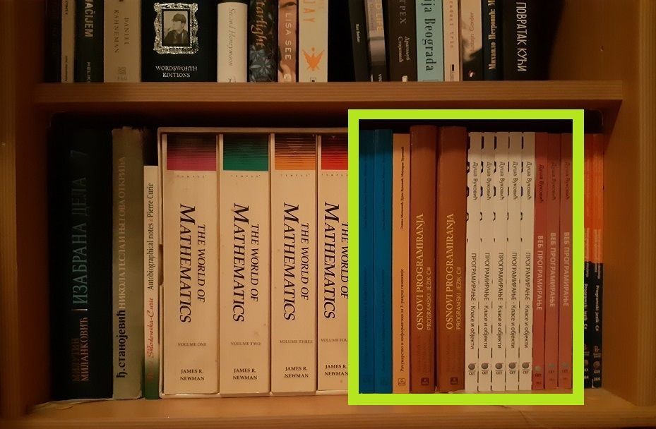
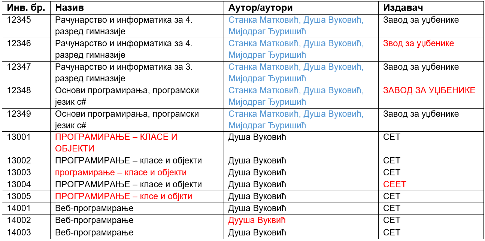
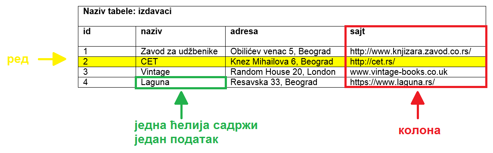
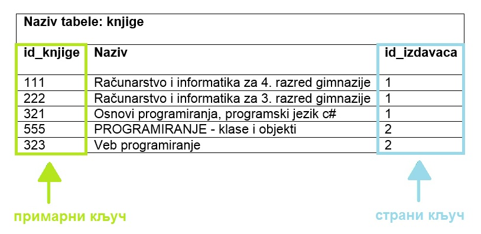
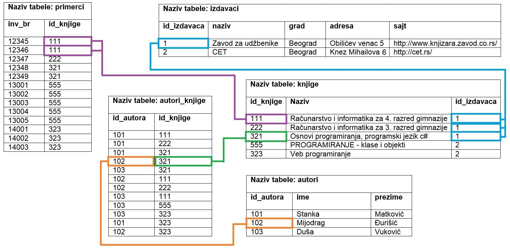
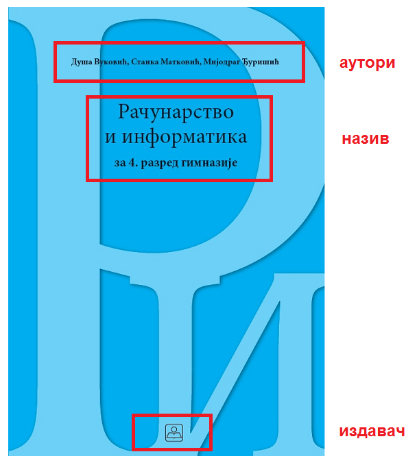

Основно о базама података
=========================

.. infonote::

 Сигурно користиш неку веб-платформу за гледање филмова, серија или за слушање музике. Да ли ти је некада „искочила“ 
 препорука за неки нови филм, серију или песму, a да je то било баш оно што се и теби потом допало? Није у питању 
 случајност. Сваки од ових система проучава велике количине података – прати навике корисника и анализира, на пример, 
 које је још филмове и серије гледао неко ко је погледао све што и ти пратиш, и онда ти препоручи баш оно што ће ти се 
 свидети. Било би лепо и корисно и да, када уђеш у библиотеку, добијеш подједнако добру препоруку за следећу књигу коју 
 ћеш прочитати. Ово би били само неки од примера употребе база података. Има их још прилично много. Да ли можеш да 
 препознаш где си све дошао у додир са базама података? 

 Додатна тема за размишљање је неодговорна употреба података. Да ли си чуо о познатим злоупотребама података? 
 Шта мислиш, зашто се то дешава и како можемо да будемо одговорни у коришћењу података? Да ли своје личне податке лако 
 дајеш другима? Да ли можда неки друг или другарица имају твоју лозинку? Зашто то није добро?

 Саветујемо ти да мало самостално истражиш добре примере употребе и обраде података, али да се информишеш и о могућим 
 опасностима и злоупотребама. 

У данашње време се свуда срећемо са великим количинама података, посебно када користимо информационе технологије. 
Подаци долазе у најразличитијим форматима. То могу да буду текстуални подаци, бројеви, слике, звучни записи, 
видео-записи, итд. Подаци се организују и чувају у базама података. **База података** је појам који користимо да у 
рачунарству назовемо систем који најчешће има велики број корисника, а служи за ефикасно и сигурно чување и обраду 
података. 

Посредно, преко апликација за рачунаре и мобилне уређаје, као и путем веб-сајтова, можете да видите и користите податке 
који се чувају у базама података. Базу података у данашње време има већина веб-сајтова, као и сваки дом здравља, пошта, 
банка или библиотека. На пример, следећи системи имају базе података:

- онлајн продаја (подаци: називи производа, произвођачи, цене...),
- веб-сајт аеродрома (подаци: ознаке летова, дестинације, долазно и одлазно време...),
- онлајн банка (подаци: лични подаци клијента банке, стање на рачуну, списак новчаних уплата и исплата...),
- друштвене мреже (подаци: лични подаци корисника, корисничка имена, фотографије, постови, листе пријатеља...),
- домови здравља (подаци: бројеви картона и лични подаци пацијената, датуми и извештаји са прегледа, датуми и описи болести, прописани лекови...),
- електронски дневник (подаци: лични подаци ученика, лични подаци наставника, називи школских предмета, датум и време одржаних часова, садржаји одржаних часова, изостанци ученика, датум и вредност добијених оцена...), итд. 

Узмимо, на пример, *библиотеку*. У библиотеци је много књига и за сваку књигу имамо више података који је описују: назив, 
аутор, издавачка кућа, година издања... Од сваке књиге можемо да имамо један, али можемо да имамо и више примерака, 
као што може да се види на слици која следи. Сваки примерак у библиотеци је обележен инвентарским бројем. Члановима 
библиотеке издајемо примерке књига које траже и водимо рачуна о томе када су узели књигу, и да ли су је вратили у року. 
Члан библиотеке се постаје након учлањења, процеса који подразумева да се оставе лични подаци као што су: име, презиме, 
адреса, број телефона, број личне карте... Као што може да се види, рад библиотеке подразумева рад са подацима, и то са 
подацима о књигама, члановима библиотеке, датуму издавања књига. Сви ови подаци су се обрађивали и пре но што су 
постојали рачунари, руком и на папиру. У данашње време свака библиотека је дигитализовала своје пословање, има рачунаре 
и има базу података и апликацију помоћу које користи ту базу. 

Можете, на пример, да мало разгледате онлајн библиотеку на адреси: http://www.vbs.rs/cobiss/

Узећемо, међутим, један мањи узорак да бисмо објаснили како се чувају и организују подаци у бази података. Издвојићемо само 13 
примерака пет различитих књига. Они су обележени на слици која следи.  

Прво што пада на памет је да се на једном списку поброје све књиге које се налазе на полици. Већ након набрајања свега 
неколико наслова, видимо да је ту много непотребног понављања. Како имамо пет примерака књиге „ПРОГРАМИРАЊЕ – класе и 
објекти“, уочавамо да пет пута понављамо исти сет података (назив, аутори, издавач). Свако непотребно понављање може 
да доведе до грешака, рецимо, у понеком реду назив може да буде исписан само великим словима, у неком само малим, 
може да дође до грешака у куцању приликом уноса. Што се више пута нешто непотребно понавља, већа је вероватноћа да 
се у неком понављању појави грешка. Много се боље концентришемо када неки податак уносимо само једном, а када исти 
податак уносимо више пута, после неког времена ће концентрација сигурно да посустане. У табели која следи црвеним 
словима су обележене грешке, плавим словима је обележен други проблем. Уколико књига има више аутора и сви су наведени 
заједно, нејасно је колико аутора има која књига, па би била неопходна додатна компликована програмерска обрада 
приликом претраживања „по имену аутора“, што је чест захтев у библиотеци. 

Да би се простор за грешке смањио колико је то год могуће, да би се уклонила непотребна понављања, да бисмо имали 
поуздан и ефикасан рад са подацима, подаци се чувају у **релационим базама података**. Основна јединица за организацију 
и чување података у релационој бази података је **табела**. Тако ће се, на пример, сви подаци о издавачима чувати у 
табели izdavaci. Табела се састоји од редова и колона. У једном реду се чувају подаци о једном издавачу. 
Конкретно, СЕТ је назив издавачке куће, и сви подаци о том издавачу се налазе у једном реду. Једна колона садржи 
једну врсту податка, на пример, у једној колони се чувају само адресе веб-сајтова издавача. Једна ћелија 
(пресек реда и колоне) садржи један податак. 

Уобичајно је да се за називе табела и колона користе слова енглеске абецеде. Тако можемо да видимо да се користи реч 
*izdavaci* као назив табеле у којој чувамо податке о издавачима. Неформално можемо да кажемо за такав начин писања наших 
речи да користимо „шишану латиницу“. Такође је уобичајно да се у називима табела и колона не користе размаци, већ да 
се на месту размака налази доња црта (_). Сами подаци које чувамо у табелама могу да буду и на нашој латиници и ћирилици. Даље у материјалима ће се углавном користити наша латинична слова или слова енглеске абецеде, а понегде и наша ћирилична слова, за податке који се налазе у табелама базе.

Генерално нам у пракси за сваку табелу треба једна колона преко које можемо једнозначно да одређујемо поједине редове 
у табели. Та колона се назива **примарни кључ** и најчешће у називу те колоне стоји id (идентификациони број). 
На претходној слици можемо да видимо, на пример, да је 2 идентификациони број издавачке куће СЕТ.

Сви подаци потребни за неко пословање, у овом случају библиотеку, распоређени су у више табела. **Страни кључ** служи 
да се табеле повежу. То је посебна колона помоћу које видимо како су подаци у једној табели, на пример подаци о књизи, 
повезани са подацима у другој табели, на пример са издавачима. На следећој слици може да се види да је 2 вредност 
шифре издавача (вредност страног кључа, *id_izdavaca*) за књигу „Веб-програмирање“. У табели у којој се налазе подаци 
о издавачима, видеће се да је СЕТ издавач са шифром 2 (вредност примарног кључа те табеле, *id*). На тај начин свака 
књига може да се повеже са издавачком кућом која ју је објавила. Вредности које се налазе у колони која је страни кључ 
увек одговарају вредностима које се налазе у колони која је примарни кључ друге табеле. 
 

Следи пример неколико табела које би имала база података библиотеке, дакле, део базе података. Табеле су попуњене са по 
неколико редова (укупно 13 примерака пет различитих књига). Права библиотека би имала много више унетих податка. 
Такође, база података библиотеке мора да има још неколико табела у којима би се чували подаци о члановима и 
изнајмљивању књига, тј. о позајмицама. 

Да бисмо илустровали како то повезивање функционише, на слици су различитим бојама означени неки примери веза међу 
подацима који се налазе у различитим табелама. Плавом бојом су обележене три књиге истог издавача са идентификационим 
бројем 1. Љубичастом бојом су приказана два примерка књиге са идентификационим бројем 111. А зеленом и наранџастом је 
обележено како је у бази сачуван податак о томе да је Мијодраг Ђуришић један од аутора књиге „Основи програмирања, 
програмски језик с#“. 

.. suggestionnote::

 Иако је ћирилично писмо сада већ доста присутно у информационо-комуникационим технологијама, није га 
 могуће баш свуда користити без потешкоћа. Дешава се да пошаљете имејл са ћириличним словима, а да особа која га је 
 примила види само кукице и друге чудне знакове. Можете, на пример, да погледате шта се дешава ако прекопирате линк 
 који је на ћирилици. Из тог разлога, у свим примерима табела и података ће се користити латинична слова. 

Подаци који се у животу виде заједно на једном месту у бази података се чувају у различитим табелама. 
Погледајмо, рецимо, корице примерка једне књиге. На тим корицама видимо назив књиге, као и основне податке о ауторима и 
издавачу. Сви ови подаци се у бази података, као што смо видели на илустрацији, чувају у четири табеле: 
knjige, autori, izdavaci и primerci. Процес којим се од описа реалног пословања, у овом случају библиотеке, и 
података који су потребни за то пословање долази до распоређивања података у различите целине назива се 
**пројектовање базе података**. Пројектовање је веома важно и подразумева детаљну анализу пословања, као и креирање 
модела на основу којег ће се креирати база података употребом конкретног система за управљање базама података. 
Како је резултат пројектовања модел базе, овај процес се још назива и **моделовање**.

Након што се креира база података, у њу се уносе подаци, а на основу свих унетих података се добијају разне корисне и 
неопходне информације. Те информације се активно користе у пословању које се служи базом података. Већину ових 
информација би било немогуће добити, или би било тешко брзо до њих доћи, без рачунара и база података. 

Примери информација које добијамо из базе података библиотеке:

- списак свих примерака књига који су тренутно издати (ове информације су важне да би се знало које књиге библиотека не може у датом тренутку да изда члановима који су дошли да позајме књиге),
- контакт информације чланова библиотеке који касне са враћањем књига (ове информације библиотека може да употреби да опомене чланове да врате позајмљене књиге), 
- списак књига које нико није позајмио у периоду од последње две године (ове информације библиотека може да употреби тако да заустави даље набављање примерака књига које чланови не позајмљују), 
- списак књига које су стално издате (ове информације библиотека може да употреби да би набавила више популарних књига које чланови желе да читају), 
- списак имена аутора чије књиге није читао конкретан члан библиотеке, али су његове књиге читали сви они чланови библиотеке који су до сада читали дела истих аутора као и тај члан (ове информације библиотека може да употреби да би члану дала препоруку ког новог аутора да узме да чита)...

