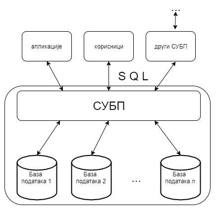

Систем за управљање базама података
===================================

.. infonote::

 Када желиш да слушаш музику на телефону или рачунару, имаш на располагању више различитих апликација које 
 можеш да користиш. Исто је и са базама података. Постоји више програма који нуде могућност креирања база података и 
 рада са њима, а овде ћемо укратко набројати оне најважније и описати шта им је то заједничко. 
 
Софтверски систем помоћу кога се формира и користи база података се назива систем за управљање базама података, 
скраћено **СУБП** (енгл. *database management system*, скраћено *DBMS*). Најпознатији системи за управљање базама 
података су:

- *Oracle Database*,
- *MySql*,
- *Microsoft SQL Server*,
- *PostgreSQL*,
- *IBM DB2*,
- *Redis*,
- *SQLite* итд.

Иако видимо да постоје различити системи различитих произвођача, основни принципи рада у њима су веома слични и током 
овог курса ћемо се држати онога што је заједничко и са мањим изменама применљиво у свим системима.  

Системи за управљање базама података својим корисницима пружају све услуге рада са подацима. Корисници су најчешће 
други програми, тј. апликације (на пример, пословне, мобилне или веб апликације), али и појединци који приступају 
подацима у облику у коме су подаци записани у бази (на пример, стручњаци за анализу података који у неким случајевима 
непосредно прегледају и користе податке из базе). Могућ је и сценарио у којем неколико СУБП-а међусобно комуницира, тј. 
да један СУБП приступа подацима из другог СУБП-а.

   
Системи за управљање се брину о смештању података на начин који обезбеђује:

- могућност што ефикаснијег приступа тим подацима у циљу њихове анализе, обраде и ажурирања,
- интегритет тих података (спречавају настанак грешака попут смештања неконзистентних и некоректних података),
- могућност да већи број корисника истовремено користи податке,
- могућност заштите приступа подацима, и слично.

Корисници база комуницирају са СУБП-ом коришћењем специјализованих језика у којима формулишу захтеве,тзв. **упите** 
(енгл. *query*) на које СУБП одговара. Такви језици се називају **упитним језицима**, а најпознатији и 
најраспрострањенији упитни језик је *SQL* (енгл. *structured query language*).

СУБП уводи поделу посла између програмера који праве сам СУБП и програмера који праве апликације (апликативни програмери). 
То значи да апликативни програмер упите формулише на апстрактном нивоу и не мора да зна све детаље о томе како СУБП те 
податке држи у меморији и датотекама. Апликативни програмер не мора да се бави детаљима ефикасног смештања података и 
алгоритмима приступа подацима, јер је СУБП тај који на основу упита одређује најефикаснији начин да се одређени упит 
изврши и да апликација добије податке које је захтевала.

Упитни језици су **декларативни**, што значи да се само описује који су подаци потребни, а СУБП је тај који аутоматски 
одређује како је најбоље доћи до тих података.

Модерни СУБП-и могу да чувају огромне количине података тако да је великом броју корисника омогућено практично 
истовремено коришћење тих података, често уз помоћ разнородних рачунарских система. На пример, централизовани 
електронски дневник на нивоу целе Србије чува податке о стотинама хиљада ученика и милионима њихових оцена тако 
да хиљаде наставника, ученика и родитеља, са својих рачунара, мобилних телефона, таблета и слично, имају готово 
тренутни приступ жељеним подацима.

