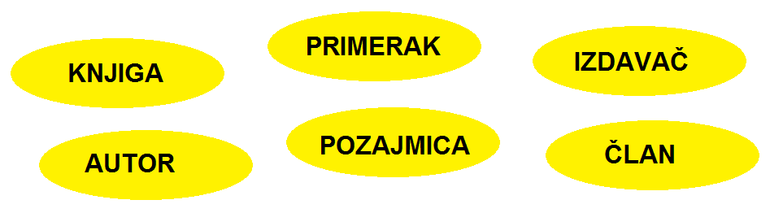
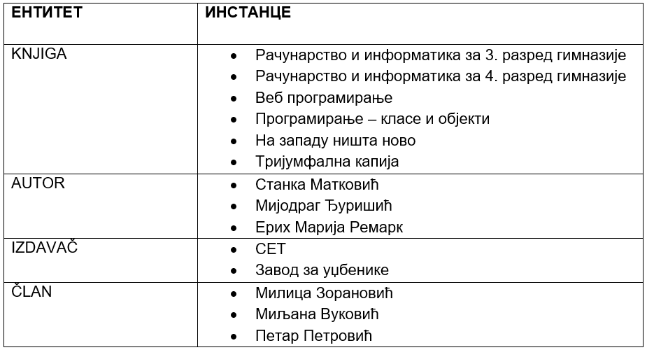

Пројектовање - ентитети и инстанце
==================================

.. infonote::

 Када помислиш на библиотеку, шта ти прво пада на памет? Вероватно су то појмови као: књига, аутор, члан, позајмица. 
 То је добра основа за почетак размишљања о креирању модела за базу података. 

 Уколико волиш музику, шта ти прво пада на памет ако имаш у виду неку онлајн платформу за пуштање или продају песама? 
 Које су твоје омиљене песме?

 У овој лекцији ћемо започети процес пројектовања базе за библиотеку. Кораци са којима ћеш се упознати кроз овај пример 
 помоћи ће ти и да креираш друге базе података, на пример, базу за продају дигиталних композиција, тј. песама.

Најчешће је случај да се подаци који се у животу виде заједно на једном месту, у **релационој бази података** чувају у 
различитим **табелама**. Процес којим се од описа реалног пословања и података који су потребни за то пословање 
долази до распоређивања података у различите табеле назива се **пројектовање базе података**. Пројектовање је изузетно 
важно и подразумева детаљну анализу пословања, као и креирање модела на основу којег ће се креирати база података 
употребом конкретног система за управљање базама података. Како је резултат пројектовања модел базе, овај процес се 
још назива и **моделовање**.

Основе моделовања ћемо објаснити кроз конкретан пример пословања – **библиотеке**. У библиотеци се налази велики број 
књига и за сваку од њих имамо више података који је описују: назив, аутор, издавачка кућа, година издања... 
Од сваке књиге можемо да имамо један, али можемо да имамо и више примерака, као што се види на слици која следи. 
Сваки примерак у библиотеци обележен је инвентарским бројем. Члановима библиотеке издајемо примерке књига које траже и 
водимо рачуна о томе када су узели књигу и да ли су је вратили у року. Члан библиотеке се постаје након учлањења, 
процеса који подразумева да се оставе лични подаци као што су: име, презиме, адреса, број телефона, број личне карте... 
Дакле, рад библиотеке подразумева рад са подацима, и то са подацима о књигама, члановима библиотеке, издавањем књига. 
Сви ови подаци су се обрађивали и пре но што су постојали рачунари, руком и на папиру. У данашње време свака библиотека 
је дигитализовала своје пословање, има рачунаре и има базу података и апликацију помоћу које користи ту базу. 

   
Први корак приликом моделовања је уочавање **ентитета**. Ентитет је важан за пословање и о њему чувамо податке. 
У случају библиотеке, потребно је да чувамо податке о књигама, примерцима, издавачима, ауторима, члановима, позајмицама 
и итд, па би ентитети би били: KNJIGA, PRIMERAK, IZDAVAČ, AUTOR, ČLAN, POZAJMICA... Уобичајно је да називе ентитета 
пишемо великим словима.

   
Сваки ентитет има своје **инстанце** са којима се сусрећемо у пословању. Инстанца је један конкретан примерак. 

У фази пројектовања, за називе ентитета можемо да користимо и наша латинична слова, као и размаке. У каснијим фазама 
ће од тих назива ентитета да се формирају називи табела које записујемо словима енглеске абецеде и без размака, тј. 
са доњом цртом (_) на месту где би био размак. Можемо, међутим, већ у овој фази и да користимо слова енглеске абецеде, 
па ће називи ентитета личити на називе табела које ћемо касније користити. Сами подаци у табелама могу бити записани и 
ћириличним словима, и латиничним, као и словима енглеске абецеде. 

Ентитети могу да буду јаки и слаби. Јаки ентитети су независни ентитети, као што су, у примеру библиотеке: књига, 
члан, издавач. Инстанце слабих ентитета не постоје без присуства инстанци јаких ентитета. На пример, један примерак 
постоји само уколико постоји књига чији је то примерак. Други пример, позајмица, могућа је само уколико постоји 
одређени члан који узима одређени примерак књиге. 