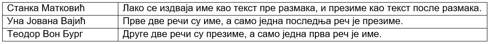

Пројектовање - атрибути
=======================

.. infonote::

 У бази података чувамо податке. Након што смо уочили најважније појмове који су важни за базу података, неопходно је 
 да се посветимо самим подацима. Размисли који су нам све подаци потребни уколико правимо базу података за библиотеку.

 Уколико би правио базу података за неку онлајн платформу за пуштање или продају песама, које податке би обавезно чувао 
 у тој бази?

 Да ли ти се десило да си попуњавао неки формулар на интернету и да ниси унео свој број телефона иако сигурно имаш 
 телефон? Да ли ти се десило да неки податак мораш да унесеш да би могао да наставиш даље? Да ли водиш рачуна о томе 
 које информације о себи дајеш другима, па и приликом попуњавања података на разним сајтовима? У овој лекцији ћемо 
 анализирати и то који су подаци неопходни, који нису, као и нека друга својства података које чувамо.  

Сваки ентитет је описан **атрибутима**. Вредности атрибута за конкретну инстанцу ентитета су подаци који се чувају у бази 
података. 

На  моделу се ентитет представља правоугаоником са заобљеним ћошковима. Назив ентитета је увек у једнини и наводи се 
унутар правоугаоника. Атрибути се такође набрајају унутар ентитета (правоугаоника) и означавају се једним од следећих 
симбола: # (примаран јединствени идентификатор), * (обавезан атрибут), или о (опцион атрибут). 

У фази пројектовања, за називе атрибута можемо да користимо и наша латинична слова, као и размаке. У каснијим фазама 
ће од тих назива ентитета да се формирају називи колона које записујемо словима енглеске абецеде и без размака, тј. са 
доњом цртицом (_) на месту где би био размак. Можемо, међутим, већ у овој фази и да користимо слова енглеске абецеде, 
па ће називи атрибута личити на називе колона које ћемо касније користити. Сами подаци у табелама могу бити записани и 
ћириличним словима, и латиничним, као и словима енглеске абецеде. 

.. image:: ../../_images/slika_202a.png
   :width: 780
   :align: center
   
Вредност сваког атрибута је најчешће један краћи податак, и то у великом броју случајева текстуални или бројевни. 
Вредности атрибута ime су краћи текстуални подаци (највише до неколико десетина знакова), на пример: Ana, Milica, 
Petar... Вредности атрибута godina rođenja су бројеви, на пример: 1998, 2001, 1979... Међутим, вредност атрибута 
може да буде и већи податак. На пример, сваки аутор има једну биографију, а то је најчешће текстуални документ од 
неколико стотина речи (више хиљада знакова). Члан библиотеке, на пример, може да остави своју фотографију. У свим 
примерима који следе ћемо се држати краћих и једноставнијих података (најчешће краћи текстуални податак или бројевни 
податак), али је потребно запамтити да се у базама података чувају и велики подаци, као што су: текст од неколико 
стотина речи, фотографија, па чак и звучни запис, видео, и сл. 

Име и презиме чувамо у бази одвојено. По потреби их лако спајамо. Често нам је потребна претрага или по имену, 
или по презимену, па нам је важно да имамо могућност да одвојено анализирамо имена, а одвојено презимена. Уколико 
бисмо име и презиме чували заједно као један податак, било би немогуће у неким ситуацијама да издвојимо шта је име, 
а шта презиме. 

   
Сваком ентитету у релационој бази података одговара једна табела. Називи табела су увек у множини. 
Следи пример како би изгледала табела knjige са унетим подацима, која би одговарала ентитету *KNJIGA*. 
Једној инстанци ентитета одговара један ред у табели. 

   
Један од атрибута обележимо тарабицом (#). Тај атрибут је **примарни јединствени идентификатор**. 
Вредност овог атрибута мора да постоји за сваку инстанцу и мора да је јединствена. Дакле, свака књига мора да има 
свој *ISBN* број; две књиге не могу да имају исти ISBN број. Неколико атрибута у истом ентитету могу да имају особину 
да за сваку инстанцу имају јединствену вредност. Један обележавамо тарабицом, а за остале морамо у додатној 
документацији да наведемо да имају ову особину да би се то касније реализовало додатним правилима у бази података. 

За ентитет *ČLAN* имамо следеће атрибуте који испуњавају услов да су њихове вредности јединствене за сваку инстанцу:

- број чланске карте – обележен тарабицом, примарни јединствени идентификатор, 
- број личне карте – два члана не могу да имају исти број личне карте.

За ентитет *IZDAVAČ* имамо следеће атрибуте који испуњавају услов да су њихове вредности јединствене за сваку инстанцу:

- *id_izdavača* – обележен тарабицом, примарни јединствени идентификатор, 
- *naziv* – два правна лица не могу да имају исти назив,
- *PIB* – два издавача не могу да имају исти ПИБ, порески идентификациони број, јединствени број који се додељује сваком правном лицу (фирми, компанији, предузећу),
- *matični broj* – два издавача не могу да имају исти матични број, јединствени број који се додељује сваком правном лицу.

Два члана могу да имају исто име, па чак и исто име и презиме, исту адресу становања и тако даље. Али мора да постоји 
атрибут по чијој вредности ћемо их разликовати. То је управо примарни јединствени идентификатор.

Иако, на пример, два издавача не могу да имају исти назив, тај атрибут никад нећемо изабрати као примарни јединствени 
идентификатор јер је у питању текстуални податак. Примарни јединствени идентификатор је најчешће број, зато што је 
бројеве у рачунарству лако упоређивати и сортирати. 

Примарни јединствени идентификатор може бити **природан** и **вештачки**. 

Природни су они који постоје и ван базе података. На пример, *ISBN* број се додељивао књигама и пре но што су постојали 
рачунари. Такођe, чланови библиотеке добијају чланске карте и бројеве чланских карата формиране на одређени начин 
независно од рачунара. Ове податке можемо да употребимо у рачунарству и да их у базама података искористимо као 
јединствене идентификаторе. За разлику од ових атрибута, *id_autora* и *id_izdavača* су бројеви који ће постојати само 
у бази података. 

У ситуацијама када постоје природни примарни јединствени идентификатори, увек можемо да уведемо вештачке. 
Тако смо за књиге и чланове могли да уведемо вештачке примарне јединствене идентификаторе: *id_knjige* и *id_člana*. 
У том случају би ентитети изгледали другачије, што је приказано на следећој илустрацији.

   
Табела *knjige* са унетим подацима, која би одговарала измењеном ентитету *KNJIGA*, такође би изгледала другачије. 
Кад је реч о рачунарском систему, рад са вештачким примарним јединственим идентификаторима је једноставнији. 

   
Друга подела примарних јединствених идентификатора је на **просте** и **сложене**. Сваки ентитет има увек тачно један 
примарни јединствени идентификатор, али он може да се састоји од једног атрибута (прост) или од комбинације неколико 
атрибута (сложен). Сви до сада наведени ентитети су имали просте примарне јединствене идентификаторе. Сложени 
идентификатор можемо да видимо на примеру ентитета *POZAJMICA*. Јединствена је комбинација атрибута који означавају 
који члан је коју књигу позајмио ког дана. Ова ситуација се другачије црта на моделу, али ће о томе бити више речи 
касније. 

.. image:: ../../_images/slika_202c.png
   :width: 300
   :align: center
   
Осим примарног јединственог идентификатора, сви остали атрибути се обележавају са:

- звездицом (*) – обавезни,
- кружићем (о) – опциони.

За сваки атрибут, на основу описа пословања, морамо да одлучимо да ли је обавезан, када одговарајући податак мора да се унесе у базу података, или није. 

Неки подаци морају да се унесу. На пример, нема смисла да упишемо члана у библиотеку ако немамо његово име и презиме. Књига мора да има назив. 

Опциони атрибути су или они за које може да се испостави да за неку инстанцу не постоје одговарајући подаци или, податак увек постоји, али за пословање није важан и не мора да се унесе у базу, или може накнадно да се унесе. Следи неколико примера опционих атрибута. 

Опциони атрибути и разлог зашто су опциони:
- број личне карте члана – млађи од 16 година немају личну карту,
- датум враћања за позајмицу – за примерке који се тренутно налазе изнајмљени код чланова немамо овај податак,
- имејл адреса – скоро свако је има, али библиотеци овај податак није важан, потребан им је број телефона, а имејл адресу чланови могу да оставе само уколико желе да добијају имејлове са промоцијама,
- веб-сајт издавача – можда неки издавач нема веб-сајт,
- ПИБ издавача – сваки издавач има ПИБ, али то није неопходан податак за библиотеку, може и накнадно да се унесе. 

