Пројектовање - везе
===================

.. infonote::

 Да би се избегла непотребна понављања и могућност грешке, подаци које чувамо у бази података су распоређени у 
 различите табеле које су повезанe, и важно је разумети те везе. 

 Да би се на прави начин обрадили подаци и из њих добиле корисне информације, неопходно је урадити правилно повезивање. 
 Разумевање веза је кључно када се бавимо релационим базама података.
 
Након што се уоче ентитети и наброје њихови атрибути, потребно је да се ентитети повежу. Свака веза спаја два различита 
ентитета или, искључиво у случају рекурзивне везе, ентитет сам са собом. Везе препознајемо у опису пословања као 
глаголе: аутор је написао књигу, члан је позајмио примерак, издавачка кућа је објавила књигу, и тако даље. 

Свака **веза** има: назив, опционалност и кардиналност. Назив је глагол који препознајемо у опису пословања. 

Опционалност нам говори да ли нека инстанца мора, или може, да буде у вези са инстанцом другог ентитета. Примери:

- књигу мора да напише неки аутор (обавезна веза), 
- члан може, али не мора, да позајми неку књигу (опциона веза),
- књигу мора да објави неки издавач (обавезна веза). 

Некад нам опционална веза служи и за то да можемо у одређеном редоследу да уносимо податке у базу. На пример, наравно 
да је аутор написао бар једну књигу, али ћемо ставити да аутор може, а не мора, да напише књигу (опциона веза), само 
зато да бисмо у базу одвојено прво унели податке о аутору, а затим податке о његовим књигама. Обавезна веза би нас 
условила да уз податке о аутору морамо да унесемо и податке о једној његовој књизи, а онда тај процес уноса не би био 
баш јасан и чист. Из овог разлога су опционе везе чешће на моделу. 

Кардиналност нам говори да ли је једна инстанца једног ентитета у вези са једном или са више инстанци другог ентитета. 
Примери:

- аутор је написао више књига (више),
- одређени примерак књиге је објавио тачно један издавач (један),
- један издавач је објавио више књига (више).

Према кардиналности везе се деле на:

- један-према-један – 1:1,
- један-према-више – 1:М,
- више-према-више – М:М.

Као ознака за „више“ може да се користи слово М (енг. *Many*), или слово N (слово које користимо за обележавање скупа 
природних бројева) или ознака за бесконачно (∞). 

Најчешћа веза у релационим базама података је веза **један-према-више, 1:М**.

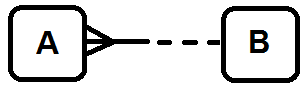
   
Ову везу могу да опишу две реченице:

1. Свакo А мора да буде у вези да тачно једним В. 
2. Свакo В може, а не мора, да буде у вези са једним или више А. 

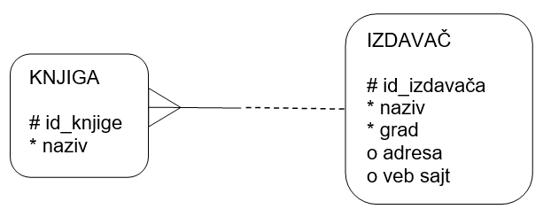
   
Ову везу могу да опишу следеће две реченице:

1. Сваку књигу мора да објави тачно један издавач. 
2. Сваки издавач може, а не мора, да објави једну или више књига. 

.. suggestionnote::

  Овај модел је исправан уколико се узме у обзир претпоставка да је све примерке исте књиге у библиотеци објавио исти 
  издавач. Уколико се у библиотеци налазе примерци исте књиге различитих издавача, ови ентитети би морали да се повежу 
  везом више-према-више. **Запамтити да је веома важно анализирати конкретан пословни захтев и креирати модел који одговара управо њему!** 
  Две библиотеке могу да имају различите облике пословања. Једна може да инсистира да се узимају имејл адресе свих 
  чланова, а другој то може да буде небитно, и тако даље. Модел се креира према детаљном опису пословања. 
  
Описани део модела се у релационој бази приказује како је илустровано на следећој слици.

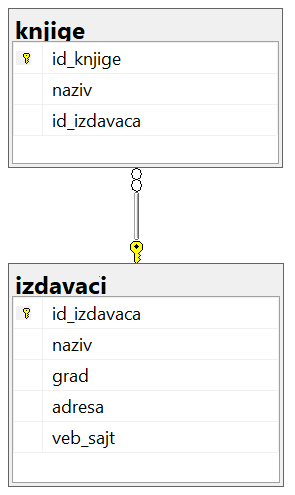
   
Уз податке о свакој књизи се чува и идентификациони број издавача тако да се зна који издавач је објавио коју књигу. 

На следећој слици је приказано како би ове табеле, повезане кључевима и попуњене подацима, изгледале у бази података. 
Јасно се види да један издавач може да објави више књига. 

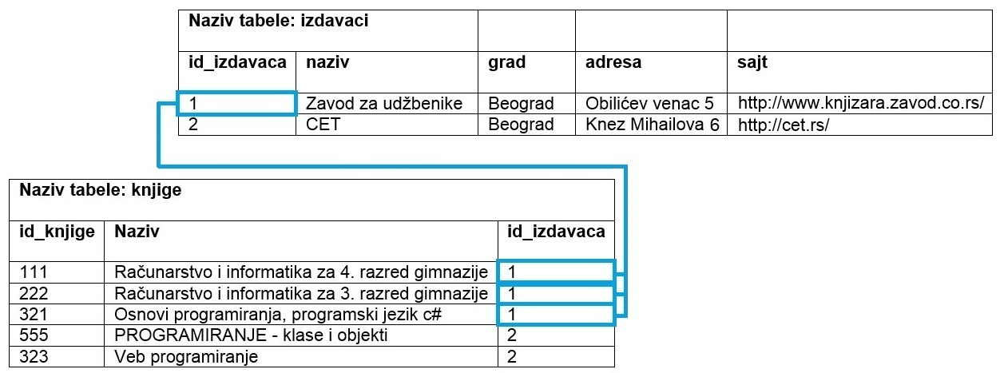
   
Веза један-према-један је изузетно ретка. Следи пример у којем издвајамо податке о личности члана библиотеке у један ентитет, 
а податке о његовом чланству у други (особа и улога).

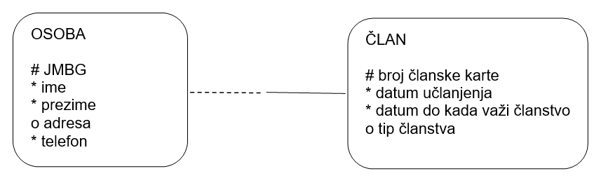
   
Веза више-према-више се баш често среће и одговара многим ситуацијама у оквиру разних пословања. 
Ако школске уџбенике посматрамо као књиге, приметићемо да свака књига има више аутора, а аутори најчешће током свог 
рада напишу више књига.  

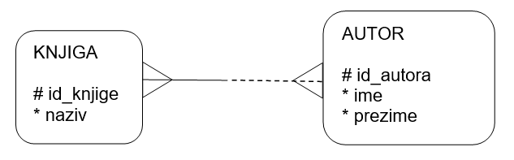
   
Овакву везу је немогуће реализовати у релационој бази података, па се на моделу уклања и уместо ње се поставља 
нови ентитет. Уколико нема бољег решења, назив новог ентитета може да буде комбинација назива почетна два ентитета 
повезана везом више-према-више.

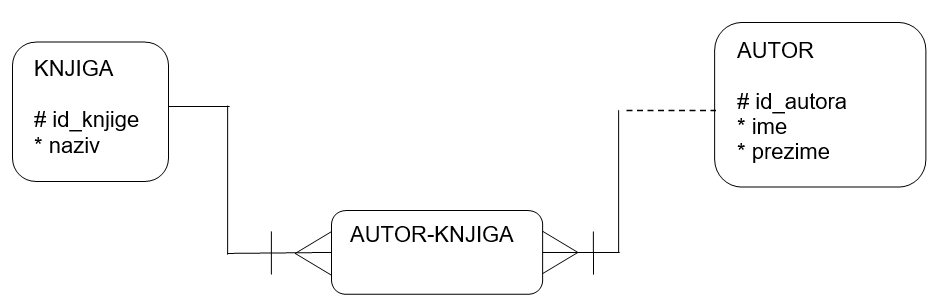

Кратке цртице којима су везе прецртане значе да везе учествују у примарном јединственом идентификатору новог ентитета. 
Тако је примарни јединствени идентификатор новог ентитета који је дошао на место везе типа М:М, ентитета *АUTOR-KNJIGA*, 
заправо сложен и представља комбинацију примарних јединствених идентификатора ентитета *АUTOR* и *KNJIGA*: 
(*id_knjige*, *id_autora*). 

Описани део модела се у релационој бази приказује како је илустровано на следећој слици.

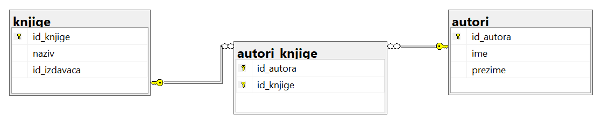
   
На следећој слици је приказано како би ове табеле, повезане кључевима и попуњене подацима, изгледале у бази података. 

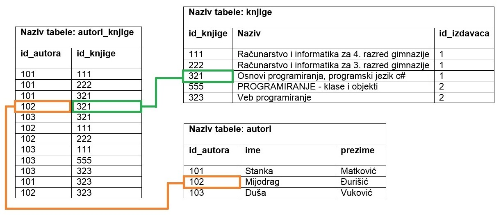
   

**Напомена**: Овај модел је исправан уколико се узме у обзир претпоставка да библиотека чува уџбенике. 
Ако се у библиотеци налазе само романи, онда је веза ентитета *AUTOR* и *KNJIGA* могла да буде један-према-више 
(роман има једног аутора). 

Веза више-према-више често има своје атрибуте који је описују. Погледајмо пример са позајмљивањем књига.  

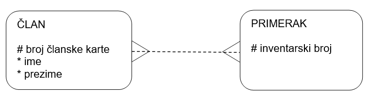
   
Овакву везу је немогуће реализовати у релационој бази података, па се на моделу уклања и уместо ње се поставља нови 
ентитет, али у овом случају тај ентитет има своје атрибуте који описују позајмицу. 

.. image:: ../../_images/slika_204k.png
   :scale: 80 %
   :align: center
   
Кратке цртице којима су везе прецртане значе да везе учествују у примарном јединственом идентификатору новог ентитета. 
Тако је примарни јединствени идентификатор новог ентитета који је дошао на место везе типа више-према-више, ентитета 
*POZAJMICA*, заправо сложен и представља комбинацију примарних јединствених идентификатора ентитета *ČLAN* и *PRIMERAK*: 
(*broj članske karte*, *inventarski broj*). 

Комбинација ове две вредности мора да буде јединствена, тако да није могуће да се понови да исти члан позајми исти 
примерак више пута. Уколико то желимо да дозволимо, онда можемо датум узимања књиге да додамо као треће поље сложеног 
примарног идентификатора. У следећем примеру је примарни јединствени идентификатор ентитета *POZAJMICA* комбинација:
(*broj članske karte*, *inventarski broj*, *datum uzimanja*).

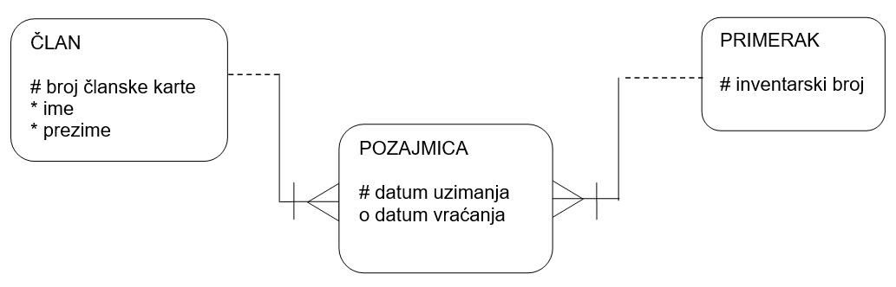
