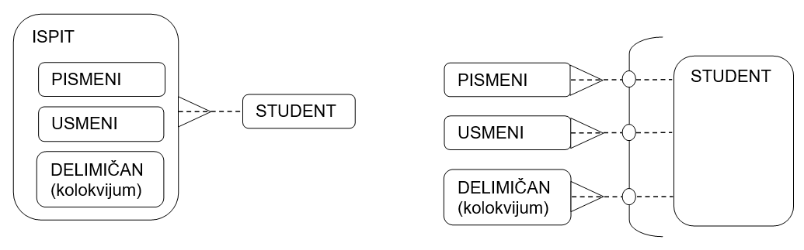
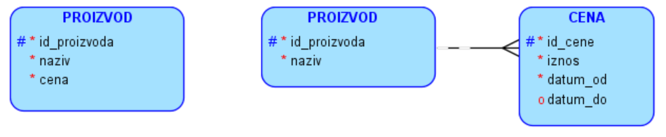

Пројектовање - посебне ситуације на моделу
==========================================

.. infonote::

 Да ли је *цена* атрибут или је потребно да имамо посебан ентитет посвећен цени? Нема тачног и коначног одговора на 
 ово питање. Одговор зависи од потреба пословања и неопходна је детаљна додатна анализа. 

 Кораци приликом пројектовања су: уочавање ентитета, набрајање атрибута за сваки ентитет и повезивање ентитета везама. 
 Постоје, међутим, одређене ситуације које захтевају посебну пажњу и овде ћемо објаснити неке као што су: надтип са 
 подтиповима, лук, рекурзивна веза и чување промене података кроз време. 

Сваки логички модел, дијаграм ентитета и веза имају ентитете и везе. Многе реалне ситуације можемо да представимо 
управо таквим једноставним моделима. Постоје, међутим, неке ситуације за које су нам потребна посебна решења и те 
ситуације ће овде бити објашњене. 

Надтип и подтипови
------------------

Уколико неколико ентитета има много истих атрибута и учествује у истим везама, можемо да их прикажемо као један ентитет 
са подтиповима. 

   
Подтипови морају да покривају све могуће случајеве. Дакле, ово је добар модел уколико пословање за које креирамо базу 
података има само аутомобиле, камионе и аутобусе. Уколико има и, на пример, моторе, овај модел није добар и морао би 
да се прошири додавањем још једног подтипа. 

Подтипови морају да буду међусобно искључиви. У овом случају је то јасно: једно возило је ИЛИ аутомобил ИЛИ аутобус ИЛИ 
камион, тј. врло јасно може да се категоризује и не може да упадне у два од наведених подтипова истовремено. 

У бази података се ова ситуација са   приказаног модела реализује на један од следећа два начина:

- једна табела у којој се чувају подаци о свим возилима, 
- онолико табела колико има подтипова. 

Следи илустрација како би изгледала једна табела – *vozila*. 

   
Следи илустрација случаја са више табела: *automobili*, *autobusi* и *kamioni*. 

   
Да ли ћемо користити надип са подтиповима зависи од тога да ли постоји већи број заједничких атрибута у односу на 
број појединачних атрибута, и да ли постоји већи број заједничких веза у односу на везе у којима учествују подтипови.  

У случају школе, на пример, наставнике и ученике нећемо ставити у заједнички надтип OSOBA, зато што, и поред великог 
броја истих атрибута (име, презиме, ЈМБГ, адреса, телефон, датум рођења, место рођења...) учествују у потпуно 
различитим везама (наставник организује и држи наставу, ученик одговара и добија оцену...).

Лукови
------

Луковима се означавају међусобно искључиве везе. Често исту ситуацију коју можемо да прикажемо уз помоћ лука можемо да 
прикажемо користећи надтип са подтиповима. Због прегледности илустрације, изостављени су атрибути на следећој слици. 
Слика представља следећу ситуацију: студент полаже ИЛИ писмени ИЛИ усмени испит ИЛИ ради колоквијум. 

   
Хијерархија и рекурзија
-----------------------

Најчешће исту ситуацију коју можемо да прикажемо као хијерархију, можемо да прикажемо користећи рекурзију, тј. 
рекурзивну везу. Погледајмо ситуацију са хијерархијом запослених у неком предузећу. Рекурзивна веза у овом случају се 
описује следећом реченицом: запослени има свог менаџера, тј. један запослени је менаџер другом запосленом. 

Рекурзивна веза је увек опциона целом дужином због оних на дну и врху хијерархије. Особа на врху нема менаџера, а 
особа на дну није никоме менаџер.

Моделовање промена кроз време
-----------------------------

Уколико, на пример, цену производа чувамо као атрибут, у сваком тренутку знамо само актуелну цену. Не знамо када је 
промењена, не знамо који је био износ претходне, нити знамо колико често се мењала или да ли се уопште мењала у неком 
дужем протеклом периоду. Уколико нам ове информације нису ни важне, цена може да остане атрибут и модел ће остати 
једноставан. Уколико су нам ове информације важне, морамо да додамо ентитет помоћу којег ћемо пратити промене цене 
кроз време. Додавање ентитета компликује модел, па самим тим и будућу базу података, па треба размислити да ли су 
нам ти подаци потребни, да ли су важни за пословање или не. 

Датум када је нека цена почела да важи увек мора бити мањи од датума до када је важила. Датум до када нека цена важи 
мора да буде опциони атрибут због тренутне цене, за коју знамо када је почела да важи, али ћемо датум до када важи 
знати тек када се измени. 
 

