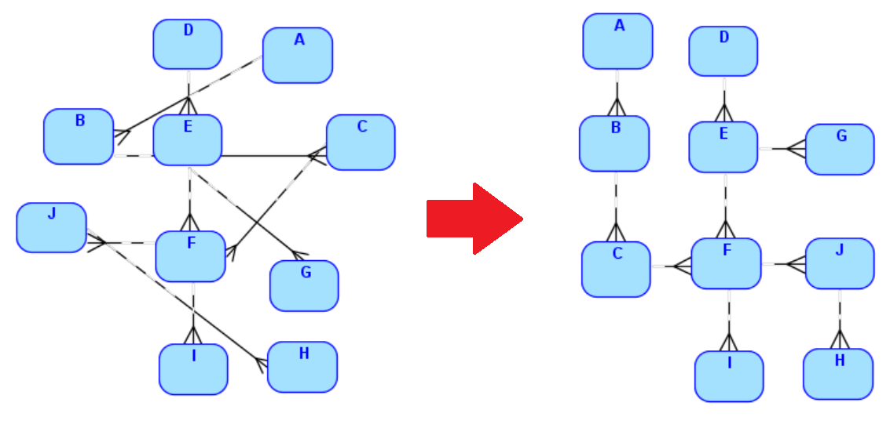
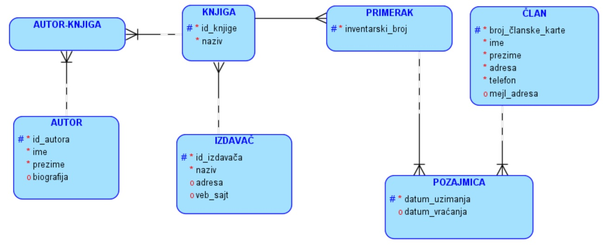
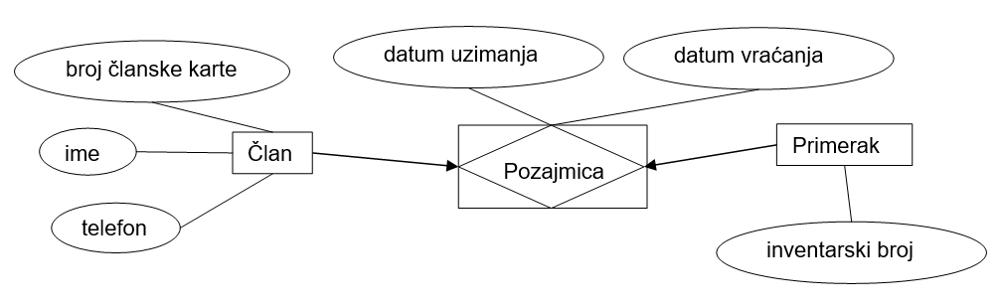

Пројектовање - модел и додатна документација
============================================

.. infonote::

 Резултат пројектовања је модел на основу којег ће се креирати база података. Не може све да се представи на моделу и 
 неопходно је да се обезбеди и додатна документација. 

 Постоје различити алати и начини цртања модела, али су кораци у пројектовању увек исти. Да ли можеш да набројиш те 
 кораке које смо описали у претходним лекцијама?
 
Модел - дијаграм ентитета и веза
--------------------------------

Модел се назива још и **дијаграм ентитета и веза**, ЕР дијаграм, или ЕРД (енг. *ERD, Entity Relationship Diagram*). 
У литератури се користи још и назив **модел објекти-везе**. 

На дијаграму морамо да прикажемо:

- ентитете,
- атрибуте (обавезне и опционе),
- примарне јединствене идентификаторе,
- везе.  

За цртање дијаграма може да се користи алат *Data Modeler*.

Када се црта модел, изузетно је важно да буде прегледан. Линије које представљају везе не смеју да се пресецају. 
Ентитети који учествују у много веза морају да буду позиционирани централно, да би око њих могли лепо и прегледно да се 
распореде ентитети који су са њима у вези. 

Модел библиотеке креиран у овом алату је приказан на следећој слици. 

   
Додатна документација
---------------------

Сва правила пословања која смо до сада видели могу да се нацртају на моделу. Таква правила се зову **структурна правила**. 
Нека правила није могуће нацртати. Њих документујемо да би касније била обрађена програмерски. Правила која не могу да 
се нацртају на моделу већ морају да се документују називају се **процедурална правила**. 

На пример, можемо да нацртамо да један члан библиотеке може да позајми више књига и то је структурно правило. 
Оно што не можемо да нацртамо већ морамо да документујемо да би касније било обрађено програмерски, јесте правило да у 
једном тренутку члан библиотеке не може да позајми више од три примерка различитих књига, правило које свака библиотека 
има. 

У додатној документацији је потребно навести сва процедурална правила, али и друга запажања до којих смо дошли приликом 
моделовања. 

Следи пример додатне документације за нацртани модел за базу података за библиотеку. 

- Назив издавача је јединствен. Два издавача, као правна лица, не могу да буду регистрована са истим називом. 
- Адреса веб-сајта издавача је јединствена. Два издавача не користе исти веб-сајт. 
- Датум узимања мора да буде пре датума враћања књиге у библиотеку. 
- За један примерак књиге, само за једну позајмицу не мора да буде попуњен датум враћања, и то је текућа позајмица. Све остале, старије позајмице тог примерка морају да буду комплетне, тј. морају да буду унети и датум узимања и датум враћања. 
- У једном тренутку члан библиотеке не може да позајми више од три примерка различитих књига. Тек када неки примерак врати у библиотеку, може да позајми нови. 
- Примерак који је тренутно код неког члана не може да се изда другом члану. Тек када је примерак враћен, стоји на располагању за нову позајмицу. 
- Телефон и адреса члана библиотеке не морају да буду јединствени. Исти телефон и адресу могу да оставе родитељ и мало дете, а посматрају се као два различита члана библиотеке. 

Други алати и процес пројектовања
---------------------------------

Постоје и други начини цртања модела. На следећој слици се виде исте ситуације које смо већ размотрили, али нацртане 
на други начин. 

За који год да се начин цртања модела одлучимо, важно је да се придржавамо доследно изабраних правила цртања, а 
кораци приликом пројектовања су увек исти:

1. уочавање ентитета,
2. набрајање атрибута за сваки ентитет,
3. повезивање ентитета везама.

Правила која су важна приликом пројектовања:

- на моделу морају да се налазе побројани сви подаци потребни за посао,
- сваки податак мора да се појави тачно једном (нема понављања истог податка на више места),
- подаци су распоређени по целинама (ентитетима) и сваки се налази тачно тамо где га очекујемо. 
