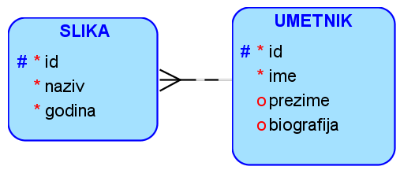

Задаци - упутство
=================

Креирати дијаграм ентитета и веза употребом алата *Oracle Data Modeler* за следећи проблем. 

Једна уљана слика има назив и годину настанка. Уметник може да наслика више слика. За уметника обавезно уносимо име, 
а можемо да унесемо и презиме, уколико је познато, и биографију, ако је доступна. 

Након покретања алата кликнути десни тастер миша над ставком *Logical Model* и изабрати *Show*. 

   
Уочити да је потребно нацртати два ентитета и везу између њих. Нови ентитет додајемо помоћу дугмета *New Entity*.

   
Када се на површину за цртање постави нови ентитет, појављује се дијалог у који можемо да унесемо назив ентитета и списак атрибута. 
Прво уносимо назив ентитета. 

Атрибуте додајемо један по један након клика на знак „**+**“. Уносимо назив атрибута. Штриклирамо *Primary UID* за онај 
атрибут који је примаран јединствени идентификатор, а *Manadatory* за обавезне атрибуте. Означимо *Logical* као *Data Type* и 
за сваки атрибут изаберемо тип података.

 
Када додамо све атрибуте, кликнемо на дугме OK и појавиће се ентитет.  

Додамо и следећи ентитет, а након тога треба додати и веза између њих. Веза 1:N се додаје тако што се прво кликне на 
ентитет који је на страни „један“, а затим на ентитет који је на страни „више“. У овом случају се прво кликне на 
ентитет UMETNIK, а затим на ентитет SLIKA, зато што је један уметник насликао више слика. 

   
Коначни дијаграм је приказан на следећој слици. 

Описани алат за потребе учења је *Oracle SQL Developer Data Modeler*, а након прихватања услова употребе, може бесплатно да се преузме са следеће адресе:

https://www.oracle.com/database/sqldeveloper/technologies/sql-data-modeler/

 
