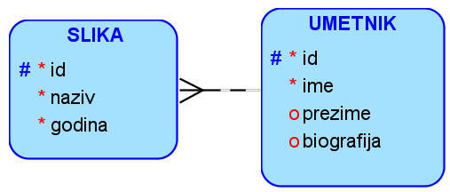
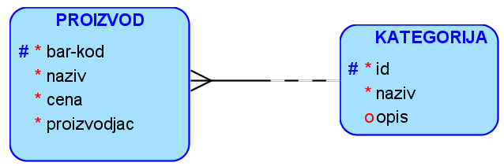
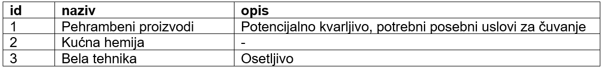
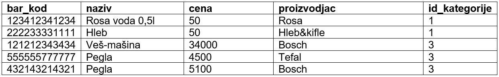

Задаци са два ентитета
======================

**Нацртати модел за базу података – два ентитета и веза 1:М**

.. questionnote::

 1. Једна уљана слика има назив и годину настанка. Уметник може да наслика више слика. За уметника обавезно уносимо име, 
 а можемо да унесемо и презиме, уколико је познато, и биографију, ако је доступна. 

.. questionnote::
   
 2. Свака веш-машина која се продаје у продавници беле технике има свој бар-код, назив и цену. Произвођач веш-машина 
 има назив, адресу седишта и ПИБ (порески идентификациони број). Један произвођач производи више различитих модела 
 веш-машина. 

.. reveal::  Задатак 212.2
   :showtitle: Прикажи решење 
   :hidetitle: Сакриј
	
   .. image:: ../../_images/slika_212b.png
     :width: 500
     :align: center

.. questionnote::
	
 3. Сваки производ има бар-код, назив, цену и назив произвођача. Производ припада одређеној категорији (бела техника, 
 кућна хемија, прехрамбени производи...). Приказати и како би изгледале табеле попуњене подацима у релационој бази 
 података. 	

   
Табела: kategorije

Табела: proizvodi

Нерешени задаци
---------------

1. Продајни салон продаје возила разних произвођача. Сваки произвођач аутомобила има назив, адресу седишта 
(улица и број, град) и адресу веб-сајта. Kако су произвођачи аутомобила правна лица, имају додељен ПИБ (порески 
идентификациони број). Произвођач аутомобила производи више различитих модела. Сваки модел има ознаку, јачину мотора, 
број врата и цену.  

2. Једна компанија може да поседује више службених возила. Аутомобил (један комад) има једног власника који је правно 
лице (компанија). За власника аутомобила су забележени следећи подаци: назив, ПИБ (порески идентификациони број), адреса 
(улица и број, град) и директор (име и презиме). Аутомобил је одређеног модела одређеног произвођача, и има још податке 
o броју регистарске таблице и цени. 

3. Продавница продаје телефоне. Сваки произвођач телефона има назив, адресу седишта (улица и број, град) и адресу 
веб-сајта. Kако су произвођачи правна лица, имају додељен ПИБ (порески идентификациони број). Произвођач производи 
више различитих модела. Сваки модел има ознаку, капацитет меморије, број мегапиксела предње камере и цену.  

