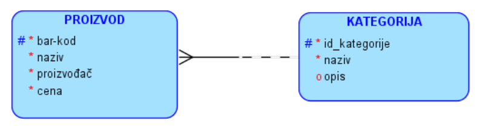
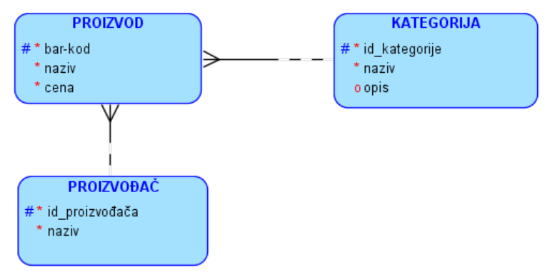
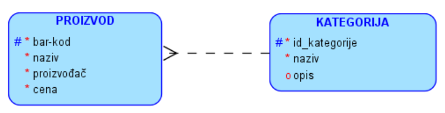
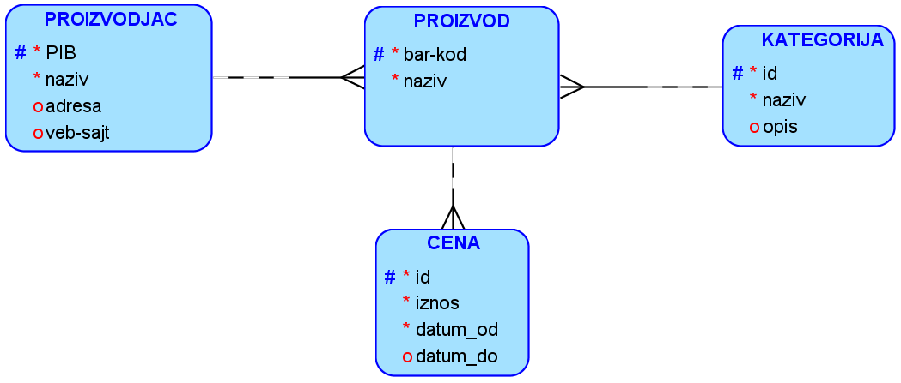
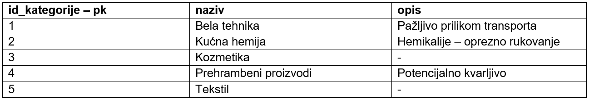
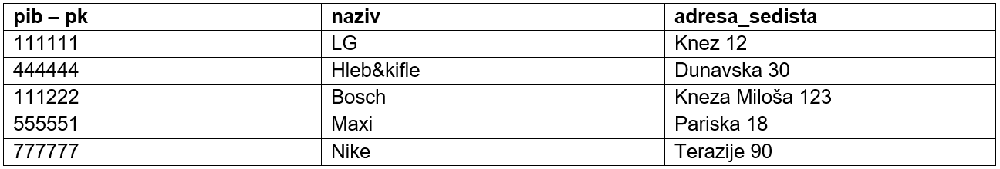
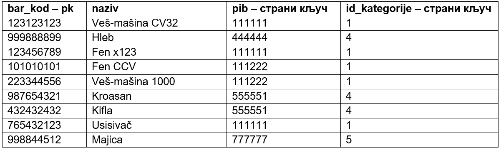
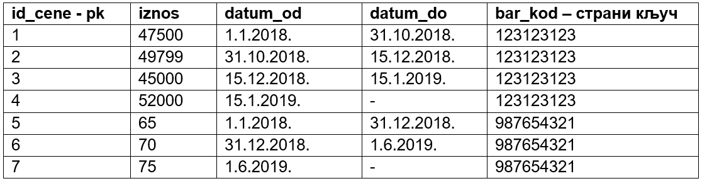

Задаци 1-М
==========

**Нацртати модел за базу података – све везе су 1:М**

.. questionnote:: 

 1. Сваки производ има бар-код, назив, цену и знамо име његовог произвођача. Производ припада одређеној категорији 
 (бела техника, кућна хемија, прехрамбени производи...). Свака категорија може да има и кратак опис. 

   
Како, према захтеву, за производ треба да региструјемо само назив његовог произвођача, и немамо друге податке о 
произвођачу, може да буде прихватљиво решење да тај назив буде атрибут ентитета PROIZVOD. Пошто нема додатних захтева 
за цену, цена такође може да буде атрибут. 

Можда у случају производа не желимо да понављамо податке о произвођачу, чак ни када је једини податак о произвођачу 
његов назив. Један од разлога је уштеда простора. Идентификациони број произвођача заузима мање места него назив, па 
када се идентификациони број често понавља уместо целог назива, може се уштедети простор. Још важније, понављањем 
назива произвођача ризикујемо словне грешке, које нарушавају интегритет података и воде ка погрешним резултатима 
претраге. Због свега тога, има смисла и да имамо посебан ентитет за произвођача. 

Уколико производ не морамо да распоредимо у категорију, веза између ентитета PROIZVOD и ентитета KATEGORIJA ће бити 
опциона целом дужином, како је то приказано на следећој слици. 

.. questionnote:: 
   
 2. Сваки производ има бар-код, назив и цену. Производ припада одређеној категорији (бела техника, кућна хемија, 
 прехрамбени производи...). Произвођач има назив, адресу седишта и ПИБ (порески идентификациони број). Један произвођач 
 производи више различитих производа. Чувамо и промене цена једног производа током времена. За сваки износ знамо датум 
 од када је важила та цена. Потребно је да чувамо и датум до када је важила та цена, и тако за све цене које је производ 
 имао у прошлости. Приказати и како би изгледале табеле попуњене подацима у релационој бази података. 

   
Како, према захтеву, треба да региструјемо више података о сваком произвођачу, неопходно је додавање новог ентитета 
PROIZVODJAC. Исто важи и за цену. Како за сваку цену треба да памтимо од када до када је важила, цена неће бити 
атрибут, већ посебан ентитет. 

**ДОКУМЕНТАЦИЈА**

- Назив категорије је јединствен. Не постоје две категорије са истим називом. 
- Назив произвођача је јединствен. Два произвођача не могу да се региструју под истим именом. 
- Веб-сајт произвођача је јединствен. Не постоје два произвођача који имају исту адресу веб-сајта. 
- За један производ интервали важења појединачних цена се надовезују и нема преклапања. Само један интервал нeма попуњен датум до када та цена важи и то је за актуелну цену. 

Табела: kategorije

   
Табела: proizvodjaci

Табела: proizvodi

   
Табела: cene   

.. questionnote:: 

 3. Сваки произвођач аутомобила има назив и адресу седишта. Произвођачи аутомобила су правна лица којима су додељени 
 ПИБ (порески идентификациони број) и матични број. Произвођач аутомобила производи више различитих модела. 
 Сваки модел има своју ознаку, јачину мотора, број врата и тип горива. Аутомобили су подељени у категорије: лимузина, 
 караван, кабриолет... Приказати и како би изгледале табеле попуњене подацима у релационој бази података. 

.. reveal::  Задатак 213.3
   :showtitle: Прикажи решење 
   :hidetitle: Сакриј

   **Решење:**
   
   .. image:: ../../_images/slika_213e.png
      :width: 500
      :align: center

   **ДОКУМЕНТАЦИЈА**

   - Назив категорије је јединствен. Не постоје две категорије са истим називом. 
   - Назив произвођача је јединствен. Два произвођача не могу да се региструју под истим именом. 
   - Матични број произвођача је јединствен. Два произвођача не могу да имају исти матични број.

   .. image:: ../../_images/tabela_213e.png
       :width: 250
       :align: center 

   Табела: proizvodjaci

   .. image:: ../../_images/tabela_213f.png
       :width: 700
       :align: center 

   Табела: proizvodi

   .. image:: ../../_images/tabela_213g.png
       :width: 780
       :align: center 
       
.. questionnote:: 
   
 4. Аутомобил (један комад) има једног власника. За власника аутомобила су забележени следећи подаци: име, презиме, 
 ЈМБГ, број личне карте и адреса становања. Аутомобил је комад одређеног модела и има следеће посебне податке: број 
 шасије, број мотора и боју. Уколико је регистрован, познат је и број регистарских таблица. Сваки модел има своју 
 ознаку, назив произвођача, јачину мотора, број врата и тип горива.

.. reveal::  Задатак 213.4
   :showtitle: Прикажи решење 
   :hidetitle: Сакриј

   **Решење:**

   .. image:: ../../_images/slika_213f.png
     :width: 500
     :align: center

   **ДОКУМЕНТАЦИЈА**

   - Број мотора је јединствен. Два аутомобила не могу да имају исти број мотора. 
   - Број регистрације је јединствен. Два аутомобила не могу да имају исти број регистарских таблица. 
   - Број личне карте је јединствен. Две особе не могу да имају исти број личне карте. 

Нерешени задаци
---------------

1. Ветеринар чува податке о кућним љубимцима који долазе на прегледе. Сваки љубимац има име, годину рођења и припада 
одређеној врсти. Љубимац може, али не мора, да буде чипован. У случају да је чипован, познат је серијски број чипа. 
Врста има назив и опис. За сваког љубимца је забележен тачно један власник – једна особа која је одговорна. За власника 
се уносе следећи подаци: име, презиме, адреса и телефон. Један власник може да има и неколико кућних љубимаца.   

2. Роман има једног аутора (писац који је написао роман), назив и годину настанка. У књижари се продају само најновија 
издања романа. Иако је роман могао раније да има и друге издаваче, за тренутно издање је задужена тачно једна издавачка 
кућа. Свака издавачка кућа има назив, адресу седишта и веб-сајт. Издавачке куће су правна лица којима су додељени ПИБ 
(порески идентификациони број) и матични број. За аутора су нам познати: име, презиме, година рођења, држава рођења и, 
ако је то случај, година смрти.   

3. Школа страних језика организује курсеве. Сваки курс има свој назив, укупан број часова, план и програм. Један курс 
води један предавач, док исти предавач може да води и неколико различитих курсева. Предавач је запослен у школи и 
познате су његове контакт информације, као и број текућег рачуна и датум од када ради у школи. Исти курс може више 
пута да се реализује и за сваку реализацију имамо датум почетка, датум завршетка и број полазника. 

4. Фудбалски клуб има неколико различитих група. За сваку групу су познати најмлађе и најстарије годиште чланова. 
Kлуб има неколико тренера. Тренер је запослен у клубу и познате су његове контакт информације, као и број текућег 
рачуна и број тренерске лиценце. Један тренер може да води и неколико група, али једну групу води само један тренер. 
Свака група броји више чланова, док један члан може да буде члан само једне групе према свом узрасту. Чланови приликом 
уписа достављају своју документацију и клуб бележи следеће податке: датум и место рођења, име једног родитеља, адресу 
становања и телефон. 

5. Удружење таксиста води евиденцију о свим вожњама. Таксиста је запослен у удружењу и познате су његове контакт 
информације, као и број текућег рачуна и број возачке дозволе. За сваку вожњу се бележе датум, време почетка, дужина 
трајања, почетна локација и дестинација. Вожња се обавља по одређеној тарифи. За сваку тарифу су познати назив (дневна, 
ноћна, празнична, градска, ванградска и сл.), опис и цена по минуту. 

6. У компанији која се бави маркетингом се води евиденција о свим обављеним позивима. Позиве обављају запослени, а за 
сваког од њих су познате контакт информације, број текућег рачуна и датум запослења. Запослени су распоређени по 
секторима у фирми. Сваки сектор има назив, адресу на којој се налази и телефонски број централе (сви запослени у том 
сектору имају исти број централе, и са тог броја позивају клијенте, а имају различите локале). Евиденција позива садржи 
позвани број, време почетка и дужину тајања разговора. 

