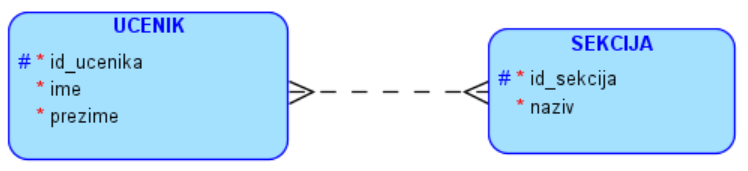
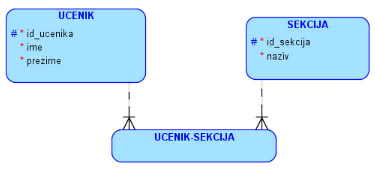
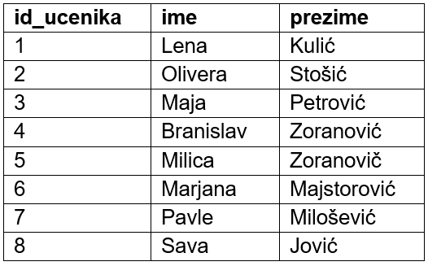
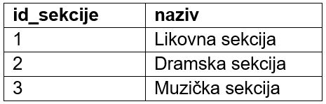
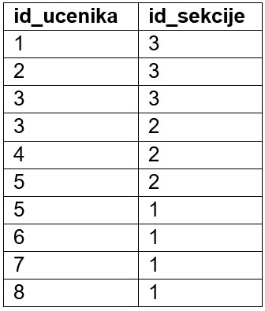
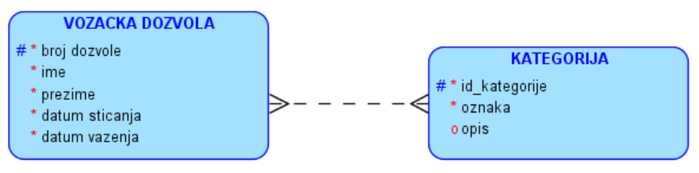
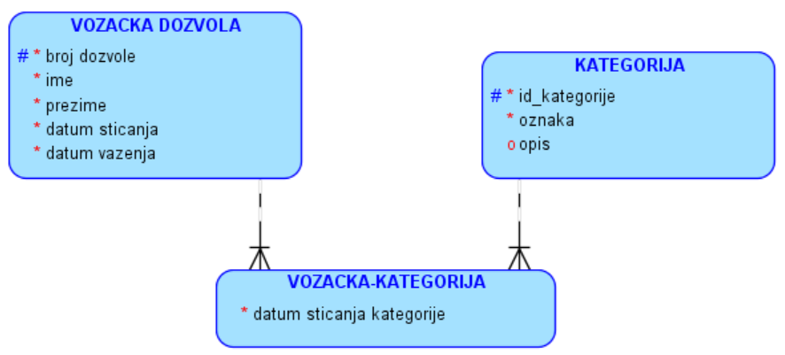

Задаци M-M
==========

**Нацртати модел за базу података – примери везе M:М**

.. questionnote:: 

 1. У школи постоји неколико секција, као што су, на пример: ликовна секција, драмска секција, музичка секција и сл. 
 Један ученик може да упише и више различитих секција уколико то жели, а у исту секцију иде обично више ученика. 
 Приказати и како би изгледале табеле у релационој бази података попуњене следећим подацима. Лена Кулић, Оливера 
 Стошић и Маја Петровић иду на музичку секцију. Маја иде и на драмску секцију. На драмску секцију иду још и Бранислав 
 Зорановић и Милица Зорановић. Милица иде и на ликовну секцију са Марјаном Мајсторовић, Павлом Милошевићем и Савом 
 Јовићем. 
 

Веза М:М се брише и додаје се нови ентитет

   
**ДОКУМЕНТАЦИЈА**

- Назив секције је јединствен. Не постоје две секције са истим називом. 
   

  

   
.. questionnote::

 2. Возачка дозвола има број, име и презиме носиоца, датум издавања и датум важења. Возачка дозвола може да обухвата 
 неколико категорија. За сваку категорију су познати ознака (A, B, C и сл.) и опис. За сваку возачку дозволу и сваку 
 категорију коју садржи познат је и датум када је носилац возачке дозволе стекао ту категорију. 
 

Веза М:М се брише и додаје се нови ентитет. Ова веза има и свој податак, а то је датум када је носилац возачке дозволе стекао ту 
категорију.

   
**ДОКУМЕНТАЦИЈА**

- Ознака категорије је јединствена. Не постоје две категорије са истом ознаком.
- Скуп вредности за ознаку категорије је коначан и могуће ознаке су: AM, A1, A2, A, B1, B, BE, C1, C1E, C, CE, D1, D1E, D, DE, F, M. 

.. questionnote::

 3. Школа страних језика организује онлајн курсеве. Сваки курс има свој назив, укупан број часова, план и програм, 
 предавача. Чувају се контакт информације о свим полазницима школе, као и број њихових платних картица. Један полазник 
 може да прати више курсева и исти курс може да прати више полазника. За свако учешће полазника на курсу памтимо датум 
 када је почео да прати курс и када га је успешно завршио. 
 
.. reveal::  Задатак 214.3
   :showtitle: Прикажи решење 
   :hidetitle: Сакриј
	
   .. image:: ../../_images/slika_214e.png
     :width: 500
     :align: center
	 
   **ДОКУМЕНТАЦИЈА**
   
   - Број платне картице је јединствен. Не постоје два полазника који имају исти број платне картице. 
   - Датум почетка курса је пре датума завршетка.

.. questionnote::

 4. Фудбалски клуб има неколико различитих група. За сваку групу су познати најмлађе и најстарије годиште чланова. 
 Kлуб има неколико тренера. Тренер је запослен у клубу и познатe су његовe контакт информације, као и број текућег 
 рачуна и број тренерске лиценце. Један тренер може да води и неколико група, а исту групу може да води и неколико 
 тренера. Сваки тренер додељен некој групи има одређену улогу (главни тренер, помоћни тренер, кондициони тренер и сл.), 
 а познати су и датуми од када и до када тренер ради са неком групом. 
 
.. reveal::  Задатак 214.4
   :showtitle: Прикажи решење 
   :hidetitle: Сакриј
	
   .. image:: ../../_images/slika_214f.png
     :width: 500
     :align: center

   **ДОКУМЕНТАЦИЈА**
   
   - Најмлађе годиште означава број који је већи од броја који означава најстарије годиште. Ови бројеви представљају године рођења чланова групе, на пример 2001, 2005. и сл. 
   - Скуп вредности за улогу је коначан, на пример: главни тренер, помоћни тренер и кондициони тренер. 
   - Број текућег рачуна је јединствен. Не постоје два тренера који имају исти број текућег рачуна. 
   - Број лиценце је јединствен. Не постоје два тренера који имају исти број лиценце. 
   - Датум од када тренер ради са неком групом је пре датума до ког ради са истом групом.

