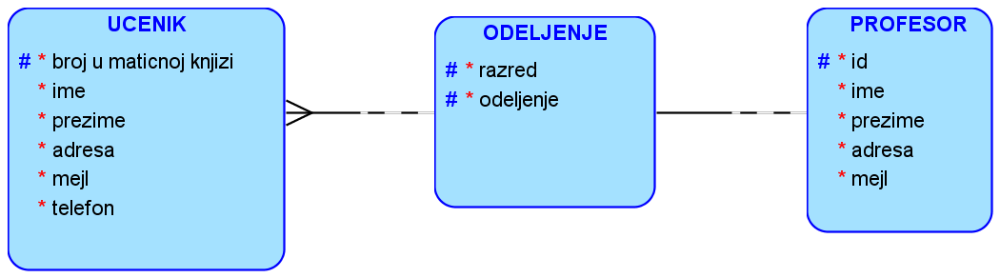

Разни задаци
============

**Нацртати модел за базу података**

**Напомена**: Везе могу бити – 1:1, 1:М и М:М.

.. questionnote::

 1. Ученик приликом уписа у школу доставља следеће податке: име, презиме, ЈМБГ, датум рођења, место рођења. 
 Ученику се приликом уписа додељује број у матичној књизи. Ученици се распоређују у одељења. За свако одељење су 
 познати редни број разреда, индекс одељења и име разредног старешине. 
 
.. image:: ../../_images/slika_215a.png
   :width: 500
   :align: center 
   
**ДОКУМЕНТАЦИЈА**

- ЈМБГ је кандидат за примарни јединствени идентификатор. 
- Одељење има сложени примарни јединствени идентификатор. Уколико би увели вештачки, морало би да се допише у 
- документацији да је комбинација редног броја разреда и индекса одељења јединствена. 

.. questionnote::

 2. Ученик приликом уписа у школу доставља следеће податке: име, презиме, адреса, имејл, број телефона. Ученику се 
 приликом уписа додељује број у матичној књизи. Ученици се распоређују у одељења. За свако одељење су познати  редни 
 број разреда, индекс одељења и разредни старешина. Разредни старешина је професор за којег су приликом запошљавања 
 узети следећи подаци: име, презиме, адреса, имејл, број телефона.   
 

.. questionnote::

 3. Ученик има два родитеља. За сваког родитеља су познати следећи подаци: име, презиме, ЈМБГ, датум рођења, место рођења.

   
**ДОКУМЕНТАЦИЈА**

- Један ученик може да има највише два родитеља. 

Следи друго решење са уведеним вештачким примарним јединственим идентификаторима. Ова измена ће утицати и на пратећу 
документацију. 

   
**ДОКУМЕНТАЦИЈА**

- ЈМБГ је јединствен за сваког ученика. 
- Један ученик може да има највише два родитеља. 

Како ученик може да има највише два родитеља, могуће је и треће решење. 

.. questionnote::

 4. За сваки уџбеник знамо назив, предмет за који је написан и годину првог објављивања. Уџбеник може да има неколико 
 аутора. За сваког аутора знамо име, презиме, годину рођења и место рођења. 
 

   

      
Нерешени задаци
---------------

1. За сваку школу се зна који се уџбеници у њој користе. Школа има назив, адресу, ПИБ, матични број. Проширити модел из 
претходног задатка. 

2. Једно одељење у школи (редни број разреда и индекс одељења) има тачно једног разредног старешину и више професора 
који предају различите предмете. Један професор може да предаје у више одељења. Када се професор запосли, доноси 
документацију из које се узимају следећи подаци: име, презиме, датум рођења, место рођења, ЈМБГ и број текућег рачуна. 

