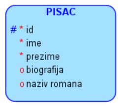
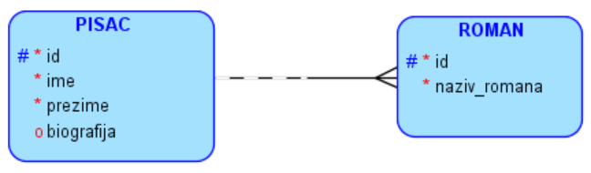

Нормализација
=============

.. infonote::

 Није нимало пријатно уколико ти хитно треба неки податак, на пример број телефона, и ти унесеш име и презиме одређене 
 особе, али ти се појави неисправан број. Важно је да имамо поверења у то да су подаци које претражујемо исправни. 
 У овој лекцији ћемо описати један од механизама којим се гарантује исправност података који се чувају у релационој 
 бази података.  
 
Основни кораци приликом цртања модела подразумевају:

1. уочавање ентитета,
2. набрајање атрибута за сваки ентитет,
3. повезивање ентитета везама.

Приликом детаљне анализе пословања за које се креира база података и током свих ових корака требало би да се придржавамо 
следећих правила: 

- на моделу морају да се налазе побројани сви подаци неопходни за посао,
- сваки податак мора да се појави тачно једном (нема понављања истог податка на више места),
- подаци су распоређени по целинама (ентитетима) и сваки се налази тачно тамо где га очекујемо. 

Уколико се придржавамо ових правила, модел вероватно неће имати грешке које ћемо навести у овој лекцији. 
Правила која су описана су веома корисна и важна, али прилично неформална. **Правила нормализације** су формална правила 
која гарантују исправност и поузданост модела. Уколико база података задовољава сва правила нормализације, каже се да 
је **нормализована**. 

Прва нормална форма – 1NF
-------------------------

Правило прве нормалне форме гласи: Сваки атрибут мора да буде такав да за једну инстанцу ентитета има тачно једну 
вредност. (Не сме да постоји атрибут који за једну инстанцу ентитета има више вредности.)

Погледајмо пример где је нарушено правило прве нормалне форме. 

PISAC: #id, ime, prezime, biografija, naziv_romana. 

Један писац је највероватније написао више романа. На пример, писац Ерих Марија Ремарк је написао романе: 
„Тријумфална капија“, „На западу ништа ново“, „Небо не зна за миљенике“, „Ноћ у Лисабону“, „Три ратна друга“.

Уколико на моделу постоји атрибут који нарушава правило прве нормалне форме, ситуација се разрешава тако што се 
уводи нови ентитет. Наравно, уколико се придржавамо неформалних правила моделовања, вероватно би тај ентитет био 
већ уочен и до ове грешке не би ни дошло.  

PISAC: #id, ime, prezime, biografija.

ROMAN: #id, naziv_romana.

   
Друга нормална форма – 2NF
--------------------------

Правило друге нормалне форме гласи: Сваки атрибут који није део примарног јединственог идентификатора мора да је у 
директној функционалној зависности од комплетног примарног јединственог идентификатора, тј. од свих његових делова. 

Погледајмо пример где је нарушено правило друге нормалне форме. 

POZAJMICA: #id_knjige, #id_člana_biblioteke, datum_uzimanja, datum_vraćanja, adresa_člana.

Атрибут *adresa_člana* није у директној функционалној зависности од целог примарног јединственог идентификатора, већ 
само од *id_člana_biblioteke*. Адреса члана библиотеке сигурно не зависи од књиге коју позајмљује из библиотеке.

Решење подразумева да се атрибут који нарушава правило нормализације пребаци у ентитет у којем му је место. 
У наведеном примеру би то изгледало овако:

POZAJMICA: #id_knjige, #id_člana_biblioteke, datum_uzimanja, datum_vraćanja.

ČLAN: #id, ime, prezime, adresa.

Трећа нормална форма – 3NF
--------------------------

Правило треће нормалне форме гласи: Међу атрибутима који нису део примарног јединственог идентификатора не сме да постоји директна функционална зависност. 

Погледајмо пример где је нарушено правило треће нормалне форме. 

PROIZVOD: #id, naziv, cena, naziv_proizvođača, PIB_proizvođača, adresa_proizvođača.

Група атрибута који нису део примарног јединственог идентификатора *naziv_proizvođača*, *PIB_proizvođača*, *adresa_proizvođača* чини засебну целину која описује произвођача. Ситуација се разрешава тако што се уводи нови ентитет чије атрибуте чини уочена група атрибута.

PROIZVOD: #id, naziv, cena.

PROIZVOĐAČ: #id_proizvoda, naziv, PIB, adresa.
