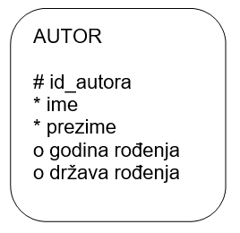
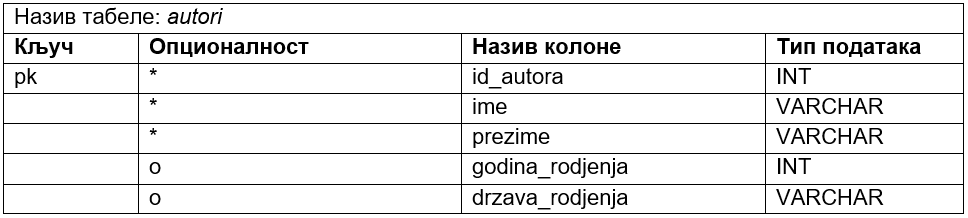
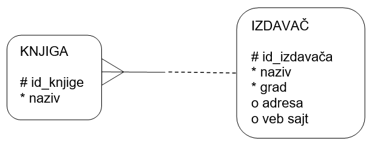
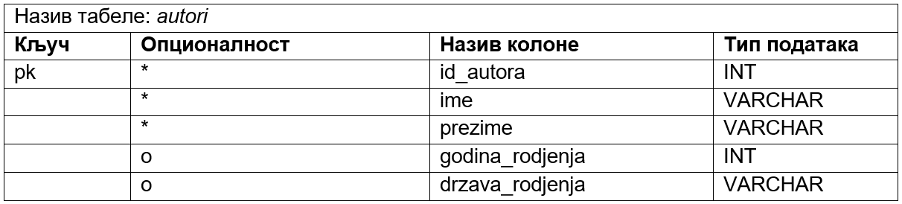
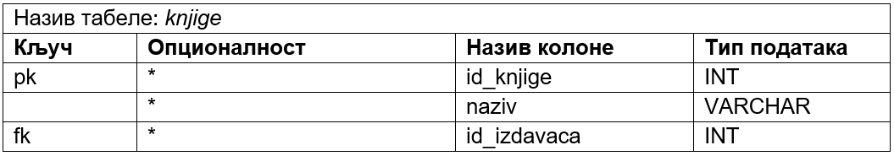
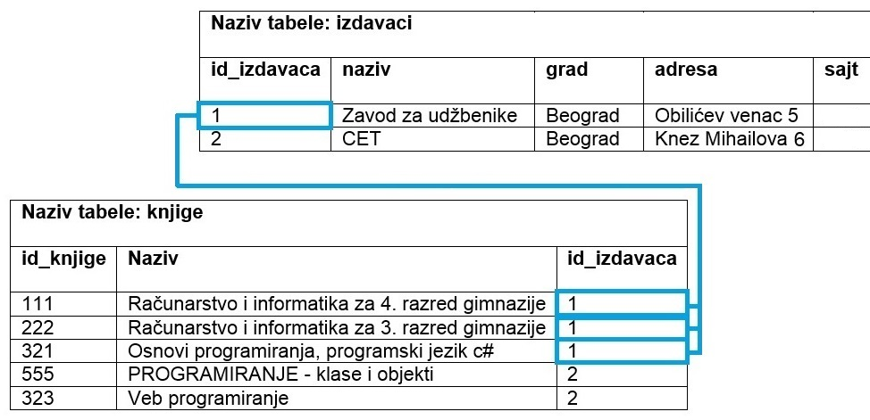
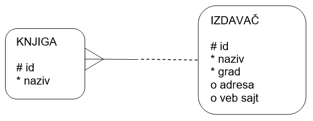
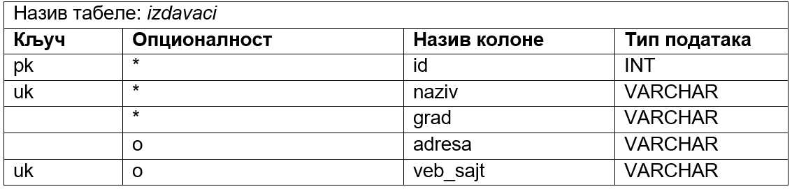
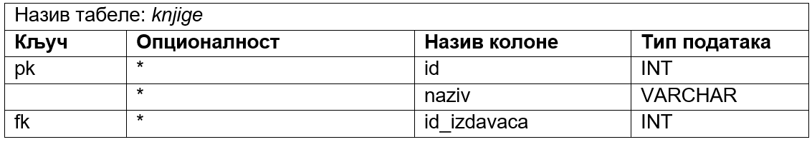

Дизајн табела у бази података - ентитети и веза 1:M
===================================================

.. infonote::

 Када имамо готов модел, пројекат на основу којег ћемо креирати базу података, потребан је још један корак пре него што
 приступимо самом систему за управљање базама података и кренемо са креирањем табела. Приликом тог корака јасно
 дефинишемо како ће изгледати табеле у бази са свим појединостима које су потребне да бисмо их успешно креирали и да би све
 прорадило. 
 
Након детаљне анализе пословања и креирања логичког модела, дијаграма ентитета и веза, потребно је да се уради припрема за 
креирање базе података. Та припрема се назива **мапирање**, односно **пресликавање**, и подразумева да се формира детаљан 
опис свих табела које ће имати база података. Опис сваке табеле мора да садржи списак колона, њихових типова података и 
списак свих ограничења, као што су примарни и страни кључеви, ограничење јединствености и ограничење *not null*. 

Током овог корака долази до промене терминологије. 

.. csv-table:: 
   :header: "**ЛОГИЧКИ МОДЕЛ, ЕРД**", "**РЕЛАЦИОНА БАЗА ПОДАТАКА**"
   :widths: auto
   :align: left
   
   "Ентитет", "Табела",   
   "Атрибут", "Колона"              
   "Обавезан атрибут", "Ограничење *not null*"
   "Инстанца", "Ред"
   "Примарни јединствени идентификатор", "Примарни кључ – *primary key*"	
   "Кандидат за примарни јединствени идентификатор", "Колона са јединственим вредностима – *unique*"	
   "Веза","Страни кључ – *foreign key*" 	

За сваки ентитет на моделу се креира једна табела у релационој бази података. Атрибути постају колоне те табеле. Називи колона не смеју да имају размаке, па свуда стављамо уместо размака доњу црту (_). Свака колона ће садржати податке истог типа. На пример, сви подаци у колони *ime* ће бити текстуалног типа, а сви подаци у колони *godina_rodjenja* ће бити бројеви. 

Најчешће коришћени типови података:

- INT – Цео број.  
- NUMERIC – Број који може да буде цео, а може да има децимале. Уколико се, на пример, наведе NUMERIC(5,2), то значи да ће број имати највише 5 цифара, од чега две децимале.  
- VARCHAR – Кратак текст. У загради може да се наведе број знакова, тако да је, на пример, VARCHAR(40) ознака за текстуални податак који има највише 40 знакова. 
- CHAR – Кратак текст фиксне дужине. У загради може да се наведе број знакова, тако да је, на пример, CHAR(13) ознака за текстуални податак који има тачно 13 знакова. Овај тип може да се користи за ЈМБГ. ЈМБГ ће се чувати као текст, а не као број, зато што би се водећа нула изгубила ако би се податак чувао као број. 
- DATE – Датум.
- DATETIME – Датум и време.
	
Примарни јединствени идентификатор постаје примарни кључ: **pk** – *primary key*. Особина атрибута који су били 
кандидати за примарни јединствени идентификатор мора бити да су им вредности за сваку инстанцу ентитета јединствене. 
Колоне које њима одговарају имају ограничење јединствености: **uk** – *unique key*. 

Атрибути који су обележени кружићем су опциони, тј. ти подаци не морају да се унесу у базу. Када податак није унет, 
то поље нема вредност, односно садржи константу *null* (недостајућа вредност, тј. показивач на ништа, на празно). 
Атрибути који су обавезни постају колоне које имају ограничење *not null*. 

Свака веза постаје додатна колона у једној од две повезане табеле са додатним ограничењем да је та колона страни кључ: 
**fk** – *foreign key*. 

Дизајн једне појединачне табеле подразумева да креирамо помоћну табелу у којој ћемо набројати све колоне, 
типове података и ограничења. Структура ове помоћне табеле на основу које ћемо креирати табелу у бази података одговара команди CREATE TABLE језика SQL. Овом командом се креира табела у релационој бази података. Језик SQL је специјализован језик за рад у бази података и биће касније детаљно обрађен. Овде се наводи само један пример команде овог језика да би се разумела структура помоћне табеле коју креирамо током процеса мапирања. 
Погледајмо пример ентитета *AUTOR*. 
	

   
Следи помоћна табела, односно дизајн будуће табеле у бази података, за овај ентитет. 

   
Само илустративно, следи команда *CREATE TABLE* језика *SQL* којом се креира ова табела у релационој бази податакa.

::

 CREATE TABLE autori
 (id_autora INT PRIMARY KEY,
 ime VARCHAR(20) NOT NULL,
 prezime VARCHAR(20) NOT NULL,
 godina_rodjenja INT,
 drzava_rodjenja VARCHAR(30)
 )
 
Уколико имамо два ентитета повезана везом **1:М** у једну од њих се додаје додатна колона која је страни кључ. 
Страни кључ се додаје као колона у ону табелу која је на страни „више“. Погледајмо следећи пример. Један издавач је 
објавио више књига. Нема смисла уз податке о издавачу чувати шифре свих књига које је објавио. Како је једну књигу 
објавио један издавач, онда уз податке о књизи можемо да чувамо и податак о томе ко ју је објавио. Тај податак је 
идентификација, шифра издавача – *id_izdavaca*. 

**Напомена**: Овај модел је исправан уколико се узме у обзир претпостaвка да су сви примерци исте књиге у библиотеци од 
истог издавача. 

Следе помоћне табеле, односно дизајн будућих табела у бази података, за ове ентитете. Прво се креира табела која нема 
страни кључ, односно она која је на крају „један“ када посматрамо везу између ентитета. 

   

   
Да се подсетимо, два правна лица не могу да имају исти назив, тако да вредности у колони naziv морају да буду 
јединствене и зато смо навели кључ *uk*. Такође, две издавачке куће сигурно неће имати исти веб-сајт. 

Само информативно, следе одговарајуће *CREATE TABLE* команде. Уколико шифра, *ID*, има седам цифара, таквих бројева 
има 107, па је то број различитих вредности, тј. број могућих различитих редова у одговарајућој табели. 
Страни кључ, колона *id_izdavaca*, у табели *knjige* показује на примарни кључ, колону *id_izdavaca*, табеле *izdavaci*. 

::

 CREATE TABLE izdavaci
 (id_izdavaca INT PRIMARY KEY,
 naziv VARCHAR(20) NOT NULL UNIQUE,
 grad VARCHAR(20) NOT NULL,
 adresa VARCHAR(50),
 veb_sajt VARCHAR(30) UNIQUE
 )

 CREATE TABLE knjige
 (id_knjige INT PRIMARY KEY,
 naziv VARCHAR(20) NOT NULL UNIQUE,
 id_izdavaca INT NOT NULL REFERENCES izdavaci(id_izdavaca)
 )

У релационој бази се ове две табеле приказују како је илустровано на следећој слици.

.. image:: ../../_images/slika_231c.png
   :width: 250
   :align: center 
   
На следећој слици је приказано како би ове табеле, повезане кључевима и попуњене 
подацима, изгледале у бази података. Јасно се види да један издавач може да објави више књига.

  
У овом примеру се примарни и страни кључ зову исто. То не мора да буде случај, па следи исти пример, 
само са различитим називима колона. Обрати пажњу на називе колона.   

   
Следе помоћне табеле, односно дизајн будућих табела у бази података, за ове ентитете. У различитим табелама могу да 
постоје колоне са истим називом, али, наравно, различитим значењем. Колона *id* у табели *izdavaci* је шифра 
(идентификациони број) издавача, а колона *id* у табели *knjige* је шифра књиге. 

   

   
Само информативно, следе одговарајуће CREATE TABLE команде. 

::

 CREATE TABLE izdavaci
 (id INT PRIMARY KEY,
 naziv VARCHAR(20) NOT NULL UNIQUE,
 grad VARCHAR(20) NOT NULL,
 adresa VARCHAR(50),
 veb_sajt VARCHAR(30) UNIQUE
 )

 CREATE TABLE knjige
 (id INT PRIMARY KEY,
 naziv VARCHAR(20) NOT NULL UNIQUE,
 id_izdavaca INT NOT NULL REFERENCES izdavaci(id)
 )
