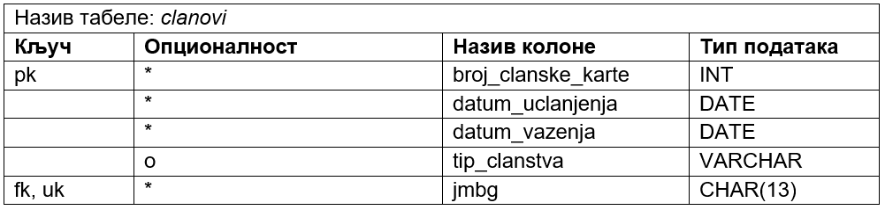

Дизајн табела у бази података - везе 1:1 и M:M
==============================================

.. infonote::
 
 У релационим базама податка, веза 1:М је веома честа и изузетно важна. Све појединости око реализације ове везе смо 
 описали у претходној лекцији. Поред везе 1:М, потребно је разумети и везу М:М и њену имплементацију помоћу додатне 
 табеле. Иако ретка, веза 1:1 је понекад неопходна и треба видети како се и она реализује у бази.  
 
**Веза 1:1** је веома ретка. Следи пример у којем издвајамо податке о личности члана библиотеке у један ентитет, а 
податке о његовом чланству у други (особа и улога). 

Као и у случају других веза, у случају везе 1:1 додатна колона која ће бити страни кључ иде у једну од две повезане 
табеле. Уколико је веза обавезна на једном крају, колона иде у ту табелу чији је ентитет на обавезном крају везе. 
Уколико је веза цела обавезна или цела опциона, та се колона може наћи у било којој од две табеле, али обавезно само 
у једној од њих. 

Следи мапирање. Осим што је одговарајућа колона страни кључ, вредности у њој морају да буду јединствене и тиме се 
гарантује веза један-према-један. Дакле, једно чланство мора да буде везано само за једну особу, односно не могу 
два различита чланства да указују на исту особу.   

   

   
**Веза више-према-више** се веома често среће и одговара многим ситуацијама у оквиру разних пословања. Ако школске 
уџбенике посматрамо као књиге, приметићемо да свака књига има више аутора, а аутори најчешће током свог рада напишу 
више књига. Овакву везу је немогуће реализовати у релационој бази података, па се на моделу уклања и уместо ње се 
поставља нови ентитет. Уколико нема бољег решења, назив новог ентитета може да буде комбинација назива почетна два 
ентитета повезана везом М:М.

Кратке цртице којима су везе прецртане значе да везе учествују у примарном јединственом идентификатору новог ентитета. 
Тако је примарни јединствени идентификатор новог ентитета који је дошао на место везе типа М:М, ентитета *АUTOR-KNJIGA*, 
заправо сложен и представља комбинацију примарних јединствених идентификатора ентитета *АUTOR* и *KNJIGA*: 
(*id_knjige*, *id_autora*). 

Примарни кључ је увек један, иако може да буде сложен и да се састоји од комбинације неколико колона. 
Зато код примарног кључа никад нема нумерације. Табела може да има више страних кључева, па уводимо нумерацију да би се 
они разликовали.  

Следи мапирање, тј. дизајн табела које ће бити креиране у бази података.

   

   

У релационој бази се ове три табеле приказују како је илустровано на следећој слици.
   
.. image:: ../../_images/slika_232c.png
   :width: 780
   :align: center
   
На следећој слици је приказано како би ове табеле, повезане кључевима и попуњене подацима, изгледале у бази података. 

.. image:: ../../_images/slika_232d.png
   :width: 780
   :align: center
   
**Напомена**: Овај модел је исправан уколико се узме у обзир претпоставка да библиотека чува уџбенике. Уколико се у 
библиотеци налазе само романи, онда је веза ентитета *AUTOR* и *KNJIGA* могла да буде 1:М (роман има једног аутора). 

Погледајмо још и мапирање примера са позајмљивањем књига.  

На следећој слици је приказан само део модела. За комплетан модел и базу података је неопходно да ентитет *PRIMERAK* 
буде повезан са ентитетом *KNJIGA*, па ће и сама табела *primerci* изгледати нешто другачије. То је изостављено да се 
не би компликовао цео пример. 

 
Следи мапирање, тј. дизајн табела које ће бити креиране у бази података.

   

   

   
**Веза којa је део идентификатора** не мора да се појави само код везе више-према-више. Погледајмо пример са рачуном у 
банци. Број рачуна банке је комбинација броја банке и броја рачуна у оквиру те банке. 

Пример података: 

Имамо банку са бројем 256, и у њој рачуне: 1234554321, 7778887771, 1290909090. Имамо другу банку са бројем 555, и у њој рачуне: 1234554321, 7778887771, 999933339, 1111133444. Иако у различитим банкама могу да постоје рачуни са истим бројем, рачун заправо има и број банке и свој број, и комбинација та два броја је јединствена: 256-1234554321, 256-7778887771, 256-1290909090, 555-1234554321, 555-7778887771, 555-999933339, 555-1111133444.

   
Следи мапирање.

   
