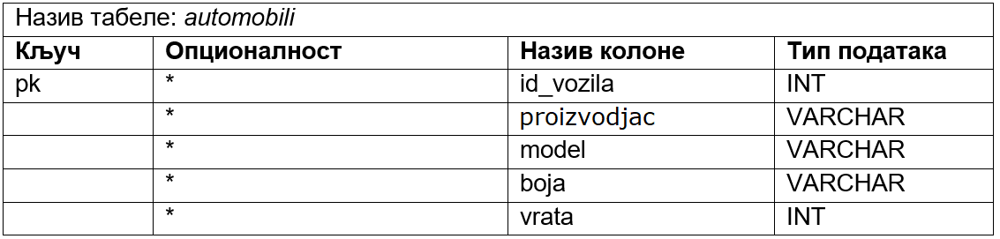
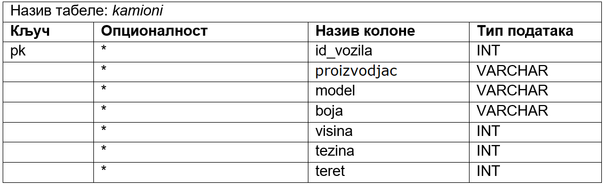

Дизајн табела у бази података - надтип са подтиповима
=====================================================

.. infonote::

 Постоје ситуације у којима је потребно да користимо надтип са подтиповима. Следи пример како такву ситуацију 
 реализујемо у бази података. 
 
Уколико имамо **надтип са подтиповима**, можемо да га мапирамо као једну или више табела. Да ли ћемо користити једну 
табелу или више табела, зависи од тога да ли постоји већи број заједничких у односу на број појединачних атрибута, 
и да ли постоји већи број заједничких веза у односу на везе у којима учествују подтипови.  

   
Приказаћемо оба начина мапирања ове ситуације у бази података:

- једна табела у којој се чувају подаци о свим возилима, 
- онолико табела колико има подтипова. 

Како ови подтипови имају више заједничких атрибута, имало би више смисла да се креира једна табела за сва возила. 

Следи илустрација како би изгледала једна табела – *vozila*. Обавезно се додаје још једна колона која означава тип 
возила. Појединачни атрибути постају опционе колоне, чак и уколико су били обавезни. На пример, камион има тежину 
терета, а аутобус нема тежину терета, али зато има број седишта. Дакле, уз вредност одговарајућег типа возила нека 
поља морају да остану празна, а нека морају да буду попуњена. 

::

 (tip = automobil AND vrata IS NOT NULL AND sedista IS NULL AND 
 visina IS NULL AND tezina IS NULL AND teret IS NULL) OR
 (tip = kamimon AND vrata IS NULL AND sedista IS NULL AND 
 visina IS NOT NULL AND tezina IS NOT NULL AND teret IS NOT NULL) OR
 (tip = autobus AND vrata IS NULL AND sedista IS NOT NULL AND 
 visina IS NULL AND tezina IS NULL AND teret IS NULL)

Следи илустрација како би било са више табела: *automobili*, *autobusi* и *kamioni*. 

   

Следи пример како би изгледале одговарајуће табеле *automobili*, *autobusi* и *kamioni* у релационој бази података.
 

   

   
   

