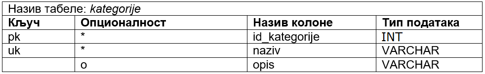

Дизајн табела у бази података - задаци
======================================

Урадити припрему за креирање табела у бази података. За сваки ентитет направити табелу у којој су записани сви називи 
колона, ограничења и типови података. 

На пример, дат је следећи логички модел. 

   
Потребно је креирати две табеле *proizvodi* и *kategorije* према следећем плану. 

   
Нерешени задаци
===============

1. Једна уљана слика има назив и годину настанка. Уметник може да наслика више слика. За уметника обавезно уносимо име, 
а можемо да унесемо и презиме, уколико је познато, и биографију, ако је доступна. 

.. image:: ../../_images/slika_234b.png
   :scale: 80 %
   :align: center

2. Сваки производ има бар-код, назив и цену. Производ припада одређеној категорији (бела техника, кућна хемија, 
прехрамбени производи...). Произвођач има назив, адресу седишта и ПИБ. Један произвођач производи више различитих 
производа. Чувамо и промене цена једног производа током времена. За сваки износ знамо датум када је почела да важи 
та цена. Потребно је да чувамо и датум до када је та цена важила за све цене које је производ имао у прошлости. 

3. Аутомобил (један комад) има једног власника. За власника аутомобила су забележени следећи подаци: име, презиме, 
ЈМБГ, број личне карте и адреса становања. Аутомобил је комад одређеног модела и има следеће посебне податке: 
број шасије, број мотора и боју. Уколико је регистрован, познат је и број регистарских таблица. Сваки модел има 
своју ознаку, назив произвођача, јачину мотора, број врата и тип горива.

4. Ученик приликом уписа у школу доставља следеће податке: име, презиме, адреса, имејл и број телефона. Ученику се 
приликом уписа додељује број у матичној књизи. Ученици се распоређују у одељења. За свако одељење су познати редни 
број разреда, индекс одељења и разредни старешина. Разредни старешина је професор за којег су приликом запошљавања 
узети следећи подаци: име, презиме, адреса и имејл..  

.. image:: ../../_images/slika_234e.png
   :scale: 80 %
   :align: center 

5. За сваки уџбеник знамо назив, предмет за који је написан и годину првог објављивања. Уџбеник може да има неколико 
аутора. За сваког аутора знамо име, презиме, годину рођења и место рођења. 

6. Фирма име више сектора и у сваком ради више радника. Један радник може да буде менаџер другом раднику – рекурзивна 
веза. Страни кључ у табели *radnici* треба да указује на примарни кључ исте табеле, па никако не сме да се зове исто. 
Тај страни кључ може да се зове, на пример, *id_menadzera*. 

7. Зграда има више спратова, а на сваком спрату се налази више станова. 

8. Одело може бити кошуља или сукња. 

Упутство: Урадити два решења

- једна табела *odeca*,
- две табеле *kosulje* и *suknje*.

