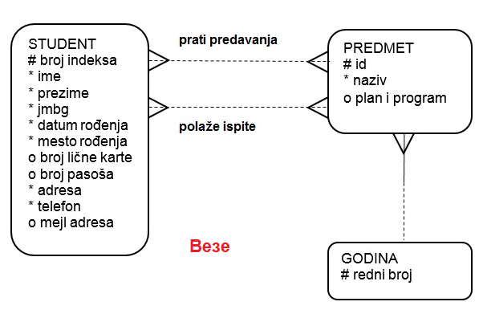

Пример моделовања - факултет
============================

.. infonote::

 Све кораке неопходне током припреме за креирање базе података које смо описали у претходним лекцијама и провежбали 
 кроз задатке поновићемо и систематизоваћемо кроз овај пример базе података за факултет. 

 Пробај да поновиш исте кораке и дођеш до модела за базу за продају дигиталних композиција, тј. песама. 
 Покушај да ово урадиш пре него што пређеш на следећу лекцију у оквиру које ћемо приказати једно могуће решење, 
 па ћеш имати прилику да провериш и допуниш оно што си урадио. 
 
Први корак приликом моделовања је уочавање **ентитета**. Ентитет је нешто што је важно за пословање и о чему 
чувамо податке. У случају факултета прво можемо да уочимо два најважнија ентитета и то су *STUDENT* и *PREDMET*. 
Студенти долазе на факултет да стекну образовање, а то подразумева да детаљно изуче одређени списак предмета и да 
положе испите из тих предмета. 

Сваки ентитет има своје **инстанце** са којима се сусрећемо у пословању. Инстанца је један конкретан примерак. 

   
Сваки ентитет је описан **атрибутима**. Вредности атрибута за конкретну инстанцу ентитета су подаци који се 
чувају у бази података. 

На  моделу се ентитет представља правоугаоником са заобљеним ћошковима. Назив ентитета је увек у једнини и наводи 
се унутар правоугаоника. Атрибути се такође набрајају унутар ентитета (правоугаоника) и означавају се једним од 
следећих симбола: **#** (примарни јединствени идентификатор), * (обавезан атрибут), или о (опциони атрибут). 

   
Вредност сваког атрибута је најчешће један краћи податак, и то, у великом броју случајева, текстуални или бројевни. 
Вредности атрибута ime су краћи текстуални подаци (највише до неколико десетина знакова), на пример: 
Ana, Milica, Petar... Међутим, вредност атрибута може да буде и већи податак. На пример, сваки предмет има план и 
програм, а то је најчешће текстуални документ од неколико стотина речи (више хиљада знакова). 

Један од атрибута обележимо тарабицом (#). Тај атрибут је **примарни јединствени идентификатор**. Вредност овог 
атрибута мора да постоји за сваку инстанцу и мора да буде јединствена. Неколико атрибута у истом ентитету може да има 
ту особину да за сваку инстанцу има јединствену вредност. Један обележавамо тарабицом, а за остале морамо у додатној 
документацији да наведемо да имају ову особину да би се то касније реализовало додатним правилима у бази података. 

Два студента могу да имају исто име, па чак и исто име и презиме, исту адресу становања и тако даље. 
Али мора да постоји атрибут по чијој вредности ћемо их разликовати. То је управо примарни јединствени идентификатор. 
За ентитет STUDENT имамо следеће атрибуте који испуњавају услов да су њихове вредности јединствене за сваку инстанцу:

- број индекса – обележен тарабицом, примарни јединствени идентификатор, 
- ЈМБГ – два члана не могу да имају исти ЈМБГ, али овај атрибут нећемо изабрати као примарни јединствени идентификатор зато што његов опсег вредности далеко премашује број студената једног факултета,
- број личне карте и пасош – два студента не могу да имају исте бројеве пасоша и личне карте, али ни један од ова два податка никад нећемо узети као примарни јединствени идентификатор зато што се мењају једном у десет година. Може се десити и да неки студенти немају пасош, а вредност примарног јединственог идентификатора мора да постоји за сваку инстанцу.

Иако, на пример, два предмета не могу да имају исти назив, тај атрибут нећемо изабрати као примарни јединствени 
идентификатор јер је то текстуални податак различите дужине за различите инстанце. Примарни јединствени идентификатор 
је најчешће број зато што је бројеве у рачунарству лако упоређивати и сортирати. Наравно, постоје ситуације када се 
одлучимо да узмемо текстуални податак као примарни јединствени идентификатор, али се то дешава ретко, и најчешће 
када је то текстуални податак ограниченог броја знакова. На пример, број индекса (до седам знакова): 21/01R, 55/01M, 
78/01R...

Примарни јединствени идентификатор може бити **природан** и **вештачки**. Природни су они који постоје и ван базе података. 
На пример, број индекса се додељивао на одређени начин (редни број, слово које означава смер и две цифре године уписа) 
и пре но што су постојали рачунари. За разлику од овог природног примарног јединственог идентификатора, *id* предмета су 
бројеви који ће постојати само у бази података. 

Након што се уоче ентитети и наброје њихови атрибути, потребно је да се ентитети повежу. Свака веза спаја два различита 
ентитета или, искључиво у случају рекурзивне везе, ентитет сам са собом. **Везе** препознајемо у опису пословања као 
глаголе: студент *прати* предавања неког предмета, студент *полаже испите* из неког предмета....  

Модел можемо полако да проширимо и додавањем још једног ентитета јер, анализирајући предмете, можемо да уочимо да су распоређени на различитим годинама студија. 

Свака веза има: назив, опционалност и кардиналност. Назив је глагол који препознајемо у опису пословања. 

Опционалност нам говори да ли нека инстанца мора, или може, да буде у вези са инстанцом другог ентитета. Примери:
•	студент може, али не мора да полаже испите (опциона веза);
•	предмет мора да припада некој години студија (обавезна веза). 

Некад нам опционална веза служи и за то да податке у базу можемо да уносимо у одређеном редоследу. На пример, 
наравно да се током одређене године студија изучава више предмета. Сигурно не постоји година студија без предмета. 
Међутим, ставићемо опциону везу код године студија само због редоследа уноса података у базу. Обавезна веза би нас 
условила да уз податке о години студија морамо да унесемо и податке о једном предмету који се изучава током ње. 
Из овог разлога су опционе везе чешће на моделу. 

Кардиналност нам говори да ли је једна инстанца једног ентитета у вези са једном или са више инстанци другог ентитета. 
Примери:

- током једне године студија се прати више предмета (више),
- одређени предмет припада тачно једној години студија (један).

Веза више-према-више се веома често среће и одговара многим ситуацијама у оквиру разних пословања. 
Уколико анализирамо пример факултета, видимо да један студент може да полаже испите из више предмета, као и да 
испит из једног предмета полаже више студената – веза више-према-више, М:М.  

Овакву везу је немогуће реализовати у релационој бази података, па се на моделу уклања и уместо ње се поставља 
нови ентитет. Уколико нема бољег решења, назив новог ентитета може да буде комбинација назива почетна два ентитета 
повезана везом М:М. У овом случају имамо добар нови назив: *ISPIT*. 

Кратке цртице којима су везе прецртане значе да везе учествују у примарном јединственом идентификатору новог ентитета. 
Тако је примарни јединствени идентификатор новог ентитета који је дошао на место везе типа М:М, ентитета *ISPIT*, 
заправо сложен и представља комбинацију примарних јединствених идентификатора ентитета *STUDENT* и *PREDMET*: 
(*broj_indeksa*, *id_predmeta*). 

Комбинација ове две вредности мора да буде јединствена, тако да није могуће да се понови да исти студент полаже испите 
из истог предмета више пута. Уколико то желимо да дозволимо, онда можемо датум полагања да додамо као треће поље 
сложеног примарног идентификатора. У следећем примеру је примарни јединствени идентификатор ентитета ISPIT комбинација:
(*broj_indeksa*, *id_predmeta*, *datum*).

Модел можемо даље да разрађујемо разрешавањем друге везе више-према-више коју смо уочили и која се односи на праћење 
предавања. Када будемо кренули да разрађујемо тај део модела појавиће се и нови ентитети: *KABINET*, *TERMIN_PREDAVANJA*, 
*PREDAVAČ*...

   

Сва правила пословања која смо до сада видели могу да се нацртају на моделу. Таква правила се зову  **структурна правила**. 
Нека правила није могуће нацртати. Њих документујемо да би касније била обрађена програмерски. Правила која не могу 
да се нацртају на моделу већ морају да се документују називају се **процедурална правила**. 

На пример, можемо да нацртамо да један студент може да полаже више испита. Оно што не можемо да нацртамо, 
већ морамо да документујемо да би касније било обрађено програмерски, јесте, на пример, да студент не може да полаже 
испите из године која је већа од године на коју је уписан. Студент прве године не може да полаже испите из друге, 
треће, четврте године. 

Основни кораци приликом цртања модела подразумевају:

1. уочавање ентитета,
2. набрајање атрибута за сваки ентитет,
3. повезивање ентитета везама.

Приликом детаљне анализе пословања за које се креира база података и током свих ових корака требало би да се 
придржавамо следећих правила: 

- на моделу морају да се налазе побројани сви подаци потребни за посао,
- сваки податак мора да се појави тачно једном (нема понављања истог податка на више места),
- подаци су распоређени по целинама (ентитетима) и сваки се налази тачно тамо где га очекујемо. 

Уколико се придржавамо ових правила, модел вероватно неће имати грешке које ћемо овде навести. Правила која су описана 
су веома корисна и важна, али прилично неформална. **Правила нормализације** су формална правила која гарантују исправност 
и поузданост модела. Уколико база података задовољава сва правила нормализације, каже се да је **нормализована**. 

**Правило прве нормалне форме гласи**: Сваки атрибут мора да буде такав да за једну инстанцу ентитета има тачно једну 
вредност. (Не сме да постоји атрибут који за једну инстанцу ентитета има више вредности.)

Погледајмо пример где је нарушено правило прве нормалне форме. Уколико на моделу постоји атрибут који нарушава правило 
прве нормалне форме, ситуација се разрешава тако што се уводи нови ентитет. Наравно, уколико се придржавамо неформалних 
правила моделовања, вероватно би тај ентитет био већ уочен и до ове грешке не би ни дошло.  

   
Овде је прво правило нормалне форме нарушено уколико за једног студента желимо да сачувамо више бројева телефона 
(мобилни, кућни, телефон блиског рођака за хитне случајеве). Уколико чувамо само један једини број, телефон може да 
остане атрибут. 

**Правило друге нормалне форме гласи**: Сваки атрибут који није део примарног јединственог идентификатора мора да је 
у директној функционалној зависности од комплетног примарног јединственог идентификатора, тј. од свих његових делова. 

Погледајмо пример где је нарушено правило друге нормалне форме. 

   
Атрибут *broj telefona učenika* није у директној функционалној зависности од целог примарног јединственог идентификатора 
већ само од *broj indeksa*. Број телефона студента сигурно не зависи од испита који полаже.

Атрибут *plan i program predmeta* није у директној функционалној зависности од целог примарног јединственог 
идентификатора, већ само од *id predmeta*.

Решење подразумева да се атрибут који нарушава правило нормализације пребаци у ентитет где му је место. 
Број телефона студента у ентитет *STUDENT*, а план и програм предмета у ентитет *PREDMET*. 

**Правило треће нормалне форме гласи**: Међу атрибутима који нису део примарног јединственог идентификатора не сме да 
постоји директна функционална зависност. 

Погледајмо пример где је нарушено правило треће нормалне форме. 

Група атрибута који нису део примарног јединственог идентификатора *profesor*, *jmbg profesora*, *broj lične karte profesora*, *broj tekućeg računa profesora*, *adresa profesora*, 
*telefon profesora*, *mejl adresa profesora* чини засебну целину која описује професора. Ситуација се разрешава тако 
што се уводи нови ентитет чије атрибуте чини уочена група атрибута.

Након детаљне анализе пословања и креирања логичког модела, дијаграма ентитета и веза, потребно је да се уради 
припрема за креирање базе података. Та припрема се назива **мапирање** и подразумева да се формира детаљан опис 
свих табела које ће база података имати. Опис сваке табеле мора да садржи списак колона, њихових типова података и 
списак свих ограничења, као што су примарни и страни кључеви, ограничење јединствености и ограничење *not null*. 

Прво се мапирају ентитети који као табеле неће имати стране кључеве. 

   

   

   

 
Следи пример како ће изгледати попуњене табеле у бази података.
 

   

