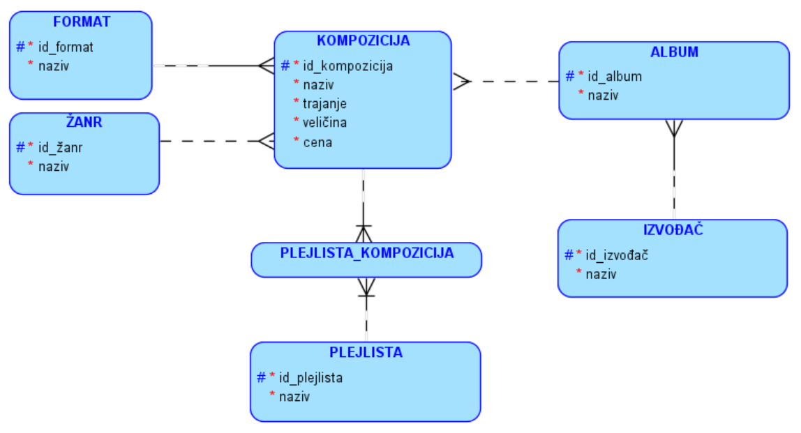
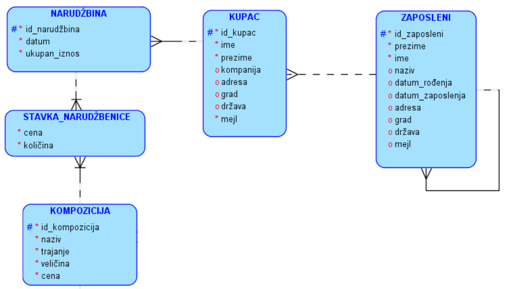
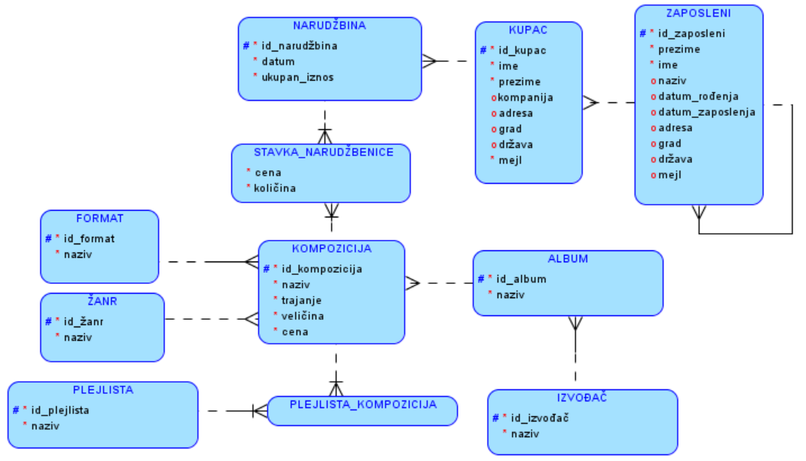

Пример моделовања - продаја дигиталних композиција
==================================================

.. infonote::
 
 Кроз претходне лекције смо, на великом примеру базе података за библиотеку, али и кроз многобројне мање примере, 
 приказали све кораке потребне за израду модела на основу којег ће се креирати база података. Када креирамо неки 
 нови модел за нову базу података, можемо да се припомогнемо познатим сличним примерима. Једна од добрих стратегија 
 када захтеви постају све већи и база података треба да има много табела, јесте и да посао поделимо на мање целине 
 које ћемо на крају повезати.

 Уколико си пробао да поновиш кораке описане у претходним лекцијама и дођеш до модела за базу за продају дигиталних 
 композиција, тј. песама, можеш своје решење да упоредиш са решењем које следи. 
 
Креираћемо модел за базу података фиктивне компаније за продају музичких композиција (углавном песама).

Цео посао ћемо поделити у две велике целине које ћемо на крају повезати. Први део би подразумевао да у бази чувамо све податке о композицијама, укључујући и жанрове, албуме, извођаче и листе композиција. Други део подразумева информације релевантне за продају композиција.

За сваку композицију чувамо неке основне податке:
•	назив
•	трајање (у милисекундама)
•	дигитални формат (mp3, AAC…)
•	величина (у бајтовима)
•	жанр
•	цена

Подразумеваћемо да је број жанрова ограничен и да жанр може да буде само неки од унапред дефинисаних жанрова или да 
је композиција евентуално неког непознатог жанра. Слично, подразумеваћемо и да је дигитални формат неки са листе 
подржаних формата (на пример, mp3 или AAC), при чему је формат сваке композиције обавезно неки са те листе 
(не може да буде непознат).

База треба да садржи и податке о албумима, који се, нормално, састоје од више композиција. Претпоставља се да није 
могуће да се иста композиција нађе на два различита албума, али је допуштено да неке композиције нису део ниједног 
албума (објављене су као тзв. синглови). Даље, претпоставља се да се на сваком албуму налазе композиције само једног 
извођача и за сваки албум су познати назив албума и извођач. За сваког извођача je познато име.

У бази су дефинисане и листе композиција (тзв. плејлисте, енг. *playlists*). Може постојати више различитих листа и 
свака листа може садржати произвољан број композиција.

Има смисла да у случају композиција истог жанра не желимо да понављамо податке о жанру, чак ни када је једини податак 
о жанру његов назив. Један од разлога је уштеда простора. Идентификациони број жанра заузима мање места него назив, 
па када се много пута понавља идентификациони број уместо целог назива, може да дође до уштеде простора. Још важније, 
понављањем назива жанра ризикујемо словне грешке, које нарушавају интегритет података и воде ка погрешним резултатима 
претраге. Због свега тога, имаћемо посебан ентитет за жанр. За композицију жанр може да буде познат, али и не мора. 

Слична је ситуација са дигиталним форматом. Да бисмо избегли понављање назива формата, дигитални формат ће бити 
ентитет. За сваку композицију мора да буде познат њен дигитални формат.

Веза између композиција и албума је један-према-више (свака композиција припада највише једном албуму, сваки албум 
садржи нула или више композиција). Повешћемо рачуна о томе да композиција може да не припада ниједном албуму. 

Веза између албума и извођача је такође један-према-више (према спрецификацији, сваки албум има тачно једног извођача, 
а сваки извођач може да има нула или више албума). 

Остаје још да осмислимо како да чувамо податке о листама композиција. Пошто свака листа може да садржи више 
композиција, а свака композиција може да се нађе на више листи, реч је о вези више-према-више. Као што је раније 
речено, такву везу обично остварујемо помоћу новог ентитета. У овом случају тај нови ентитет ће се звати 
*PLEJLISTA_KOMPOZICIJA*.

Описани део модела је приказан на следећој слици. 

Следећи део модела треба да покрије информације релевантне за продају композиција. 

У компанији постоји неколико запослених особа. За сваког запосленог познати су следећи подаци:

- име, презиме
- титула, тј. назив запослења
- датум рођења
- датум запослења
- адреса
- град
- држава/покрајина
- поштански кôд
- број телефона
- факс
- имејл

Запослени имају свог надређеног и на тај начин су организовани у хијерархијску, дрволику структуру.

Чува се листа свих купаца. За сваког купца су познати следећи подаци:
- име, презиме
- компанија у чије име купује (ако не купује сам за себе)
- адреса
- град
- држава/покрајина
- поштански кôд
- телефон
- факс
- имејл

За купца може бити задужен неко од запослених (он му пружа комплетну корисничку подршку).

Корисници врше наруџбине и у склопу сваке наруџбине могу да наруче и више композиција. За сваку наруџбину познати су следећи подаци:
- датум наруџбине
- адреса наплате
- град наплате
- поштански кôд наплате
- држава/покрајина наплате
- укупна цена наруџбине

За сваку наруџбину познат је и списак свих композиција на тој наруџбини.

Сваки запослени има нула или једног надређеног, а може бити надређени за нула или више запослених. 
Дакле, постоји веза један-према-више од ентитета запослени ка њему самом. 

Специфичност ове наше фиктивне компаније је у томе да сваком купцу може да се додели један запослени који обрађује 
све његове куповине. Слично као када у банци имате свог личног банкара. Тако да сваки купац може имати нула или једног 
запосленог који брине о њему, док сваки запослени може имати нула или више купаца о којима брине. 

Свакој наруџбеници одговара тачно један купац, док сваки купац може имати нула или више наруџбеница. 

На крају, свака наруџбеница садржи нула или више композиција, док се свака композиција може налазити на нула или више 
наруџбеница. Ову везу типа више-према-више морамо реализовати креирањем посебне табеле *STAVKA_NARUDZBENICE*, која 
ће имати и своје додатне атрибуте који се односе на број композиција које се наручују и јединичну цену те композиције 
у склопу те наруџбине.

На следећој слици може да се види комплетан модел базе када се ова два описана дела повежу. На моделу можемо да видимо 11 ентитета, тако да ће цела база имати 11 табела. 

 
