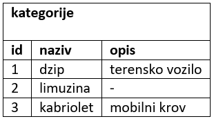
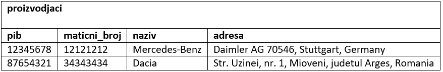
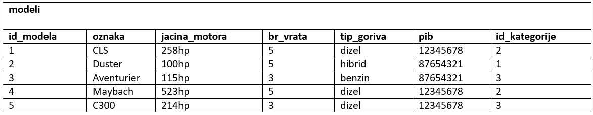

Задатак - салон аутомобила
==========================

.. questionnote::

 Написати команде за унос података у креирану базу података за салон аутомобила. Обавезно покренути све команде, 
 једну по једну, у алату *SQL Server Management Studio* у којем је база већ креирана.

 Сваки произвођач аутомобила има назив и адресу седишта. Произвођачи аутомобила су правна лица којима су додељени ПИБ 
 и матични број. ПИБ и матични број имају по осам цифара и свако правно лице има свој јединствени ПИБ и свој 
 јединствени матични број. Произвођач аутомобила производи више различитих модела. Сваки модел има своју ознаку, 
 јачину мотора, број врата и тип горива. Аутомобили су подељени у категорије: лимузина, караван, кабриолет... 

Следе подаци које треба унети у базу командама INSERT INTO. 

   

.. reveal:: 310
    :showtitle: Прикажи решење
    :hidetitle: Сакриј
	
    |
    
    **Решење:**

    ::
	
	 INSERT INTO kategorije
	 VALUES(1, 'dzip', 'terensko vozilo')
	 
	 INSERT INTO kategorije
	 VALUES(2, 'limuzina', null)
     
	 INSERT INTO kategorije
	 VALUES(3, 'kabriolet', 'mobilni krov')
	 
	 INSERT INTO proizvodjaci
	 VALUES(12345678, 12121212, 'Mercedes-Benz', 'Daimler AG 70546, Stuttgart, Germany')
	 
	 INSERT INTO proizvodjaci
	 VALUES(87654321, 34343434, 'Dacia', 
	 'Str. Uzinei, nr. 1, Mioveni, judetul Arges, Romania')
	 
	 INSERT INTO modeli
	 VALUES(1, 'CLS', '258hp', 5, 'dizel', 12345678, 2)
	 
	 INSERT INTO modeli
	 VALUES(2, 'Duster', '100hp', 5, 'hibrid', 87654321, 1)
	 
	 INSERT INTO modeli
	 VALUES(3, 'Aventurier', '115hp', 3, 'benzin', 87654321, 3)
	 
	 INSERT INTO modeli
	 VALUES(4, 'Maybach', '523hp', 5, 'dizel', 12345678, 2)
	 
	 INSERT INTO modeli
	 VALUES(5, 'C300', '214hp', 3, 'dizel', 12345678, 3)
	

    .. image:: ../../_images/slika_310a.png
        :width: 780
        :align: center