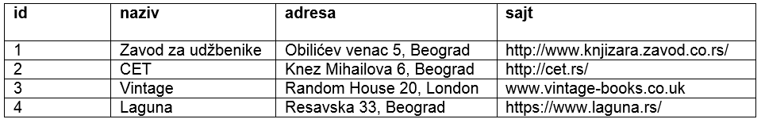

Команда CREATE TABLE
====================

.. infonote::

 Пројектовање база података о којем смо досад говорили изузетно је важно. Мада се нове базе не креирају често, 
 па је могуће да ћеш у будућности радити само са готовим системима, познавање читавог процеса пројектовања помоћи ће 
 ти да боље разумеш концепт релационих база података и начин на који све функционише. 

 Сада долазимо до практичног дела где ћеш моћи да креираш базе података у конкретном алату, изабраном систему за 
 управљање базама података. Као што смо већ спомињали, алата је много, али се сви придржавају истог језика за рад 
 са релационим базама података. Зато ћемо у свим лекцијама које следе тежиште стављати управо на тај језик, а сам 
 алат ће бити у другом плану.  

Након детаљне анализе пословања, креирања логичког модела (дијаграм ентитета и веза, ЕР дијаграм, ЕРД) и дизајнирања 
табела (мапирање), следи креирање саме базе података. Посебан језик за рад у системима за управљање базама података 
је језик **SQL** (енг. *Structured Query Language*). Језик није осетљив на велика и мала слова, али ипак понешто пишемо 
велико, а понешто мало, да би код био читљивији. 

Команда језика SQL којом се креирају табеле је команда **CREATE TABLE**. Називи табела су увек у множини. 
Језик SQL није осетљив на мала и велика слова. Правило је, међутим, да неке речи пишемо великим, а неке малим словима, 
ради боље читљивости кода. Великим словима пишемо кључне речи језика и функције, а малим називе табела и колона. 

Приказаћемо креирање табела релационе базе података библиотеке на основу следећег модела и мапирања, дизајна табела, 
урађеног у алату *Data Modeler*.

.. image:: ../../_images/slika_301a.png
   :width: 780
   :align: center
   
За сваки ентитет на дијаграму ентитета и веза потребно је креирати табелу у релационој бази података. Атрибути постају 
колоне те табеле. Називи колона не смеју да имају размаке, па свуда уместо размака стављамо доњу црту (_). Свака колона 
ће садржати податке истог типа. На пример, сви подаци у колони ime ће бити текстуалног типа, а сви подаци у колони 
*godina_rodjenja* ће бити бројеви. 

Најчешће коришћен типови података:

- INT – Цео број.  
- NUMERIC – Број који може да буде цео, а може да има децимале. Уколико се, на пример, наведе NUMERIC(5,2), то значи да ће број имати највише 5 цифара од чега две децимале.  
- VARCHAR – Кратак текст. У загради може да се наведе број знакова, тако да је, на пример, VARCHAR(40) ознака за текстуални податак који има највише 40 знакова. 
- CHAR – Кратак текст фиксне дужине. У загради може да се наведе број знакова, тако да је, на пример, CHAR(13) ознака за текстуални податак који има тачно 13 знакова. Овај тип може да се користи за ЈМБГ. ЈМБГ ће се чувати као текст, а не као број, зато што би се водећа нула изгубила ако би се податак чувао као број. 
- DATE – Датум.
- DATETIME – Датум и време.

Примарни јединствени идентификатор постаје примарни кључ: **pk – primary key**. Свака веза постаје додатна колона у 
једној од две повезане табеле са додатним ограничењем да је та колона страни кључ: **fk – foreign key**. Атрибути који 
су обележени кружићем су опциони, тј. ти подаци не морају да се унесу у базу. Када податак није унет, то поље нема 
вредност, односно садржи константу *null* (показивач на ништа, на празно). Атрибути који су обавезни постају колоне 
које имају ограничење **NOT NULL**. 

Погледајмо следећи део модела за базу података библиотеке. 

   
Прво креирамо оне табеле за које, према моделу и након урађеног мапирања, знамо да немају стране кључеве. 
То су независни, јаки, ентитети. На пример, ентитет *AUTOR* је независан: аутор постоји и без обзира на то колико и које 
књиге је написао, као и без обзира на то колико примерака његових књига постоји у библиотеци. За разлику од њега, 
ентитети *KNJIGA* и *PRIMERAK* су везани. Књига не постоји уколико је није написао неки аутор, а примерак не постоји 
ако није примерак неке конкретне књиге. 

Кренимо од ентитета *AUTOR*. 

   
Следи помоћна табела, дизајн будуће табеле у бази података, за овај ентитет. 

   
Команда CREATE TABLE језика *SQL* почиње називом команде, коју прати назив табеле, након чега се између заграда 
набрајају колоне. За сваку колону се наводи назив и тип податка, а често се додају и једно или више ограничења 
(NOT NULL, PRIMARY KEY....).

Следи команда CREATE TABLE језика *SQL* којом се ова табела креира у релационој бази података. Као што може да се уочи, 
структура команде одговара помоћној табели коју смо креирали у процесу мапирања и за коју кажемо да описује дизајн 
табеле. 

::

 CREATE TABLE autori
 ( id_autora INT PRIMARY KEY, 
 ime VARCHAR(15) NOT NULL, 
 prezime VARCHAR(15) NOT NULL )

Када се ова табела креира у бази података, и када се у њу унесу неки подаци, она ће изгледати овако:

   
Следећи јак ентитет на приказаном делу модела је *IZDAVAC*. 

   
Следи дизајн будуће табеле у бази података за овај ентитет. 

   
Два издавача, као правна лица, не могу да имају исти назив, а сигурно не користе исти веб-сајт. 

Команда CREATE TABLE језика *SQL* креира ову табелу у релационој бази података:  

::

 CREATE TABLE izdavaci
 ( id INT PRIMARY KEY, 
 naziv VARCHAR(40) NOT NULL UNIQUE, 
 adresa VARCHAR(50), 
 veb_sajt VARCHAR(50) UNIQUE)

Када се ова табела креира у бази података, и када се у њу унесу неки подаци, она ће изгледати овако:

Следећи јак ентитет на приказаном делу модела је *CLAN*. 

   
Следи дизајн будуће табеле у бази података за овај ентитет. 

   
Команда CREATE TABLE језика *SQL* креира ову табелу у релационој бази података:  

::

 CREATE TABLE clanovi
 ( broj_clanske_karte INT PRIMARY KEY, 
 ime VARCHAR(15) NOT NULL, 
 prezime VARCHAR(15) NOT NULL, 
 adresa VARCHAR(50) NOT NULL, 
 telefon VARCHAR(20) NOT NULL,
 mejl_adresa VARCHAR(50) )

Када се ова табела креира у бази података, и када се у њу унесу неки подаци, она ће изгледати овако:   

   
Сваки систем за управљање базама података нуди могућност да се поља у колони која је примарни кључ попуњавају 
аутоматски. Уколико се та опција користи, може да се догоди да, када се исте команде понове на различитим рачунарима, 
вредности примарних кључева за исте инстанце буду другачије, па би то знатно отежало праћење примера који су овде 
изложени и из тог разлога се ова могућност неће користити у овој лекцији и лекцијама које следе.

