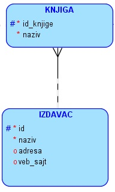
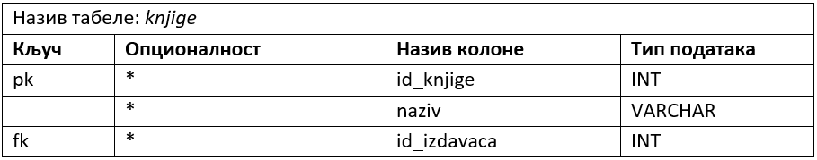
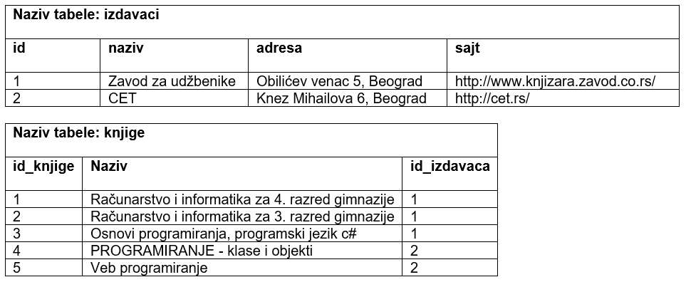
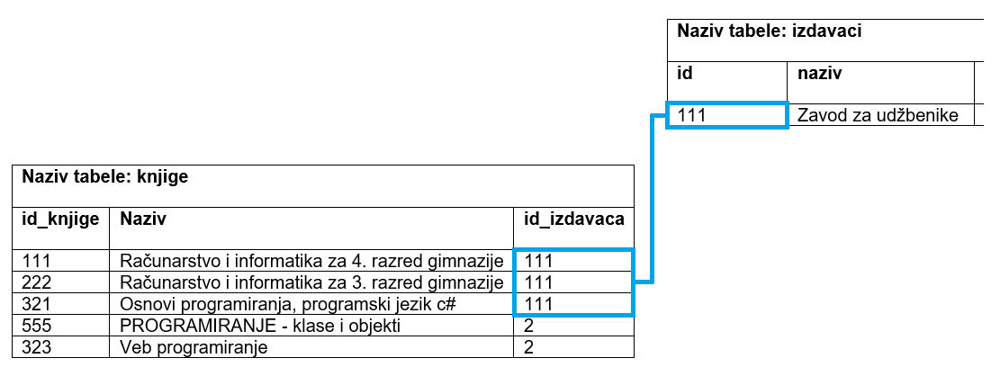
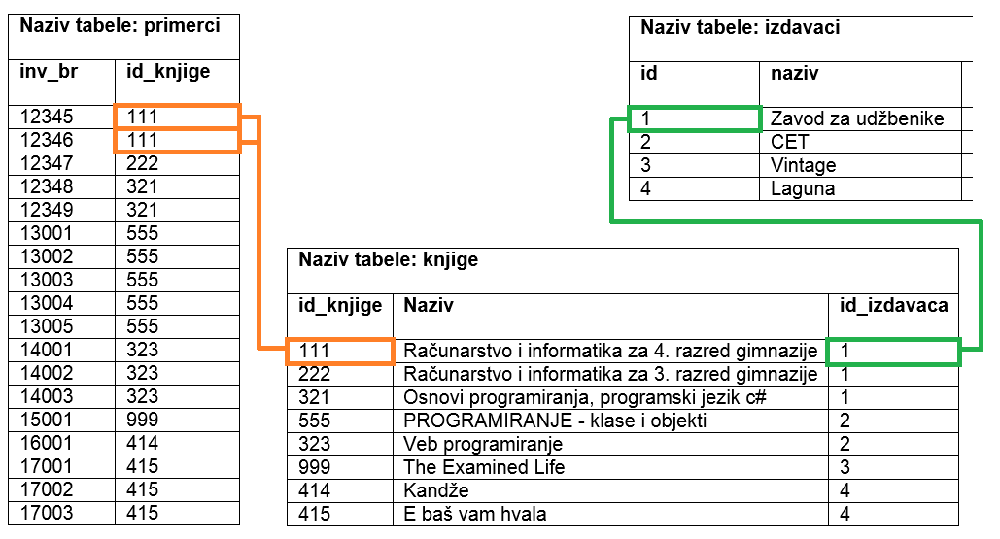
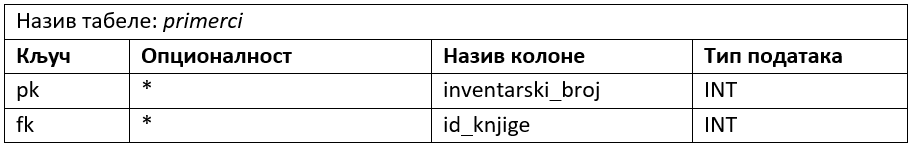
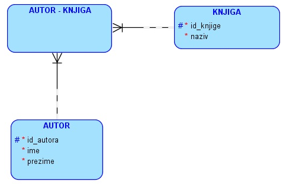
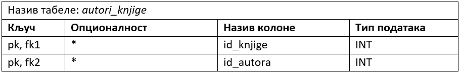
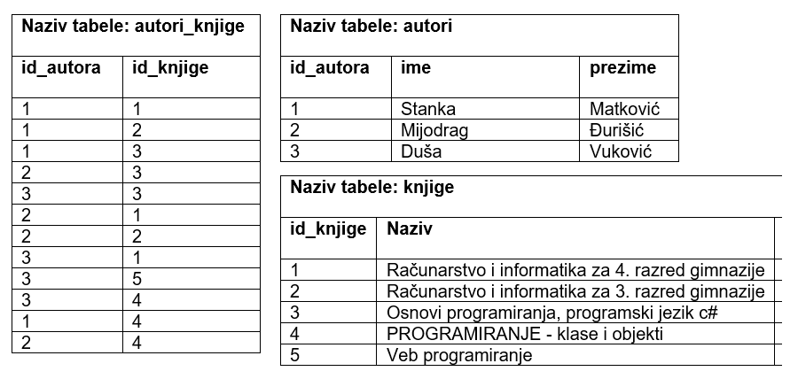

Креирање табела - команда CREATE TABLE и везе 1:M и M:M
=======================================================

.. infonote::

 Да би се избегла непотребна понављања података и могућност грешке, подаци које чувамо у бази података су распоређени у 
 различите табеле, али су оне повезани и важно је разумети те везе. 

 Две најчешће везе су један-према-више и више-према-више. Веза један-према-више захтева постојање додатне колоне у 
 једној од табела која показује на другу табелу. Веза више-према-више је заправо додатна табела у бази. Детаљно ћемо 
 објаснити како се креирају повезане табеле. 
 
Уколико имамо два ентитета повезана **везом један-према-више**, у једну од табела се додаје додатна колона која је страни 
кључ. Страни кључ се додаје као колона у ону табелу која је на страни „више“. Погледајмо следећи пример. Један издавач 
је објавио више књига. Нема смисла уз податке о издавачу чувати шифре свих књига које је објавио. Како је једну књигу 
објавио један издавач, онда уз податке о књизи можемо да чувамо и податак о томе ко ју је објавио. Тај податак је 
идентификација, шифра издавача – *id_izdavaca*.

**Напомена**: Овај модел је исправан уколико се узме у обзир претпостaвка да су сви примерци исте књиге у библиотеци 
од истог издавача.  

Следи дизајн табеле *knjige* у бази података. 

   
Страни кључ, колона *id_izdavaca* у табели knjige показује на примарни кључ, колону *id*, табеле *izdavaci*. 
Поред колоне која је страни кључ неопходно је додати реч **REFERENCES**, а након ње назив табеле и колоне на коју 
страни кључ показује. Није довољно само предвидети ову додатну колону која представља везу ка другој табели, 
већ је изузетно важно уз њу дефинисати и да је та колона страни кључ тако што се наведе реч REFERENCES и одговарајућа 
референца. На тај начин се обезбеђују додатне провере приликом рада са подацима у бази. Тако, на пример, неће бити 
могуће да се унесе књига са идентификационим бројем издавача који не постоји у табели *izdavaci*. 

У примеру који следи се примарни и страни кључ не зову исто. 

::

 CREATE TABLE knjige
 ( id_knjige INT PRIMARY KEY, 
 naziv VARCHAR(50) NOT NULL, 
 id_izdavaca INT NOT NULL REFERENCES izdavaci(id) )
 
Приказано је како се страни кључ дефинише уз дефиницију колоне. Могуће је дефинисати и страни кључ након списка свих 
колона. У том случају је обавезно користити и кључне речи FOREIGN KEY, након којих се у загради наведе назив колоне 
која је страни кључ, а затим обавезан део са кључном речју REFERENCES.

::

 CREATE TABLE knjige
 ( id_knjige INT PRIMARY KEY, 
 naziv VARCHAR(50) NOT NULL, 
 id_izdavaca INT NOT NULL,
 FOREIGN KEY (id_izdavaca) REFERENCES izdavaci(id) )

Уколико се након речи REFERENCES налази само назив табеле, подразумева се да страни кључ показује на примарни кључ те 
табеле. 

На следећој слици је приказано како би ове табеле, повезане кључевима, изгледале у бази података. Јасно се види да 
један издавач може да објави више књига. 

.. image:: ../../_images/slika_302b.png
   :width: 780
   :align: center

На свим илустрацијама до сада се користе другачији скупови вредности за примарне кључеве у различитим табелама да би 
се илустрације лакше пратиле и разумеле. Међутим, чест је случај да се вредности у колонама које су примарни кључеви 
попуњавају бројевима редом 1, 2, 3, 4, и тако даље, па би приказана ситуација са претходне слике могла да изгледа и 
другачије, а са истим значењем. Важно је и у том случају да посматрамо и повезујемо вредности из колоне *id_izdavaca*, 
која је страни кључ у табели *knjige*, и вредности у колони *id*, која је примарни кључ табеле *izadavaci*. 

Приликом креирања страног кључа могуће је додати неку од опција за ажурирање UPDATE и брисање DELETE:
 
- CASCADE
- NO ACTION
- SET NULL 
- SET DEFAULT

За ажурирање има смисла дозволити каскадну измену. У нашем примеру би то значило да, уколико се измени вредност 
примарног кључа за издавача, каскадно ће се изменити и одговарајуће вредности страних кључева код свих књига тог 
издавача. 

Каскадна опција можда није најбоље решење за брисање зато што би брисање једног реда у једној табели потенцијално 
обрисало податке из више редова више различитих табела, па тиме можда и значајан део целе базе. Узмимо, на пример, 
да желимо да обришемо једног издавача. Уколико је укључена каскадна опција, то би значило да би брисање тог једног 
реда узроковало брисање свих књига тог издавача, а затим брисање свих примерака тих књига, а онда и брисање свих 
позајмица тих примерака. Боље решење би било да се такво брисање не дозволи, у овом случају да се не дозволи брисање 
података о издавачу чије књиге имамо у библиотеци. Када брисање не успе, било би добро урадити неко архивирање података 
о књигама, примерцима и позајмицама издавача којег желимо да обришемо. Затим урадити брисање обрнутим редоследом, 
који је увек дозвољен, а то би подразумевало прво брисање свих позајмица, онда свих примерака, затим свих књига тог 
издавача, а на крају и самог издавача. 

   
Како у овим табелама вредности страног кључа не могу да буду NULL, нити је дефинисана подразумевана вредност, 
друге две опције нису на располагању. 

Следи допуњена команда за креирање табеле. 

::

 CREATE TABLE knjige
 ( id_knjige INT PRIMARY KEY, 
 naziv VARCHAR(50) NOT NULL, 
 id_izdavaca INT NOT NULL,
 FOREIGN KEY (id_izdavaca) REFERENCES izdavaci(id) 
 ON UPDATE CASCADE ON DELETE NO ACTION )

Наравно, можда се установи да би друге опције биле боље решење након детаљне анализе захтева пословања. Можда нам не 
треба архива свих података о издавачу којег желимо да обришемо, па има смисла да укључимо каскадно брисање и тиме 
уштедимо време тако што нећемо морати све пешке да бришемо. Такође је могуће да не желимо да дозволимо измену вредности 
приманог кључа било које табеле. Следи измењена команда у складу са овим што је управо описано. 

::

 CREATE TABLE knjige
 ( id_knjige INT PRIMARY KEY, 
 naziv VARCHAR(50) NOT NULL, 
 id_izdavaca INT NOT NULL,
 FOREIGN KEY (id_izdavaca) REFERENCES izdavaci(id) 
 ON UPDATE NO ACTION ON DELETE CASCADE)
 
Следећа два ентитета повезана везом 1:М су *KNJIGA* и *PRIMERAK*. 

Следи дизајн табеле *primerci* у бази података. 

Страни кључ, колона *id_knjige*, у табели knjige показује на примарни кључ, колону *id_knjige*, табеле *knjge*. 
У овом примеру се примарни и страни кључ зову исто. 

::

 CREATE TABLE primerci
 ( inventarski_broj INT PRIMARY KEY, 
 id_knjige INT NOT NULL REFERENCES knjige(id_knjige) )
 
На следећој слици је приказано како би ове табеле, повезане кључевима, изгледале у бази података. Уколико желимо да 
сазнамо, на пример, ко је издавач примерака са инвентарским бројевима 12345 и 12346 (за које је очигледно да су 
примерци исте књиге), погледаћемо вредност страног кључа који садржи идентификацију књиге: 111. У табели *knjige* се 
види да је књига са идентификацијом 111: „Рачунарство и информатика за 4. разред гимназије“, а да је вредност страног 
кључа који садржи идентификацију њеног издавача: 1. У табели *izdavaci* се види да је издавач са идентификацијом 1: 
„Завод за уџбенике“.

.. image:: ../../_images/slika_302e.png
   :width: 780
   :align: center

Веза више-према-више се веома често среће у животу и одговара многим ситуацијама у оквиру различитих типова пословања. 
Ако као књиге посматрамо школске уџбенике, приметићемо да свака књига има више аутора, а аутори најчешће током свог 
рада напишу више књига. Овакву везу је немогуће реализовати у релационој бази података, па се на моделу уклања и 
уместо ње се поставља нови ентитет. Уколико нема бољег решења, назив новог ентитета може да буде комбинација назива 
почетна два ентитета повезана везом М:М.

Кратке цртице којима су везе прецртане значе да везе учествују у примарном јединственом идентификатору новог ентитета. 
Тако је примарни јединствени идентификатор новог ентитета који је дошао на место везе типа М:М, ентитета *АUTOR-KNJIGA*, 
заправо сложен и представља комбинацију примарних јединствених идентификатора ентитета *АUTOR* и *KNJIGA*: 
(*id_knjige*, *id_autora*). 

Следи мапирање, тј. дизајн табеле која ће бити креирана у бази података.

Табеле *knjige* и *autori* су већ креиране. Команда CREATE TABLE језика *SQL* којом се креира табела *autori_knjige* у 
релационој бази података која има два страна кључа и један сложен примарни кључ:  

::

 CREATE TABLE autori_knjige
 (id_autora INT REFERENCES autori(id_autora),
 id_knjige INT REFERENCES knjige(id_knjige), 
 PRIMARY KEY (id_autora, id_knjige) )

Када се ограничење, у овом случају примерни кључ, односи на комбинацију колона, оно мора да буде наведено након списка 
свих колона и да се тада наброје називи колона који у њему учествују. 

На следећој слици је приказано како би ове табеле, повезане кључевима, изгледале у бази података. 

.. image:: ../../_images/slika_302g.png
   :width: 780
   :align: center

**Напомена**: Овај модел је исправан уколико се узме у обзир претпоставка да библиотека чува уџбенике. Уколико се у 
библиотеци налазе само романи, онда је веза ентитета AUTOR и KNJIGA могла да буде 1:М (роман има једног аутора). 

На свим илустрацијама до сада се користе другачији скупови вредности за примарне кључеве у различитим табелама да би се 
илустрације лакше пратиле и разумеле. Међутим, чест је случај да се вредности у колонама које су примарни кључеви 
попуњавају бројевима редом 1, 2, 3, 4, и тако даље, па би приказана ситуација са претходне слике могла да изгледа и 
другачије а са истим значењем. Важно је и у том случају да посматрамо и повезујемо вредности одговарајућих колона. 

