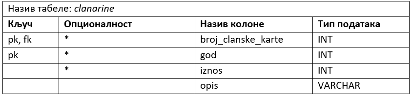

Креирање табела - команда CREATE TABLE - примери
================================================

.. infonote::

 Поред до сада описаних повезивања табела, имамо и разне ситуације које захтевају посебан приступ. У овој лекцији ће 
 бити описане неке од њих. 

 На пример, иако страни кључ у једној табели најчешће показује на примарни кључ у другој табели, имамо случај када је 
 менаџер такође особа која је запослена, па постоји потреба да креирамо страни кључ који показује на примарни кључ исте 
 табеле. 
 
Следи још један део модела са неколико ентитета и потребно је да се креирају одговарајуће табеле командом CREATE TABLE. 

У овом делу дијаграма имамо: рекурзивну везу, пример везе која учествује у примарном јединственом идентификатору 
ентитета који није резултат везе М:М, имамо ентитет који је последица везе М:М и имамо пример везе 1:1.

   
Кренимо од јаког ентитета *ZAPOSLEN*. Овај ентитет учествује у рекурзивној вези: сваки запослени може да има менаџера и 
сваки менаџер може да буде менаџер за једног или више запослених

   
Следи помоћна табела, дизајн будуће табеле у бази података, за овај ентитет. Рекурзивна веза се остварује додавањем 
колоне која је страни кључ који показује на примарни кључ исте табеле. Како две колоне у једној табели не могу да имају 
исте називе, страни кључ не може да се зове исто као и примарни на који показује. 

   
Следи команда CREATE TABLE језика SQL којом се креира ова табела у релационој бази података.  

::

 CREATE TABLE zaposleni
 ( id INT PRIMARY KEY, 
 ime VARCHAR(15) NOT NULL, 
 prezime VARCHAR(15) NOT NULL,
 mejl VARCHAR(50),
 datum_zaposlenja DATE NOT NULL,
 plata INT NOT NULL,
 id_menadzera INT REFERENCES zaposleni(id) )

Када се ова табела креира у бази података и када се у њу унесу неки подаци, она ће изгледати овако:

.. image:: ../../_images/tabela_303b.png
   :width: 780
   :align: center
   
Можемо да видимо, на пример, да је запосленом са идентификацијом 3, Ани Милосављевић, идентификација менаџера 
(вредност страног кључа): 1. Менаџер је запослен, па можемо да видимо у истој табели да је Анин менаџер запослени 
који има идентификацију 1: „Јован Јовановић“. 

Како вредност страног кључа у овој табели може да буде NULL, има смисла да код брисања употребимо опцију SET NULL. 
Следи допуњена команда. 

::

 CREATE TABLE zaposleni
 ( id INT PRIMARY KEY, 
 ime VARCHAR(15) NOT NULL, 
 prezime VARCHAR(15) NOT NULL,
 mejl VARCHAR(50),
 datum_zaposlenja DATE NOT NULL,
 plata INT NOT NULL,
 id_menadzera INT REFERENCES zaposleni(id) 
 ON UPDATE CASCADE ON DELETE SET NULL)

Уколико бисмо, на пример, из базе обрисали Јована Јовановића, код свих запослених којима је он био менаџер би се 
поставила вредност NULL на место страног кључа *id_menadzera*. 

   
Jак ентитет на приказаном делу модела је *CLAN*. Слаб ентитет повезан са ентитетом CLAN је *CLANARINA*.

    
Следи дизајн будуће табеле у бази података за овај ентитет. Веза је део примарног јединственог идентификатора, 
па ће примарни кључ бити сложен и састојаће се од комбинације *broj_clanske_karte* и *god*.

   
Команда CREATE TABLE језика SQL креира ову табелу у релационој бази података:  

::

 CREATE TABLE clanarine
 ( broj_clanske_karte INT REFERENCES clanovi(broj_clanske_karte), 
 god INT NOT NULL, 
 iznos INT NOT NULL, 
 opis VARCHAR(50), 
 PRIMARY KEY (broj_clanske_karte, god) )

Када се овe табелe креирају у бази података и када се у њих унесу неки подаци, оне ће изгледати овако:

   
Међу подацима се види, на пример, да је члан библиотеке Милица Зорановић, са бројем чланске карте 11, платила чланарине 
за 2018. и 2019. годину. У табели која чува податке о чланаринама, комбинација вредности (број чланске карте, година) 
мора да буде јединствена. Један члан само једном плаћа чланарину за једну годину. 

Ентитет *POZAJMICА* је настао уместо везе М:М између ентитета *CLAN* и *PRIMERAK*, а у вези је и са ентитетом *ZAPOSLEN* 
(који запослени библиотеке је издао одређену књигу одређеном члану). 

   
Следи мапирање, тј. дизајн табеле која ће бити креирана у бази података.
 

   
Команда CREATE TABLE језика SQL креира табелу pozajmice у релационој бази података која има три страна кључа и један 
сложен примарни кључ:  

::

 CREATE TABLE pozajmice
 ( inventarski_broj INT REFERENCES primerci(inventarski_broj), 
 broj_clanske_karte INT REFERENCES clanovi(broj_clanske_karte), 
 datum_uzimanja DATE, 
 datum_vracanja DATE, 
 id_zaposlenog INT NOT NULL REFERENCES zaposleni(id),
 PRIMARY KEY (inventarski_broj, broj_clanske_karte, datum_uzimanja), 
 CHECK (datum_vracanja >= datum_uzimanja) )

Поред наведених страних и сложеног примарног кључа, ова табела има и још једно ограничење. Датум враћања не може да 
буде пре датума узимања књиге из библиотеке, и то се записује на следећи начин:

::

 CHECK (datum_vracanja >= datum_uzimanja)
 
Највероватније се подаци о позајмици уносе у базу оног дана када се књига узме из библиотеке. Тако да можемо за датум узимања књиге да подразумевамо да је „данашњи“ датум. Непотребно ручно уношење датума може да се избегне тако што ћемо за ту колону да предвидимо подразумевану вредност. Тај датум можемо да добијемо позивом функције GETDATE.

::

 datum_uzimanja DATE DEFAULT GETDATE()
 
Следи комплетна команда за креирање табеле са овом изменом. 

::

 CREATE TABLE pozajmice
 ( inventarski_broj INT REFERENCES primerci(inventarski_broj), 
 broj_clanske_karte INT REFERENCES clanovi(broj_clanske_karte), 
 datum_uzimanja DATE DEFAULT GETDATE(), 
 datum_vracanja DATE, 
 id_zaposlenog INT NOT NULL REFERENCES zaposleni(id),
 PRIMARY KEY (inventarski_broj, broj_clanske_karte, datum_uzimanja), 
 CHECK (datum_vracanja >= datum_uzimanja) )

Овај модел дозвољава да се један примерак књиге изда два пута у току истог дана. На пример, неко ујутру узме књигу, 
схвати да му не треба та него нека друга, врати је у библиотеку у року од два сата, а по подне неко други позајми исти 
примерак. Уколико се ограничимо на то да се један примерак може издати само једном у току дана, онда би ситуација са 
овом табелом била другачија. Примарни кључ би тада имао само два поља. 

Команда би изгледала овако:

::

 CREATE TABLE pozajmice
 ( inventarski_broj INT REFERENCES primerci(inventarski_broj), 
 broj_clanske_karte INT REFERENCES clanovi(broj_clanske_karte), 
 datum_uzimanja DATE DEFAULT GETDATE(), 
 datum_vracanja DATE, 
 id_zaposlenog INT NOT NULL REFERENCES zaposleni(id),
 PRIMARY KEY (inventarski_broj, datum_uzimanja), 
 CHECK (datum_vracanja >= datum_uzimanja) )

Уколико бисмо желели да у овој табели имамо једноставан примарни кључ, идентификатор позајмице, то можемо да урадимо. 
Поред тога морамо да водимо рачуна да колоне које би чиниле сложен примарни јединствени идентификатор 
(*inventarski_broj*, *broj_clanske_karte*, *datum_uzimanja*) и даље имају иста својства, а то је да морају да буду 
попуњена (додајемо код сваке од тих колона ограничење NOT NULL) и да је њихова комбинација јединствена 
(додајемо ограничење UNIQUE за комбинацију ових колона). 

::

 CREATE TABLE pozajmice
 ( id_pozajmice INT PRIMARY KEY,
 inventarski_broj INT NOT NULL REFERENCES primerci(inventarski_broj), 
 broj_clanske_karte INT NOT NULL REFERENCES clanovi(broj_clanske_karte), 
 datum_uzimanja DATE NOT NULL DEFAULT GETDATE(), 
 datum_vracanja DATE, 
 id_zaposlenog INT NOT NULL REFERENCES zaposleni(id),
 UNIQUE (inventarski_broj, broj_clanske_karte, datum_uzimanja), 
 CHECK (datum_vracanja >= datum_uzimanja) )
 
**Напомена: Запамтити да је изузетно важно анализирати конкретан пословни захтев и креирати модел а затим и базу који одговарају управо њему!**

  
**Веза један-према-један** је веома ретка. Као и код других веза, у случају везе 1:1 додатна колона која ће бити страни 
кључ иде у једну од две повезане табеле. Уколико је веза обавезна на једном крају, колона иде у ту табелу чији је 
ентитет на обавезном крају везе. Уколико је веза цела обавезна или цела опциона, та колона може у било коју од две 
табеле, али обавезно само у једну од њих. Следи пример:  

   
Табела *pozajmice* је већ креирана и садржи сложен примарни кључ који се састоји од три колоне. Тако ће табела *kaznе* 
имати сложен страни кључ: (*inventarski_broj*, *broj_clanske_karte*, *datum_uzimanja*) који одговара сложеном примарном 
кључу табеле pozajmice. У овом случају, када се ограничење односи на групу колона, неопходно је користити кључне 
речи FOREIGN KEY и ограничење дефинисати након списка свих колона. 

Код везе један-према-један страни кључ мора да има и ограничење јединствености. У овом примеру је важно да за једну 
позајмицу постоји само једна казна, односно одговарајућа вредност примарног кључа јаке табеле *POZAJMICE* ће се 
појавити само једном у колони која је страни кључ у табели *KAZNE*. 

Команда за креирање табеле би изгледала овако:

::

 CREATE TABLE kazne
 ( id_kazne INT PRIMARY KEY,
 iznos INT NOT NULL,
 datum DATE NOT NULL,  
 inventarski_broj INT NOT NULL, 
 broj_clanske_karte INT NOT NULL, 
 datum_uzimanja DATE NOT NULL,
 FOREIGN KEY (inventarski_broj, broj_clanske_karte, datum_uzimanja) 
 REFERENCES pozajmice(inventarski_broj, broj_clanske_karte, datum_uzimanja),
 UNIQUE (inventarski_broj, broj_clanske_karte, datum_uzimanja) )

