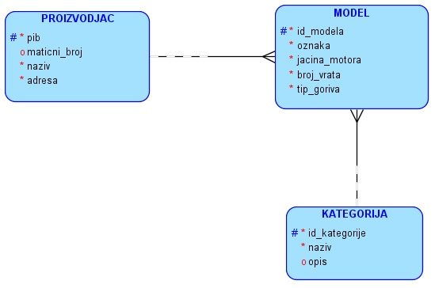

Задатак - салон аутомобила
==========================

.. questionnote::

 **Написати команде како би се креирала табела за базу података на примеру салона аутомобила.**

Сваки произвођач аутомобила има назив и адресу седишта. Произвођачи аутомобила су правна лица којима су додељени 
ПИБ и матични број. ПИБ и матични број имају по осам цифара и свако правно лице има свој јединствени ПИБ и свој 
јединствени матични број. Произвођач аутомобила производи више различитих модела. Сваки модел има своју ознаку, 
јачину мотора, број врата и тип горива. Аутомобили су подељени у категорије: лимузина, караван, кабриолет... 

|
   
.. reveal:: 305
    :showtitle: Прикажи решење 
    :hidetitle: Сакриј
	
    ::
	
	CREATE TABLE kategorije
	(
		id_kategorije INT PRIMARY KEY,
		naziv VARCHAR(30) NOT NULL UNIQUE,
		opis VARCHAR(150) 
	)
	
	CREATE TABLE proizvodjaci
	(
		pib INT PRIMARY KEY,
			maticni_broj INT UNIQUE,
		naziv VARCHAR(100) NOT NULL UNIQUE,
		adresa VARCHAR(150) NOT NULL 
	)

	CREATE TABLE modeli
	(
		id_modela INT PRIMARY KEY,
		oznaka VARCHAR(20) NOT NULL UNIQUE,
		jacina_motora VARCHAR(6) NOT NULL,
		broj_vrata INT NOT NULL,
		tip_goriva VARCHAR(10) NOT NULL,
		pib INT NOT NULL REFERENCES proizvodjaci(pib),
		id_kategorije INT NOT NULL REFERENCES kategorije(id_kategorije) 
	)
 
 