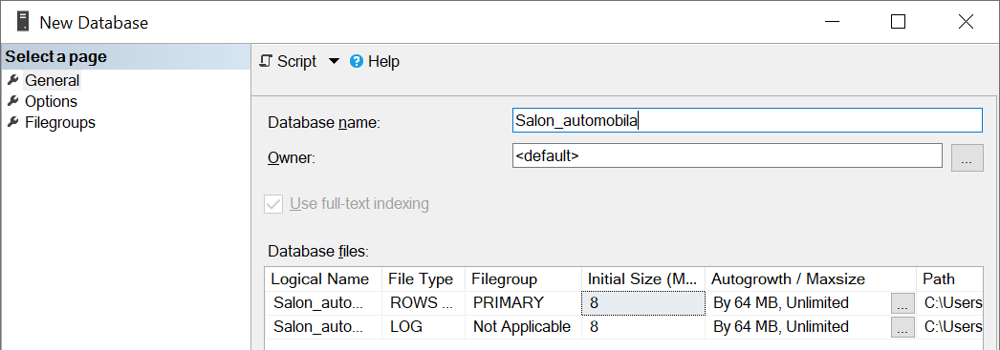
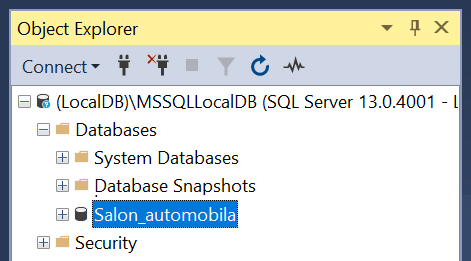
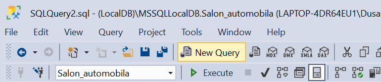
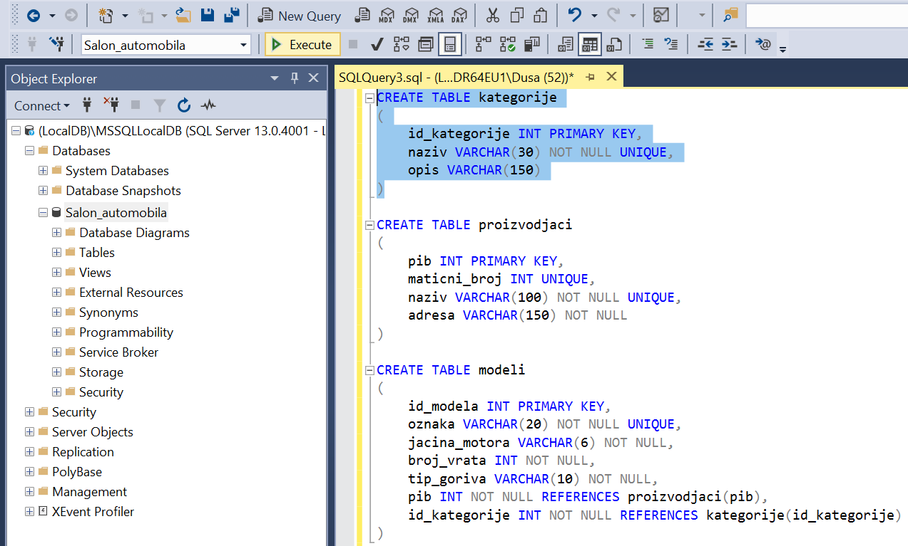
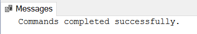

Креирање базе помоћу алата SQL Server Management Studio
=======================================================

Сваки произвођач аутомобила има назив и адресу седишта. Произвођачи аутомобила су правна лица којима су додељени ПИБ 
и матични број. ПИБ и матични број имају по осам цифара и свако правно лице има свој јединствени ПИБ и свој 
јединствени матични број. Произвођач аутомобила производи више различитих модела. Сваки модел има своју ознаку, 
јачину мотора, број врата и тип горива. Аутомобили су подељени у категорије: лимузина, караван, кабриолет... 

За ову базу смо већ припремили CREATE TABLE команде. 

::

 CREATE TABLE kategorije
 (
     id_kategorije INT PRIMARY KEY,
     naziv VARCHAR(30) NOT NULL UNIQUE,
     opis VARCHAR(150) 
 )
 
 CREATE TABLE proizvodjaci
 (
     pib INT PRIMARY KEY,
     maticni_broj INT UNIQUE,
     naziv VARCHAR(100) NOT NULL UNIQUE,
     adresa VARCHAR(150) NOT NULL 
 )
 
 CREATE TABLE modeli
 (
     id_modela INT PRIMARY KEY,
     oznaka VARCHAR(20) NOT NULL UNIQUE,
     jacina_motora VARCHAR(6) NOT NULL,
     broj_vrata INT NOT NULL,
     tip_goriva VARCHAR(10) NOT NULL,
     pib INT NOT NULL REFERENCES proizvodjaci(pib),
     id_kategorije INT NOT NULL REFERENCES kategorije(id_kategorije) 
 )

Кликнути десни тастер миша над *Databases* у прозору *Object Explorer* и изабрати *New Database*.

.. image:: ../../_images/slika_306a.png
   :width: 400
   :align: center
   
Унети назив нове базе података и кликнути дугме OK. 

   
Нова база података се појавила на списку у прозору *Object Explorer*.

   
Кликнути дугме *New Query* испод главног падајућег менија. 

Прво извршити све **CREATE TABLE** команде, једну по једну.

**Напомена: Редослед је важан!** Пре креирања табеле која има страни кључ, неопходно је креирати табелу на коју она 
показује. 

Све команде могу да се истовремено прекопирају, али се свака појединачно прво означи мишем и за сваку означену команду 
се кликне *Execute*, као што је приказано на следећој слици. 
 

   
Након сваке успешно извршене команде појави се одговарајућа порука.

   
Када се свака команда изврши, све табеле ће остати сачуване у бази података за даљу употребу. Фајл *SQLQuery1.sql* може, 
али и не мора да се сачува.

Описани алат *Microsoft SQL Server Management Studio* може бесплатно да се преузме са следеће адресе:

https://docs.microsoft.com/en-us/sql/ssms/download-sql-server-management-studio-ssms
