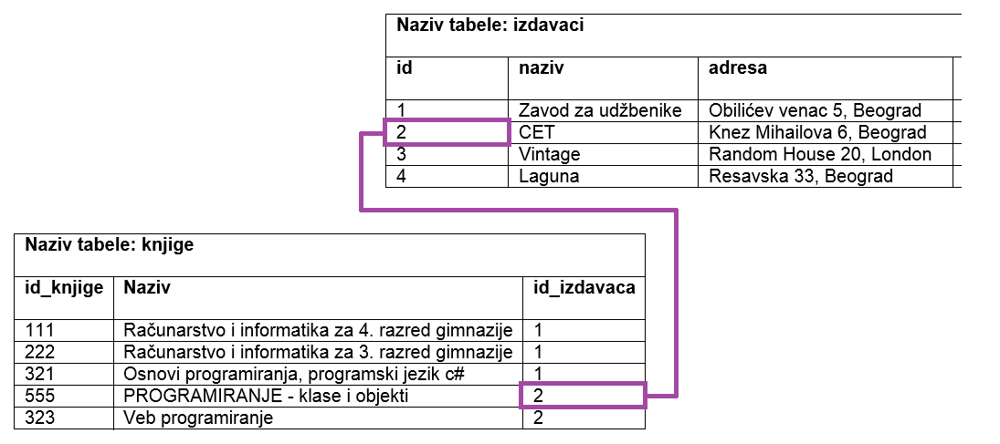
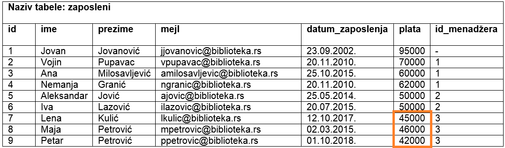
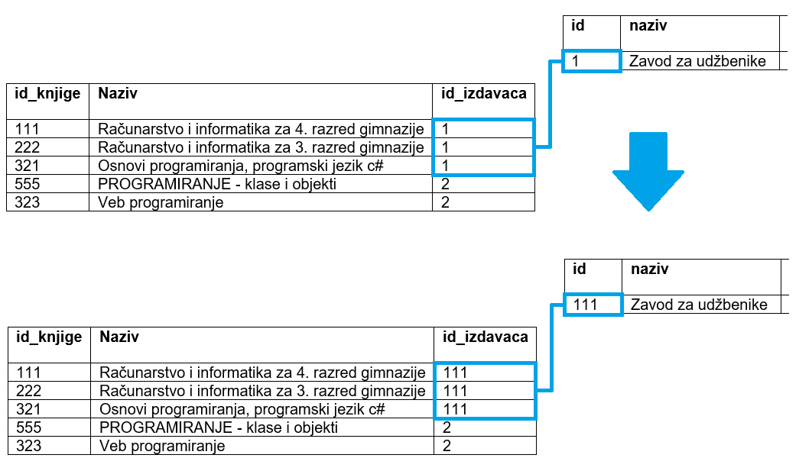
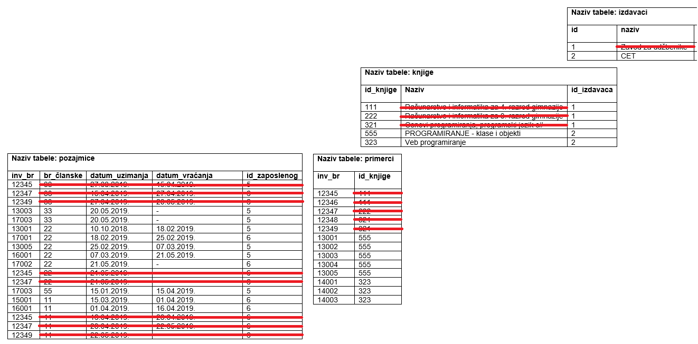

Рад са подацима
===============

.. infonote::

 Подаци који се налазе у базама су корисни уколико су исправни и уколико можемо ефикасно из њих да добијемо важне 
 информације. За обраду и претрагу података употребљава се команда SELECT, која се назива упит и којој ће бити касније 
 посвећено доста пажње. Да бисмо могли да је користимо, потребно је прво да имамо податке и да су ти подаци ажурирани. 
 Постоје посебне команде за унос, ажурирање и брисање података. Већина система за управљање базама података има 
 графички кориснички интерфејс који обезбеђује удобан и једноставан рад са подацима. Овај интерфејс се незнатно 
 разликује од система до система, а заједничко им је то да се након било које акције у позадини извршава одговарајућа 
 команда језика *SQL*. Упознаћеш и ове команде да би разумео како се у релационим базама података заправо ради са подацима. 
 
Када су табеле креиране, подаци се уносе командом **INSERT INTO**. Овом командом се уноси један по један ред. 

Погледајмо табелу *izdavaci*. 

::

 CREATE TABLE izdavaci
 ( id NUMBER(5) PRIMARY KEY, 
 naziv VARCHAR2(40) NOT NULL, 
 adresa VARCHAR2(50), 
 veb_sajt VARCHAR2(50) )
 
Следећом командом се уноси један ред у табелу. Текстуални подаци се наводе под апострофима. 

::

 INSERT INTO izdavaci(id, naziv, adresa, veb_sajt)
 VALUES (2, 'CET', 'Knez Mihailova 6, Beograd', 
 'http://www.knjizara.zavod.co.rs/')

Подаци који се уносе су наведени у редоследу који одговара редоследу колона. 
Табела има четири колоне и четири податка се уносе у ред. Из тог разлога списак колона може да се изостави и 
команда може да изгледа овако:

::

 INSERT INTO izdavaci
 VALUES (2, 'CET', 'Knez Mihailova 6, Beograd', 
 'http://www.knjizara.zavod.co.rs/')

Уколико, међутим, хоћемо да унесемо податке у другачијем редоследу или хоћемо да изоставимо податак који можемо да 
изоставимо (колона нема NOT NULL ограничење), морамо да наведемо одговарајући списак колона. Следе примери.

::

 INSERT INTO izdavaci(id, naziv, veb_sajt, adresa)
 VALUES (2, 'CET', 'http://www.knjizara.zavod.co.rs/', 
 'Knez Mihailova 6, Beograd')

 INSERT INTO izdavaci(id, naziv, adresa)
 VALUES (2, 'CET', 'Knez Mihailova 6, Beograd')

У случају последње наведене команде, поље veb_sajt ће остати празно, тј. биће *null*. Исти резултат може да се постигне 
и експлицитним уносом вредности *null* у одговарајуће поље. 

::

 INSERT INTO izdavaci
 VALUES (2, 'CET', 'Knez Mihailova 6, Beograd', null)

Следеће две команде се **неће** успешно извршити.

1) Већ постоји издавачка кућа са идентификационим бројем 2 (вредности примарног кључа морају да буду јединствене).

::

 INSERT INTO izdavaci
 VALUES (2, 'Vintage', 'Random House 20, London', 
 'www.vintage-books.co.uk')

2) Вредности морају да се унесу у колоне које су примарни кључ или имају NOT NULL ограничење.  

::

 INSERT INTO izdavaci
 VALUES (null, null, 'Random House 20, London', 'www.vintage-books.co.uk')

Важан је редослед уноса података у базу података. На пример, прво морамо да унесемо податке о издавачкој кући, а затим 
податке о књигама које су њена издања. 

::

 INSERT INTO knjige 
 VALUES (555, 'PROGRAMIRANJE - klase i objekti', 2)

Вредност у колони која је страни кључ мора да постоји у табели на коју тај страни кључ показује. У наведеном примеру 
уноса података у бази ћемо имати исправно повезану књигу и њеног издавача. 

   
Следећа командa се **неће** успешно извршити зато што не постоји издавач са идентификационим бројем 88. 

::

 INSERT INTO knjige 
 VALUES (555, 'PROGRAMIRANJE - klase i objekti', 88)

Унети подаци могу да се ажурирају командом **UPDATE**. 

На пример, члан библиотеке са бројем чланске карте 33 се преселио и нова адреса је Страхињића бана 2. Постоји само 
један члан са овим бројем чланске карте, па ће се измена догодити у једном реду. 

::

 UPDATE clanovi
 SET adresa = 'Strahinjica bana 2, Beograd'
 WHERE broj_clanske_karte = 33

Можемо да променимо и више од једног податка у једном реду користећи једну команду. Наредном командом мењамо и адресу и 
телефон члана библиотеке са бројем чланске карте 33.

::

 UPDATE clanovi
 SET adresa = 'Strahinjica bana 2, Beograd' AND telefon = '011-222-777'
 WHERE broj_clanske_karte = 33

Једном командом могу да се измене подаци у више редова. На пример, свим запосленим особама којима је менаџер запослени 
са идентификационим бројем 3 променити плату тако да нови износ буде 47.000. Плате које ће се променити на следећој 
слици обележене су наранџастом бојом. 

   
Наредба којом се то постиже је следећа.

::

 UPDATE zaposleni
 SET plata = 47000
 WHERE id_menadzera = 3

У наредби може да се користи и нека формула. Не морамо свим запосленим особама чији је менаџер запослени са 
идентификационим бројем 3 да доделимо исти износ новца. Једном командом можемо, на пример, свима да повећамо плату 
за 10%. 

::

 UPDATE zaposleni
 SET plata = plata * 1.1
 WHERE id_menadzera = 3

Код ажурирања података је важно и да знамо да ли постоје нека ограничења дефинисана приликом креирања табеле. 

Узмимо да је страни кључ у табели knjige креиран на следећи начин. 

::

 FOREIGN KEY (id_izdavaca) REFERENCES izdavaci(id) 
 ON UPDATE CASCADE ON DELETE NO ACTION

Уколико желимо да променимо вредност идентификационог броја неког издавача, на пример, Завода за уџбенике, потребно 
је да напишемо следећу команду која ће се успешно извршити. 

::

 UPDATE izdavaci SET id = 111 
 WHERE id = 1 

Након што се измени вредност примарног кључа у табели *izdavaci*, измениће се и одговарајуће вредности у колони која је 
страни кључ у табели *knjige*. 

Међутим, написана команда се неће успешно извршити уколико је страни кључ у табели knjige креиран на другачији начин, 
односно ако се спречава акција приликом покушаја ажурирања. 

::

 FOREIGN KEY (id_izdavaca) REFERENCES izdavaci(id) 
 ON UPDATE NO ACTION ON DELETE CASCADE 

Подаци се бришу из табеле командом **DELETE FROM**.  

На пример, запослени са идентификационим бројем 5 не ради више у библиотеци па је потребно да обришемо податке о њему. 

::

 DELETE FROM zaposleni
 WHERE id = 5

Можемо да обришемо и више редова једном командом. На пример, следећа команда брише све књиге издавача са 
идентификационим бројем 2. 

::

 DELETE FROM knjige
 WHERE id_izdavaca = 2

Код брисања података је важно и да знамо да ли постоје нека ограничења дефинисана приликом креирања табеле. 

Узмимо да је страни кључ у табели *knjige* креиран на следећи начин. 

::

 FOREIGN KEY (id_izdavaca) REFERENCES izdavaci(id) 
 ON UPDATE CASCADE ON DELETE NO ACTION

Како је на овај начин забрањено брисање реда из табеле izdavaci уколико постоји нека књига тог издавача, следећа 
команда се неће извршити. 

::

 DELETE FROM izdavaci
 WHERE id = 1

Међутим, написана команда ће сe успешно извршити уколико је страни кључ у табели *knjige* креиран на другачији начин, 
односно ако се дозвољава каскадно брисање. 

::

 FOREIGN KEY (id_izdavaca) REFERENCES izdavaci(id) 
 ON UPDATE NO ACTION ON DELETE CASCADE 

У том случају ће се обрисати и издавач, и све његове књиге, и сви примерци свих његових књига и сви подаци о 
позајмицама тих књига. 

Уколико изоставимо WHERE део команде, команда ће обрисати све податке из табеле. 

::

 DELETE FROM knjige
