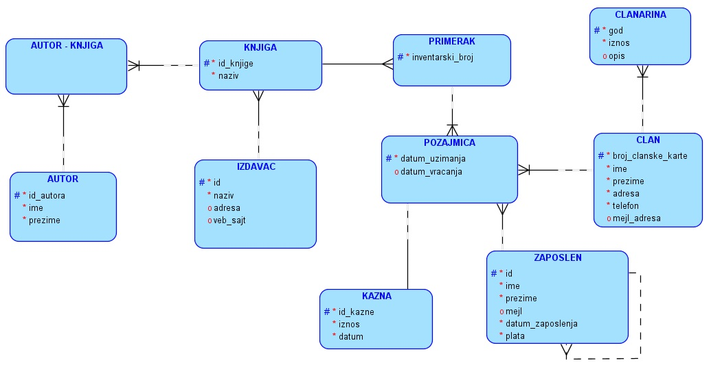

База података библиотеке - преглед модела и базе
================================================

.. infonote::
 
 Најбоље се учи кроз практичан рад, па смо и целу тему „Пројектовање“ обрадили кроз велики број примера, а највише 
 пажње посветили смо креирању модела за базу података библиотеке. Дошло је време да креирамо ову базу података у 
 изабраном конкретном систему за управљање базама података, али држећи се универзалног језика *SQL*. 
 
На следећој слици је приказан модел на основу којег се може креирати релациона базу података библиотеке.

Следи приказ како би требало да изгледа садржај креираних и попуњених табела након извршених свих команди које су 
потребне да бисмо креирали базу.

Табела *autori*

Табела *izdavaci* 

   
Табела *clanovi*

Табела *clanarine*

   
Табела *knjige* 

   
Табела *primerci*

   
   
Табела *autori_knjige*

   
Табела *zaposleni*

.. image:: ../../_images/slika_311j.png
   :width: 700
   :align: center 
   
Табела *pozajmice*
   
У правој библиотеци се књиге стално позајмљују и враћају тако да би подаци били ажурирани и у складу са данашњим 
датумом. Како је ово пример базе креиран за наставу, направљен је узорак података који би био валидан у неком 
тренутку, на пример, на дан 1. јун 2019. године. 

Табела *kazne*

