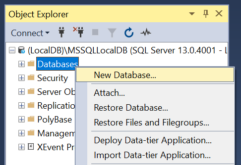
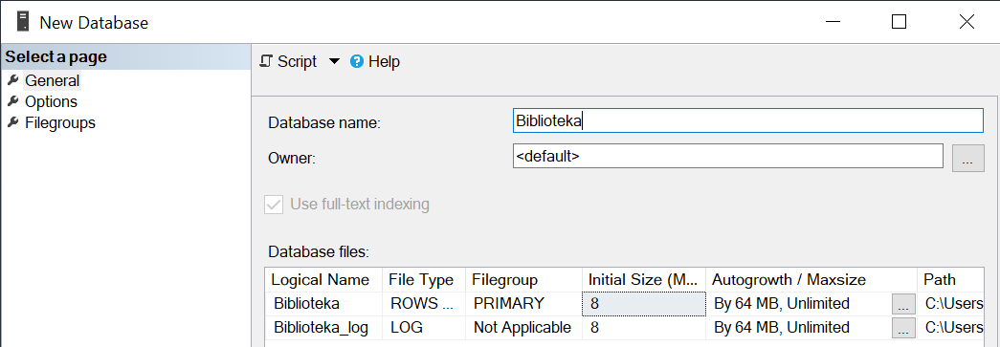
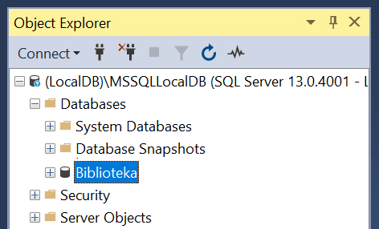
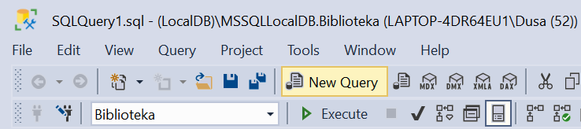
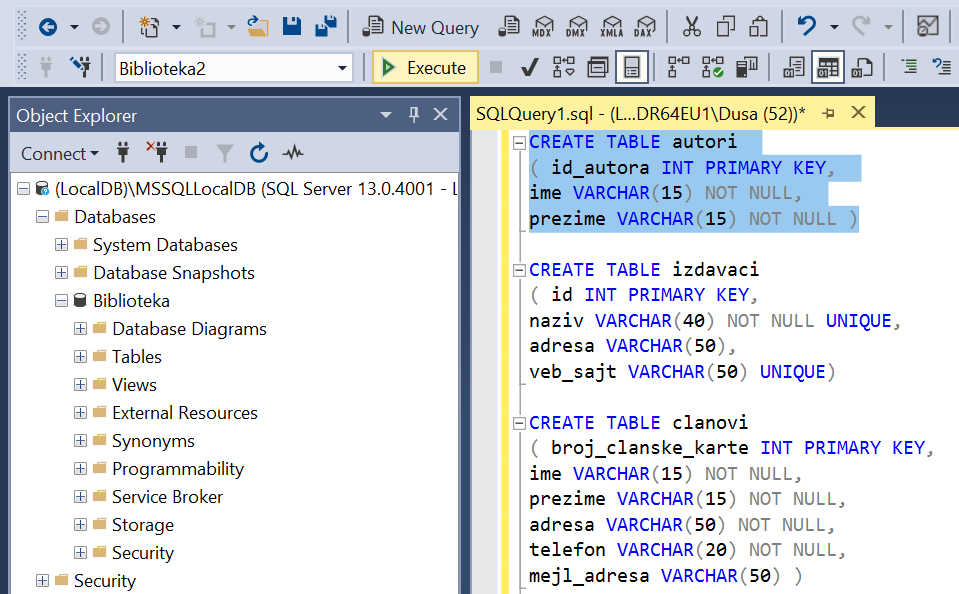
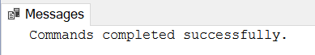
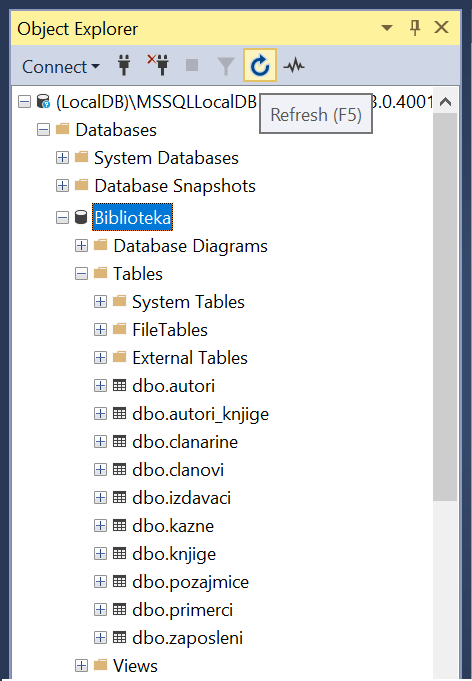

База података библиотеке - креирање базе и табела
=================================================

Кликнути десни тастер миша над *Databases* у прозору *Object Explorer* и изабрати *New Database*...

Унети назив нове базе података и кликнути дугме OK. 

   
Нова база података се појавила на списку у прозору *Object Explorer*.

   
Кликнути дугме *New Query* испод главног падајућег менија.

   
Прво извршити све **CREATE TABLE** команде, једну по једну.

**Напомена: Редослед је важан!** Пре креирања табеле која има страни кључ, неопходно је креирати табелу на коју она 
показује. 

Све команде могу да се истовремено прекопирају, али се свака појединачно прво означи мишем и за сваку означену команду 
се кликне *Execute*, као што је приказано на следећој слици. 

   
Након сваке успешно извршене команде, појави се одговарајућа порука.

   
Након што се свака команда изврши, све табеле ће остати сачуване у бази података за даљу употребу. 
Фајл *SQLQuery1.sql* може, али и не мора да се сачува.

Следе све CREATE TABLE команде за табеле базе података за библиотеку. 

::

 CREATE TABLE autori
 ( id_autora INT PRIMARY KEY, 
 ime VARCHAR(15) NOT NULL, 
 prezime VARCHAR(15) NOT NULL )
 
 CREATE TABLE izdavaci
 ( id INT PRIMARY KEY, 
 naziv VARCHAR(40) NOT NULL UNIQUE, 
 adresa VARCHAR(50), 
 veb_sajt VARCHAR(50) UNIQUE)
 
 CREATE TABLE clanovi
 ( broj_clanske_karte INT PRIMARY KEY, 
 ime VARCHAR(15) NOT NULL, 
 prezime VARCHAR(15) NOT NULL, 
 adresa VARCHAR(50) NOT NULL, 
 telefon VARCHAR(20) NOT NULL,
 mejl_adresa VARCHAR(50) )
 
 CREATE TABLE clanarine
 ( broj_clanske_karte INT REFERENCES clanovi(broj_clanske_karte), 
 god INT NOT NULL, 
 iznos INT NOT NULL, 
 opis VARCHAR(50), 
 PRIMARY KEY (broj_clanske_karte, god) )
 
 CREATE TABLE knjige
 ( id_knjige INT PRIMARY KEY, 
 naziv VARCHAR(50) NOT NULL, 
 id_izdavaca INT NOT NULL REFERENCES izdavaci(id) )
 
 CREATE TABLE primerci
 ( inventarski_broj INT PRIMARY KEY, 
 id_knjige INT NOT NULL REFERENCES knjige(id_knjige) )
 
 CREATE TABLE autori_knjige
 (id_autora INT REFERENCES autori(id_autora),
 id_knjige INT REFERENCES knjige(id_knjige), 
 PRIMARY KEY (id_autora, id_knjige) )
 
 CREATE TABLE zaposleni
 ( id INT PRIMARY KEY, 
 ime VARCHAR(15) NOT NULL, 
 prezime VARCHAR(15) NOT NULL,
 mejl VARCHAR(50),
 datum_zaposlenja DATE NOT NULL,
 plata INT NOT NULL,
 id_menadzera INT REFERENCES zaposleni(id) )
 
 CREATE TABLE pozajmice
 ( inventarski_broj INT REFERENCES primerci(inventarski_broj), 
 broj_clanske_karte INT REFERENCES clanovi(broj_clanske_karte), 
 datum_uzimanja DATE, 
 datum_vracanja DATE, 
 id_zaposlenog INT NOT NULL REFERENCES zaposleni(id),
 PRIMARY KEY (inventarski_broj, broj_clanske_karte, datum_uzimanja), 
 CHECK (datum_vracanja >= datum_uzimanja) )
 
 CREATE TABLE kazne
 ( id_kazne INT PRIMARY KEY,
 iznos INT NOT NULL,
 datum DATE NOT NULL,  
 inventarski_broj INT NOT NULL, 
 broj_clanske_karte INT NOT NULL, 
 datum_uzimanja DATE NOT NULL,
 FOREIGN KEY (inventarski_broj, broj_clanske_karte, datum_uzimanja) 
 REFERENCES pozajmice(inventarski_broj, broj_clanske_karte, datum_uzimanja) 
 UNIQUE (inventarski_broj, broj_clanske_karte, datum_uzimanja) )
 

Након што су све табеле креиране, појављују се на списку у прозору *Object Explorer*. Уколико се не виде, потребно је 
кликнути *Refresh*. 

