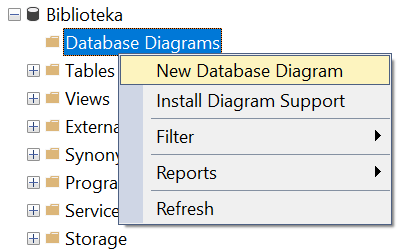
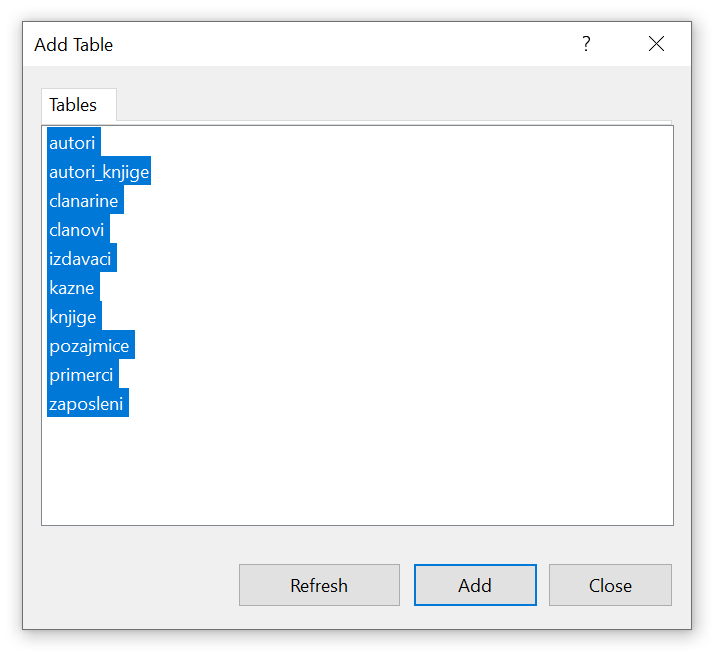
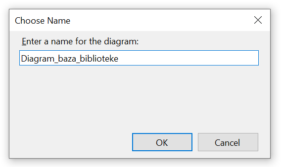
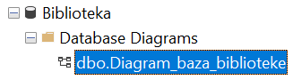

База података библиотеке - дијаграм
===================================

Кликнути десни тастер миша над *Database Diagrams* под базом података за библиотеку, и изабрати *New Database Diagram*.

   
У наредном кораку додати све табеле. 

     
Према потреби увеличати или умањити слику и испремештати табеле. Добијени дијаграм је приказан на следећој слици. 

.. image:: ../../_images/slika_314c.png
   :width: 780
   :align: center
  
Дијаграм може да се сачува.  

Када је сачуван, може да се пронађе у прозору Object Explorer и да се поново отвори. Уколико се не прикаже одмах, 
потребно је кликнути на *Refresh*. 

