База података библиотеке - други начин за креирање базе
=======================================================

Сваки систем за управљање базама података нуди и графичко окружење за креирање табела и рад са подацима које је 
једноставно за употребу. Треба имати у виду да се, чак и када се овако креирају табеле и ради са подацима, у позадини 
извршавају одговарајуће *SQL* команде.  

Након што се формира база података, могуће је креирати табеле. Табеле се креирају кликом на десни тастер миша 
над *Tables*, а затим одабиром *New / Table*...

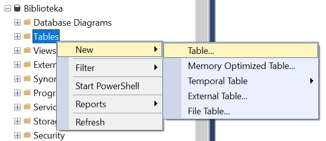

Појављује се простор за дефинисање колона које ће имати нова табела. 

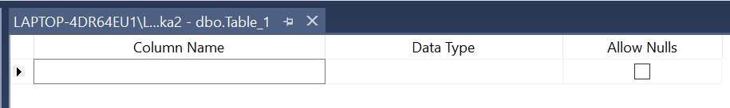
   
Потребно је унети назив колоне, изабрати тип података и одлучити да ли је дозвољено да у тој колони постоје вредности 
NULL. Креираћемо табелу са подацима о ауторима. 

Тип података може да се изабере са падајућег менија који се појави када се кликне стрелица на доле под *Data Type*.
 
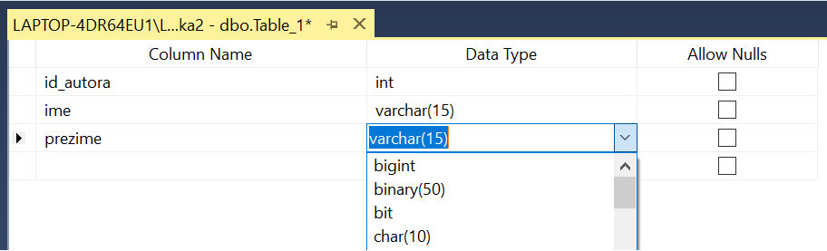
   
Над колоном која треба да буде примарни кључ треба кликнути десни тастер миша и одабрати опцију *Set Primary Key*.

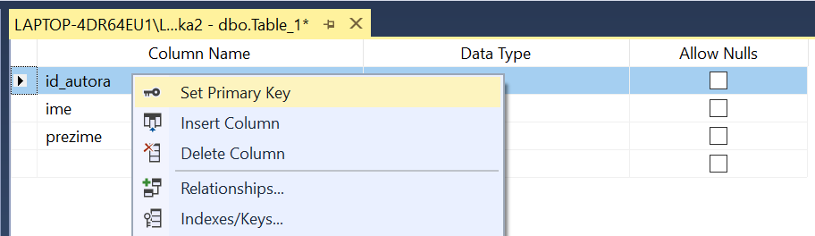
   
На следећој слици је приказана ситуација након дефинисања свих колона.

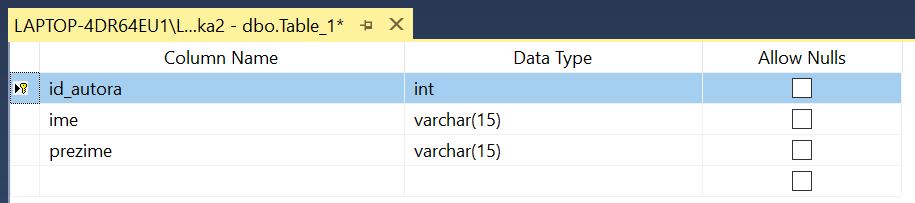
   
Табелу је потребно сачувати. Кликнути десни тастер миша над активном картицом и изабрати опцију *Save Table_1*. 
Кликнути дугме OK након што се унесе назив табеле. 
 
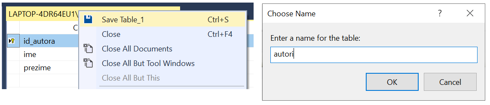
   
Када је табела креирана, појављује се на списку у прозору *Object Explorer*. Уколико се не види, треба кликнути 
на *Refresh*. Подаци се могу унети ако се одабере опција *Edit Top 200 Rows* десним кликом над табелом. 

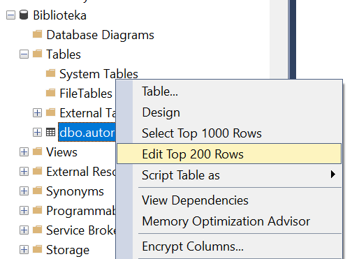
   
Уноси се један по један ред. Потребно је унети податке у све обавезне колоне, након чега може да се пређе на следећи ред.

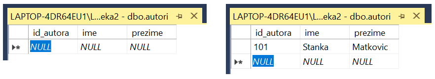

На слици која следи приказан је садржај табеле након уноса података.    

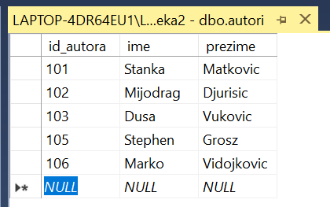
   
Табела *knjige* има страни кључ. Додавање страног кључа подразумева неколико корака којима се приступа након што се 
табела креира, додају се све колоне и табела сачува. Потребно је кликнути десни тастер миша над простором за креирање 
табеле и изабрати опцију *Relationships*..., а затим дугме *Add*. 

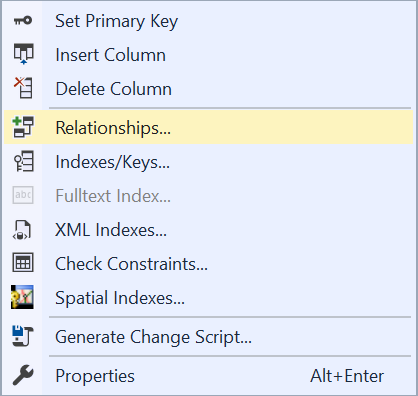
   
Кликнути на три тачке поред *Tables And Columns Specification*.

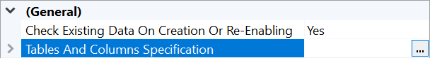
   
Десно поље *Foreign key table* је већ попуњено зато што се налазимо у табели *knjige*, а у левом пољу треба изабрати 
табелу *izdavaci* као *Primary key table*. Када се то уради, аутоматски ће се променити и назив везе *Relationship name* 
у *FK_knjige_izdavaci*. Испод назива табела је потребно изабрати и колоне које су страни кључ и одговарајући примарни 
кључ. У овом примеру примарни кључ је колона *id* у табели *izdavaci*, а страни кључ је колона *id_izdavaca* у табели *knjige*. 
Када се ово подеси, потребно је кликнути на дугме OK и веза је креирана. 

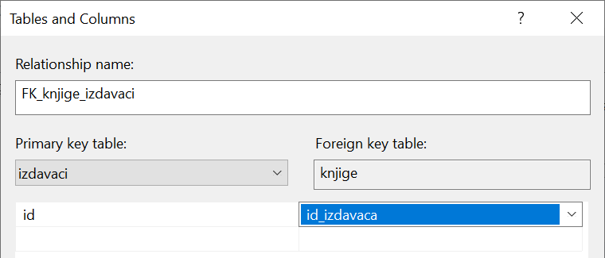