Упит SELECT - упит из једне табеле - пројекција
===============================================

.. infonote::

 Људи су одувек имали потребу да гомилају податке. Размисли само колико је података забележено
 на папирима у библиотекама и архивама. Оно што разликује системе за управљање базама података
 од других опција јесте могућност да брзо и поуздано дођемо до корисних информацијa на основу
 велике количине сачуваних података. 
 
 Већ смо дали неке примере информација које можемо да добијамо ако имамо базу података за пословање библиотеке:
 
 - контакт информације чланова библиотеке који касне са враћањем књига (ове информације библиотека може да употреби како би опоменула чланове да врате позајмљене књиге), 
 - списак књига које нико није позајмио у периоду од последње две године (ове информације библиотека може да употреби тако да заустави даље набављање примерака књига које чланови не позајмљују), 
 - списак књига које су стално издате (ове информације библиотека може да употреби да би набавила више примерака популарних књига које чланови желе да читају), 
 - списак имена аутора чије књиге није читао конкретан члан библиотеке, али су његове књиге читали сви они чланови библиотеке који су до сада читали дела истих аутора као и тај члан (ове информације библиотека може да употреби да би члану дала препоруку ког новог аутора да узме да чита)...
 
 У овој и наредним лекцијама ћеш детаљно научити како добијамо информације из сачуваних података.
 Кренућемо од најједноставнијих корака.

Најважнија предност чувања података у бази података јесте могућност ефикасне обраде и добијања
корисних информација.

Замислимо библиотеку без рачунара и базе података за праћење рада. Подаци о издавању једне књиге
су записани на једном картону, а библиотека има картотеку која садржи картоне за све књиге које се
ту налазе. То може бити и више хиљада књига. Узмимо, на пример, да библиотека жели да зна којих се
то десет књига најчешће издавало у последње две године, да би, због велике потражње, набавили још
примерака. Без рачунара је готово немогуће благовремено и тачно добити ту информацију. Било би
потребно да се извади сваки картон сваке књиге и да се преброје сва издавања, а затим да се
добијени резултати сортирају. Ручно је немогуће овај посао урадити брзо и без грешака. Када имамо
базу података, довољан је један **SELECT** упит, команда *SQL* језика која служи да се извуку информације,
и добићемо тражени резултат. 

Упознаћемо SELECT упит кроз пример базе података библиотеке. Следи списак свих табела са колонама.
Примарни кључеви су истакнути болдом, а страни италиком.

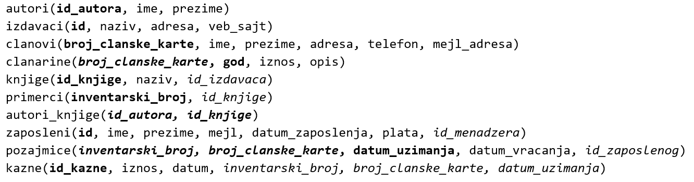

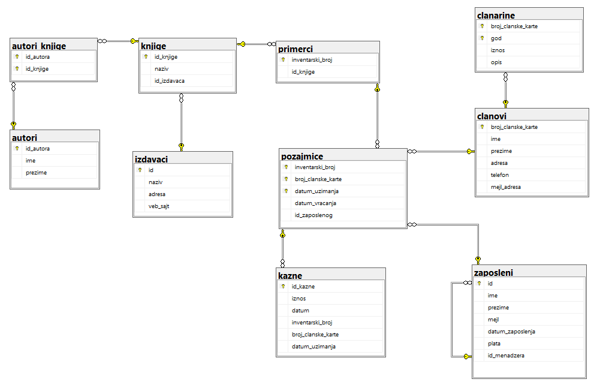

Упити се пишу и покрећу када се кликне *New Query* након што се покрене систем *SQL Server* и
кликне на креирану базу *Biblioteka* у прозору *Object Explorer*. Фајл са упитима *SQLQuery1.sql*
може, али и не мора да се сачува.

Када се унесе једна команда, кликне се на дугме *Execute*. Уколико се у простору за писање команди
налази више њих, потребно је обележити ону коју желимо да покренемо. Ако је ту више база података,
обавезно проверити да ли је поред овог дугмета назив базе у којој желите да вршите упите. 

.. image:: ../../_images/slika_401b.png
   :width: 390
   :align: center

Често ће нам код упита бити потребно да знамо и тачне називе колона, а понекад нам је значајно и
да знамо како су неки подаци записани у бази (да ли су ћирилична слова, да ли су латинична, да ли
имена и називи почињу великим словом, итд), па је добро да се пре писања коначног решења задатка
прво напише и изврши основни SELECT упит који приказује све податке из табеле као што је овде
приказано у првом задатку.

.. questionnote::

 1. Написати упит којим се приказују сви подаци о члановима библиотеке.

Упит SELECT има најмање два дела, такозване клаузулe, SELECT део и FROM део. Најједноставније што
можемо да напишемо након резервисане речи SELECT је звездица која означава да су нам потребни
подаци из свих колона. Након речи FROM треба навести бар једну табелу из које упит треба да узме
податке.

::

 SELECT * FROM clanovi

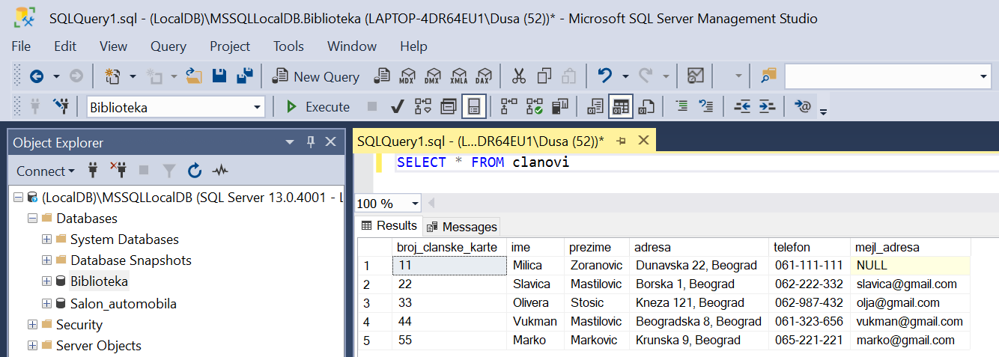

Упит враћа све редове и све колоне, дакле комплетан садржај табеле. Ово је основни облик команде. 

Језик SQL није осетљив на мала и велика слова, тако да ће се све наредне команде успешно извршити. 

::

 SELECT * FROM CLANOVI

 select * from clanovi

 select * from CLANOVI

 SeLeCt * FrOm clanOVI

Правило је, међутим, да неке речи пишемо великим, а неке малим словима, ради боље читљивости кода.
Великим словима пишемо кључне речи језика и функције, а малим називе табела и колона.

::

 SELECT * FROM clanovi

Упит може да се пише у једном реду, али може да се преломи и на неколико редова без икаквог утицаја
на резултат извршавања. Следећи упит је написан у два реда, и у том случају сваки ред креће кључном
речју.

::

 SELECT * 
 FROM clanovi

.. questionnote::

 2. Написати упит којим се приказују имена и презимена запослених у библиотеци. 

::
    
 SELECT ime, prezime FROM zaposleni

Након кључне речи SELECT треба набројати колоне из којих желимо да се прикажу подаци. У теорији
база података операција којом се издвајају само неке колоне из табеле назива се **пројекција**.

Подразумевано се приликом приказа резултата као заглавља колона резултата прикажу називи колона
из табела базе података. Ово је обележено на следећој слици.

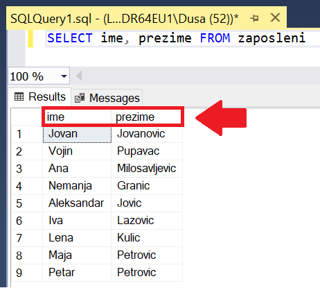

Можемо да утичемо на заглавља колона у приказу резултата. Следи пример који приказује исте податке
из базе података, али је разлика у томе шта пише у заглављу колона резултата.

::

 SELECT ime "Ime zaposlenog", prezime "Prezime zaposlenog" FROM zaposleni

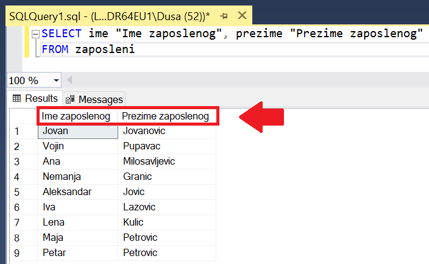

Када желимо да променимо заглавља колона, можемо да користимо реч AS, тако да следећи упит има
идентичан резултат. Употреба ове речи је опциона и уводи се само ради читљивости кода.

::

 SELECT ime AS "Ime zaposlenog", prezime AS "Prezime zaposlenog" FROM zaposleni

Наводнике морамо да користимо када имамо више од једне речи. 

Има смисла да име и презиме запосленог прикажемо у једној колони резултата. То постижемо
употребом оператора за спајање (надовезивање) текстуалних података: + (плус).

::

 SELECT ime + ' ' + prezime "Ime i prezime zaposlenog" FROM zaposleni

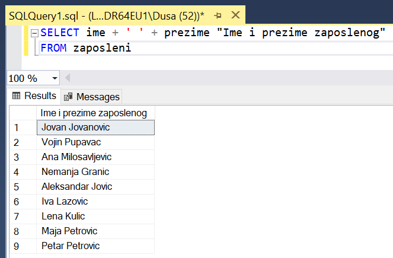

Име и презиме чувамо у бази одвојено. По потреби их лако спајамо. Често нам је потребна
претрага или по имену или по презимену, па нам је важно да имамо могућност да одвојено
анализирамо имена, а одвојено презимена. Уколико бисмо име и презиме чували заједно као
један податак, било би немогуће у неким ситуацијама да издвојимо шта је име, а шта презиме.

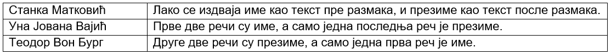

.. questionnote::

 3. Написати упит којим се приказујe извештај о запосленима у једној колони са новим заглављем
 „Izvestaj“ у виду реченице која садржи: име, презиме и имејл адресу, као у примеру који следи: 
 
 ``Ana Milosavljevic koristi imejl amilosavljevic@biblioteka.rs``

::

 SELECT ime+' '+prezime+' koristi mejl '+mejl "Izvestaj"
 FROM zaposleni

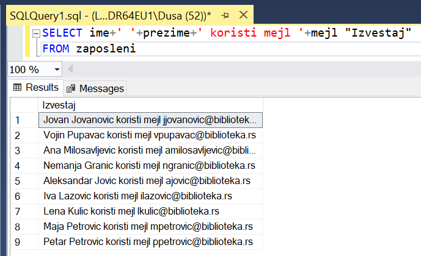

.. questionnote::

 4. Написати упит којим се приказују презимена запослених, њихове плате и који би износ плате
 ималe након повећања од 10%.

Овим упитом се, наравно, не мењају подаци у бази, али на основу ових података корисници базе,
рецимо чланови управе библиотеке, могу да донесу одлуку о увећању плата.

::

 SELECT prezime, plata "Plata", plata*1.1 "Uvecana plata"
 FROM zaposleni

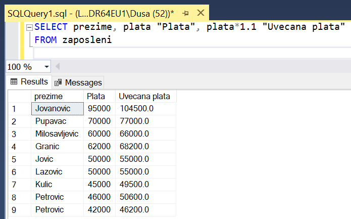

.. questionnote::

 5. Написати упит којим се приказују имена, презимена и имејл адресе запослених уређени абецедно
 по презимену и имену.

Потребно је додати ORDER BY да би резултат био сортиран. Подразумевано је растуће сортирање.
Сортира се по првом критеријуму, а уколико двоје запослених има исто презиме, уредиће се њихов
редослед по имену.

::

 SELECT ime, prezime, mejl FROM zaposleni
 ORDER BY prezime, ime

Уколико не наведемо да се подаци уреде по неком критеријуму, они ће бити приказани редом којим
се налазе уписани у меморији. Ово чак не мора да буде ни редослед којим су унесени у базу, зато
што може да се догоди да се нови подаци упишу на место неких старих који су обрисани. 

На следећој слици се види резултат упита без дела са сортирањем, и резултат упита након што се
дода део ORDER BY.

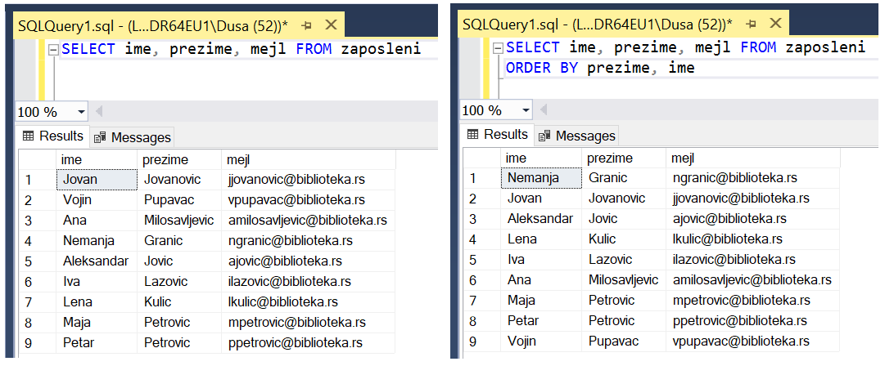

.. questionnote::

 6. Написати упит којим се приказују: презиме, име, имејл адреса и износ плате свих запослених
 сортиран опадајуће према висини примања. Уколико неколико запослених има исту плату, сортирати
 их абецедно по презимену и имену.

За опадајући поредак је потребно додати реч DESC.

::

 SELECT prezime, ime, mejl, plata FROM zaposleni
 ORDER BY plata DESC, prezime, ime

Уместо назива колона могу да се користе њихови редни бројеви. У овом примеру прва колона је
*prezime*, друга је *ime*, четврта је *plata*, па би исти упит могао да се запише и на следећи начин.

::

 SELECT prezime, ime, mejl, plata FROM zaposleni
 ORDER BY 4 DESC, 1, 2

На наредној слици се види да је списак сортиран опадајуће према висини плате, а двоје запослених
који зарађују исти износ, 50.000 динара, на списку су уређени по презимену, па је „Јовић“ наведено
пре „Лазовић“.

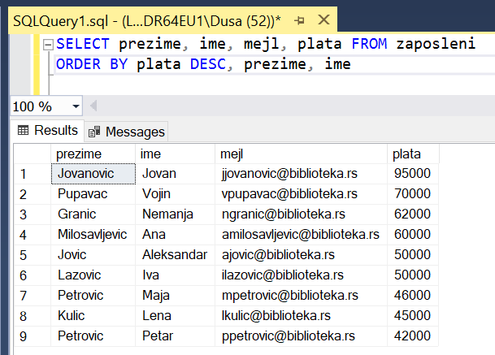

.. questionnote::

 7. Написати упит којим се приказују идентификациони бројеви запослених који су менаџери.

Нису сви запослени менаџери. Уколико је неко менаџер, његов идентификациони број се налази у
колони *id_menadzera* у табели *zaposleni*, па може да се напише следећи упит.

::

 SELECT id_menadzera FROM zaposleni

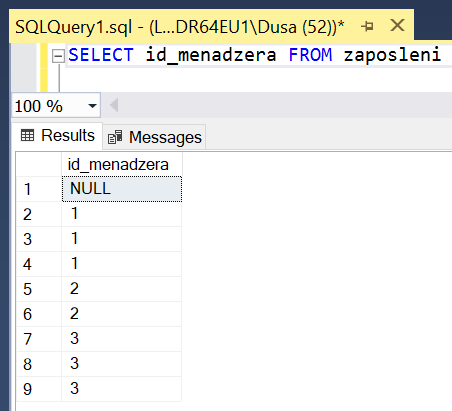

Може се уочити да се у резултату исти идентификациони број појављује више пута, зато што исти
менаџер има више запослених у свом тиму. Да би се избегли ови дупликати, потребно је додати
реч DISTINCT.

::

 SELECT DISTINCT id_menadzera FROM zaposleni

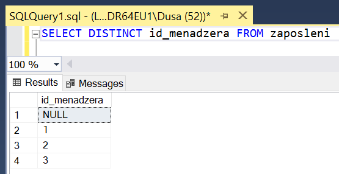
