Упит SELECT - упит из једне табеле - селекција
==============================================

.. infonote::

 Како ћемо помоћи члану библиотеке кога занима које се све књиге на тему програмирања налазе у
 библиотеци да би неку од њих одабрао за читање. 
 
 Како смо се већ упознали са упитом SELECT којим добијамо корисне информације из базе података,
 можемо даље да се упознајемо са његовим могућностима. Једна од битних опција упита SELECT је
 могућност писања услова по којем вршимо селекцију података и издвајамо само оне који су нам
 неопходни.

Упити се пишу и покрећу када се кликне *New Query* након што се покрене систем *SQL Server* и
кликне на креирану базу *Biblioteka* у прозору *Object Explorer*. Фајл са упитима
*SQLQuery1.sql* може, али и не мора да се сачува.

Након што се унесе једна команда, кликне се на дугме *Execute*. Уколико се у простору за писање
команди налази више њих, потребно је обележити ону коју желимо да покренемо. Ако има више база
података, обавезно проверити да ли је поред овог дугмета назив базе у којој желите да вршите упите.

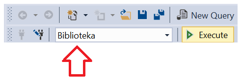

Често ће нам код упита бити потребно да знамо и тачне називе колона, а понекад нам је значајно
и да знамо како су неки подаци записани у бази (да ли су ћирилична слова, да ли су латинична, да
ли имена и називи почињу великим словом, итд), па је добро да се пре писања коначног решења
задатка прво напише и изврши основни SELECT упит који приказује све податке из табеле.

.. questionnote::

 1. Написати упит којим се приказују запослени који зарађују више од 60.000 динара. 

Сваки упит мора да има SELECT део, у којем наводимо или звездицу или списак колона, и FROM део,
где наводимо назив табеле или табела из којих узимамо податке. Када је потребно да извршимо и
селекцију само неких редова, додајемо и WHERE део са условом по којем се врши селекција. Када
наведемо WHERE део упита, кажемо да је извршена **селекција** редова табеле, тј. да смо извршили
филтрирање података. У овом задатку и свим упитима који следе у овој лекцији постоји селекција,
без пројекције, тј. користи се звездица у SELECT делу упита и приказују се подаци из свих колона.

У WHERE делу упита наводимо услов и можемо да користимо операторе поређења: <, <=, =, >=, >.

::

 SELECT * FROM zaposleni WHERE plata>60000 

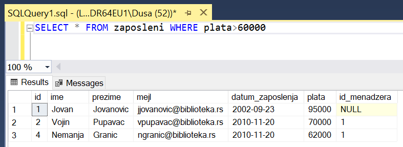

.. questionnote::

 2. Написати упит којим се приказују запослени који зарађују тачно 50.000 динара.

::

 SELECT * FROM zaposleni 
 WHERE plata=50000

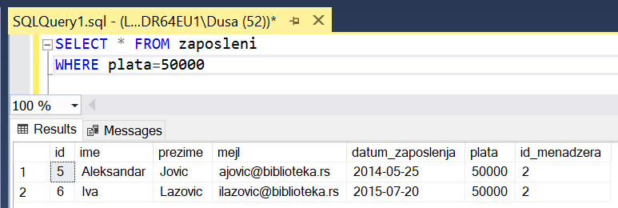

.. questionnote::

 3. Написати упит којим се приказују запослени који зарађују између 40.000 и 50.000,
 укључујући и те износе.

У WHERE делу упита можемо да наведемо и више услова које повезујемо логичким операторима:
AND, OR и NOT.

::

 SELECT * FROM zaposleni WHERE plata>=40000 AND plata<=50000

У овом упиту је могуће користити оператор BETWEEN.

::

 SELECT * FROM zaposleni 
 WHERE plata BETWEEN 40000 AND 50000

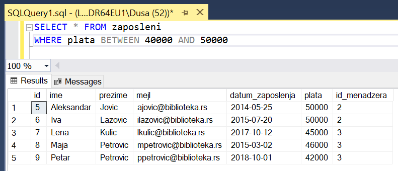

.. questionnote::

 4. Написати упит којим се приказују запослени који би након повећања плате од 20% зарађивали
 више од 70.000 динара, а сада зарађују мање.

::

 SELECT * FROM zaposleni 
 WHERE plata<70000 AND plata*1.2>70000

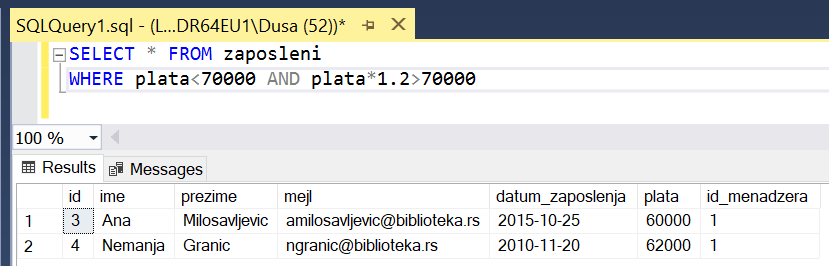

.. questionnote::

 5. Написати упит којим се приказују запослени који зарађују више од 60.000 динара и презиме
 им почиње на слово П.

Уколико хоћемо да проверимо да ли неки текст почиње одређеним словом или словима, можемо да
користимо оператор LIKE. У шаблону који задамо том оператору можемо да користимо знак % као
замену за ниједан, један или више знакова, и _ за тачно један знак.

::

 SELECT * FROM zaposleni WHERE plata>60000 AND prezime LIKE 'P%'

Можемо да видимо на следећој слици да је издвојен запослени чије презиме Пупавац почиње траженим
словом, а плата му је 70.000 динара, што је веће од 60.000 динара.

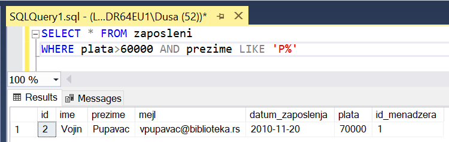

.. questionnote::

 6. Написати упит којим се приказују запослени чије име има тачно четири слова.

::

 SELECT * FROM zaposleni WHERE ime LIKE '____'

Можемо да видимо на следећој слици да су издвојене две запослене које се зову Лена и Маја и обе
имају имена од четири слова.

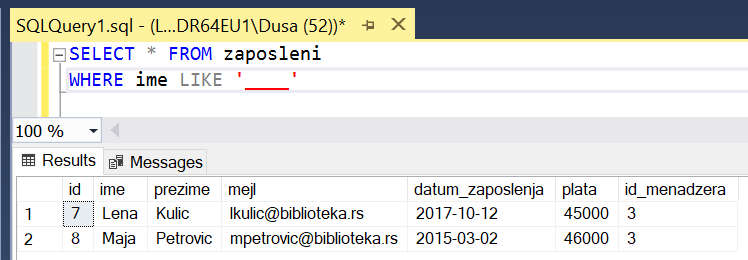

.. questionnote::

 7. Написати упит којим се приказују сви подаци о запосленима који у оквиру своје имејл адресе
 имају реч „petrovic“.

Како није прецизирано да ли је ова реч на почетку, у средини или на крају имејл адресе,
потребно је у шаблону ставити знак за проценат и испред и иза речи коју тражимо.

::

 SELECT * FROM zaposleni
 WHERE mejl LIKE '%petrovic%'

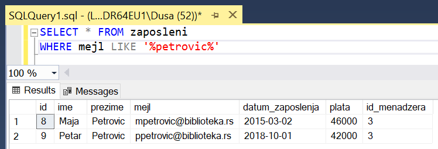

.. questionnote::

 8. Написати упит којим се приказују сви подаци о запосленој Маји Петровић.

::

 SELECT * FROM zaposleni 
 WHERE prezime='Petrovic' AND ime='Maja'

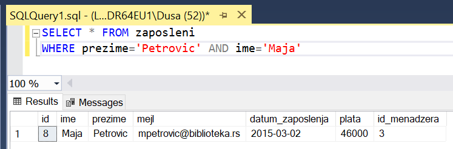

Није довољно урадити претрагу само по презимену. Могуће су ситуације, као што је приказано на
слици, да постоје особе са истим презименом.

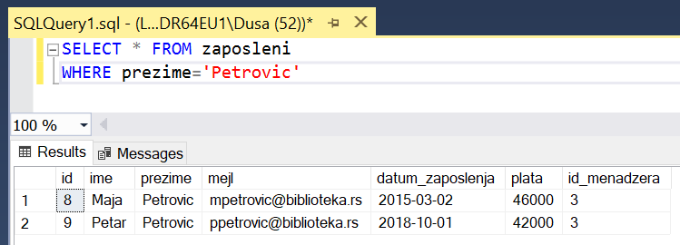

У случају да у бази постоји више од једне особе са истим именом и презименом, било би неопходно
додати још неки критеријум за селекцију да би се тачно знало чији су нам подаци потребни.

.. questionnote::

 9. Написати упит којим се приказују запослени чији су менаџери са идентификационим бројевима
 1, 2 и 3. 

::

 SELECT * FROM zaposleni 
 WHERE id_menadzera=1 OR id_menadzera=2 OR id_menadzera=3

У овом упиту је могуће користити оператор IN.

::

 SELECT * FROM zaposleni 
 WHERE id_menadzera IN (1,2,3)

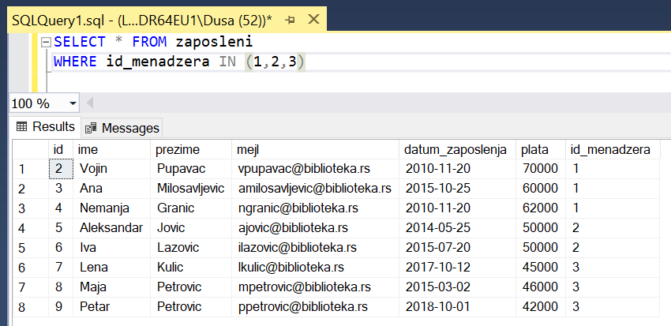

.. questionnote::

 10. Написати упит којим се приказују запослени чији менаџери нису запослени са идентификационим бројевима 1 и 3.

::

 SELECT * FROM zaposleni WHERE id_menadzera!=1 AND id_menadzera!=3

Може да се користи и оператор <> са истим значењем као и !=, тј. који проверава да ли је вредност
различита од неке дате.

::

 SELECT * FROM zaposleni WHERE id_menadzera<>1 AND id_menadzera<>3

Овај упит је могао да се запише и на следећи начин:

::

 SELECT * FROM zaposleni WHERE NOT(id_menadzera=1) AND NOT(id_menadzera=3)

Или са негацијом целог услова:

::

 SELECT * FROM zaposleni WHERE NOT(id_menadzera=1 OR id_menadzera=3)

Следећи упит има исти резултат.

::

 SELECT * FROM zaposleni 
 WHERE id_menadzera NOT IN (1,3)

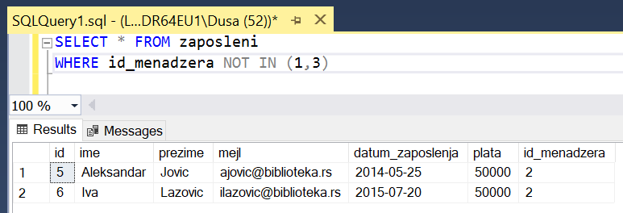

.. questionnote::

 11. Написати упит којим се приказују запослени који немају менаџера.

Уколико запослени нема менаџера, поље *id_menadzera* је празно. Иако кажемо да то поље садржи
*null*, *null* није вредност и не можемо да је упоређујемо као друге вредности. Постоје посебни
оператори који проверавају да ли је поље *null* или није.

::

 SELECT * FROM zaposleni 
 WHERE id_menadzera IS NULL

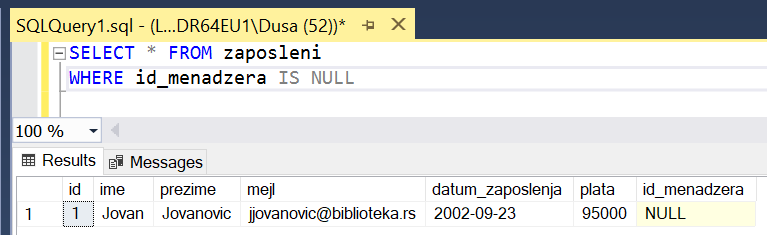

.. questionnote::

 12. Написати упит којим се приказују, уређени абецедно по презимену и имену, сви запослени
 који имају менаџера.

Део упита у којем се уређују подаци, ORDER BY, увек се наводи на самом крају команде.

::

 SELECT * FROM zaposleni 
 WHERE id_menadzera IS NOT NULL
 ORDER BY prezime, ime

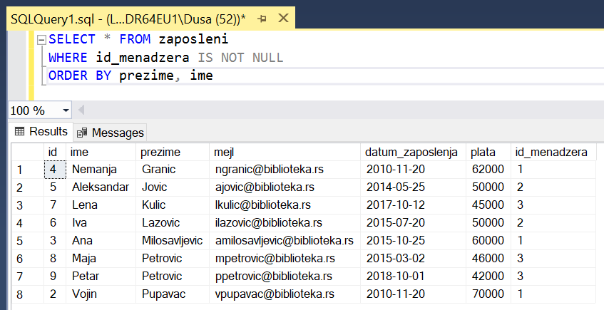

.. questionnote::

 13. Написати упит којим се приказују запослени који су почели да раде пре 2015. године. 

::

 SELECT * FROM zaposleni 
 WHERE datum_zaposlenja < '2015-01-01'

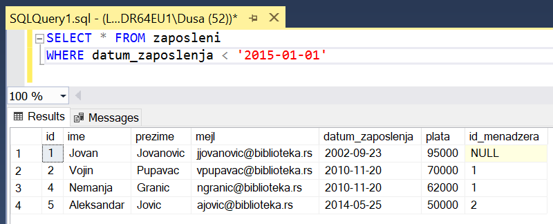
