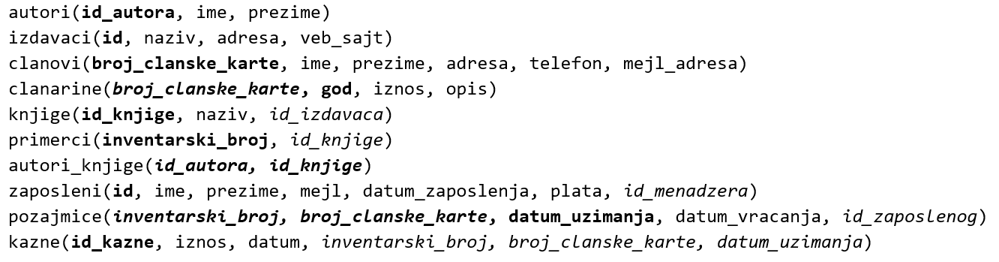

Упит SELECT - упит из једне табеле - селекција - задаци
=======================================================

Сви наредни SELECT упити обрађују податке из базе података библиотеке.
Следи списак свих табела са колонама. Примарни кључеви су истакнути болдом,
а страни италиком.

.. questionnote::

 1. Написати упит којим се приказују сви подаци о члану са бројем чланске карте 11.

.. dbpetlja:: db_4061
   :dbfile: it3_biblioteka.sql
   :solutionquery: SELECT * FROM clanovi
                   WHERE broj_clanske_karte=11

.. questionnote::

 2. Написати упит којим се приказују сви подаци о казнама које износе више од 450 динара.

.. dbpetlja:: db_4062
   :dbfile: it3_biblioteka.sql
   :solutionquery: SELECT * FROM kazne
                   WHERE iznos>450

.. questionnote::

 3. Написати упит којим се приказују запослени који зарађују мање од 50.000 динара и презиме им почиње на слово К.

.. dbpetlja:: db_4063
   :dbfile: it3_biblioteka.sql
   :solutionquery: SELECT * 
                   FROM zaposleni
                   WHERE plata<50000 AND prezime LIKE 'K%'

.. questionnote::

 4. Написати упит којим се приказују запослени чије презиме почиње на слово J или K.

.. dbpetlja:: db_4064
   :dbfile: it3_biblioteka.sql
   :solutionquery: SELECT * FROM zaposleni
                   WHERE prezime LIKE 'J%' OR prezime LIKE 'K%'

.. questionnote::

 5. Написати упит којим се приказују запослени чије презиме има тачно пет слова и почиње на слово К.

.. dbpetlja:: db_4065
   :dbfile: it3_biblioteka.sql
   :solutionquery: SELECT * FROM zaposleni
                   WHERE prezime LIKE 'K____'

.. questionnote::

 6. Написати упит којим се приказују запослени који зарађују између 45.000 и 50.000 динара, укључујући и те износе, а њихов менаџер има идентификациони број 3.

.. dbpetlja:: db_4066
   :dbfile: it3_biblioteka.sql
   :solutionquery: SELECT * FROM zaposleni
                   WHERE id_menadzera = 3 AND plata BETWEEN 45000 AND 50000

.. questionnote::

 7. Написати упит којим се приказују све позајмице пре 1. марта 2019.

.. dbpetlja:: db_4067
   :dbfile: it3_biblioteka.sql
   :solutionquery: SELECT *
                   FROM pozajmice
                   WHERE datum_uzimanja<'2019-03-01'

.. questionnote::

 8. Написати упит којим се приказују сви подаци о чланаринама плаћеним 2017. и 2018. године.

.. dbpetlja:: db_4068
   :dbfile: it3_biblioteka.sql
   :solutionquery: SELECT *
                   FROM clanarine
                   WHERE god IN (2017,2018)

.. questionnote::

 9. Написати упит којим се приказују сви подаци о чланаринама за све чланарине које имају унет опис.

.. dbpetlja:: db_4069
   :dbfile: it3_biblioteka.sql
   :solutionquery: SELECT *
                   FROM clanarine
                   WHERE opis IS NOT NULL
