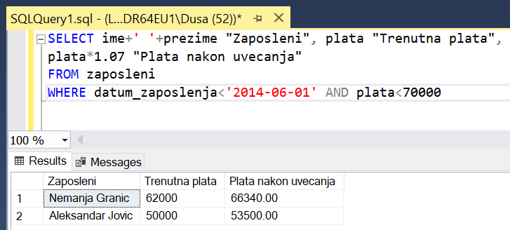
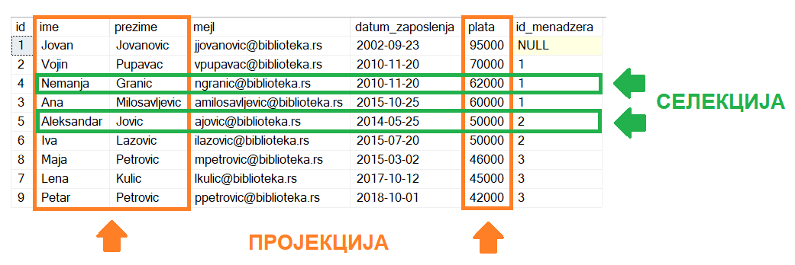

Упит SELECT - упит из једне табеле - пројекција и селекција - задаци
====================================================================

Упит из једне табеле најчешће у себи има и пројекцију и селекцију, тј. постоји и избор података
које желимо да прикажемо и из којих колона су нам потребни подаци у складу са задатим условом
претраге. 

На пример, ако библиотека жели да награди повишицом од 7% оне запослене који раде дуго, тј.
запослили су се пре 1. јуна 2014. године, а у овом тренутку зарађују мање од 70.000. 

Потребно је написати и покренути упит којим се издвајају запослени који су се запослили пре 1.
јуна 2014. године, а у овом тренутку зарађују мање од 70.000. Корисно је и да видимо тренутну
плату, као и износ плате након повишице од 7%. Има смисла да се име и презиме запосленог прикажу
у једној колони. 

На основу ове анализе долазимо до следећег задатка. 

Написати упит којим се приказују имена и презимена чланова библиотеке који су се запослили пре
1. јуна 2014. године, а у овом тренутку зарађују мање од 70.000. Име и презиме приказати спојено
са једним размаком између у једној колони. Приказати и тренутну плату и износ плате након повећања
од 7%. Измени заглавља колона у приказу резултата тако да буду редом „Zaposleni“, „Trenutna plata“
и „Plata nakon uvecanja“.

::

 SELECT ime+' '+prezime "Zaposleni", plata "Trenutna plata", 
 plata*1.07 "Plata nakon uvecanja"
 FROM zaposleni
 WHERE datum_zaposlenja<'2014-06-01' AND plata<70000

У овом упиту су издвојени подаци из колона *ime*, *prezime* и *plata*, и подаци из оних редова
који одговарају постављеним условима.

Упити се пишу и покрећу када се кликне *New Query* након што се покрене систем *SQL Server* и
кликне на креирану базу *Biblioteka* у прозору *Object Explorer*. Фајл са упитима *SQLQuery1.sql*
може, али и не мора да се сачува.

Након што се унесе једна команда, кликне се на дугме *Execute*. Уколико се у простору за писање
команди налази више њих, потребно је обележити ону коју желимо да покренемо. Ако има више база
података, обавезно провери да ли је поред овог дугмета назив базе у којој желите да вршите упите.

.. image:: ../../_images/slika_401b.png
   :width: 390
   :align: center

Сви наредни SELECT упити имају и **пројекцију** и **селекцију**, и обрађују податке из базе
података библиотеке. Следи списак свих табела са колонама. Примарни кључеви су истакнути болдом,
а страни италиком.

.. image:: ../../_images/slika_401.png
   :width: 780
   :align: center

.. questionnote::

 1. Члан библиотеке са својом чланском картом чији је број 33 дошао је да позајми неколико књига.
 Пре него што му библиотека изда нове, потребно је да се провери да ли члан тренутно држи неке
 књиге код себе.

 **Задатак:** Написати упит којим се приказују датуми узимања и инвентарски бројеви књига које се
 тренутно налазе код члана са бројем чланске карте 33.

.. dbpetlja:: db_4071
   :dbfile: it3_biblioteka.sql
   :showresult:
   :solutionquery: SELECT datum_uzimanja, inventarski_broj
                   FROM pozajmice
                   WHERE broj_clanske_karte=33 AND datum_vracanja IS NULL

.. questionnote::

 2. Библиотеци је потребан извештај о свим примерцима књига који су тренутно издати. На почетку
 извештаја је важно да се прикажу књиге које су дуже време код чланова библиотеке.

 **Задатак:** Написати упит којим се приказују инвентарски бројеви примерака књига који су тренутно
 издати и датуми када су позајмљене из библиотеке. Списак уредити по датуму позајмице.

.. dbpetlja:: db_4072
   :dbfile: it3_biblioteka.sql
   :showresult:
   :solutionquery: SELECT inventarski_broj, datum_uzimanja
                   FROM pozajmice
                   WHERE datum_vracanja IS NULL
                   ORDER BY datum_uzimanja

.. questionnote::

 3. Библиотека прати и анализира понашање чланова и као један од извештаја проучава све позајмице
 по месецима. За то ће бити потребни извештаји за сваки месец. На пример, извештај о свим
 позајмицама током априла 2019. године.

 **Задатак:** Написати упит којим се приказују инвентарски бројеви примерака књига, датум узимања
 и датум враћања за све позајмице током априла 2019. године. 

.. dbpetlja:: db_4073
   :dbfile: it3_biblioteka.sql
   :showresult:
   :solutionquery: SELECT inventarski_broj, datum_uzimanja, datum_vracanja
                   FROM pozajmice
                   WHERE datum_uzimanja>='2019-04-01' AND datum_uzimanja<='2019-04-30'

.. questionnote::

 4. Библиотека планира да набави још књига издавача са називом СЕТ и због тога су јој потребне
 контакт информације овог издавача.

 **Задатак:** Написати упит којим се приказују адреса и адреса веб-сајта издавача чији је назив СЕТ. 

.. dbpetlja:: db_4074
   :dbfile: it3_biblioteka.sql
   :showresult:
   :solutionquery: SELECT adresa, veb_sajt
                   FROM izdavaci
                   WHERE naziv='CET'

.. questionnote::

 5. Члана библиотеке занима које све књиге библиотека има на тему програмирања да би неку изабрао
 за читање.

 **Задатак:** Написати упит којим се приказују називи књига који у себи садрже реч „programiranje“.
 Реч „programiranje“ може да буде на почетку, у средини или на крају, и може да буде написана
 великим словима, малим словима или да је прво слово велико, а остала мала уколико је на почетку
 назива књиге.

.. dbpetlja:: db_4075
   :dbfile: it3_biblioteka.sql
   :showresult:
   :solutionquery: SELECT naziv
                   FROM knjige 
                   WHERE naziv LIKE '%Programiranje%' OR naziv LIKE '%programiranje%' OR naziv LIKE '%PROGRAMIRANJE%'
