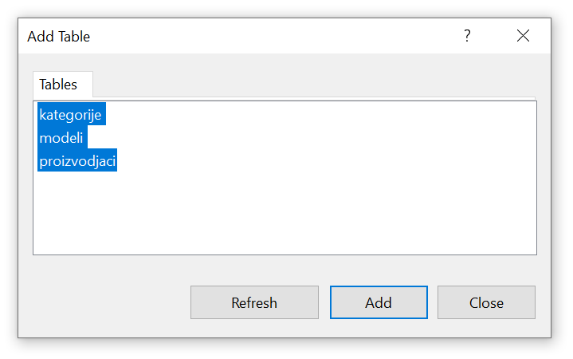
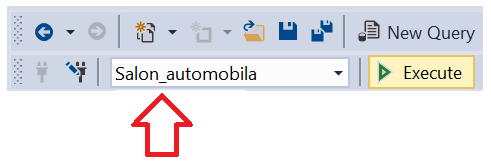

Задаци - салон аутомобила
=========================

Написати упите који су решење задатака који следе. Сви упити имају пројекцију и селекцију, а
узимају податке из по једне табеле базе података за салон аутомобила.  

Уколико база података за салон аутомобила није креирана, прво креирати базу података за коју
смо већ припремили све CREATE TABLE и INSERT INTO команде у ранијим лекцијама.

.. reveal:: 4081
   :showtitle: Упутство за креирање базе
   :hidetitle: Сакриј упутство
   
   **Упутство за креирање базе:**
   
   Кликнути десни тастер миша над *Databases* у прозору *Object Explorer* и изабрати *New Database...*

   .. image:: ../../_images/slika_408a.png
     :width: 390
     :align: center

   Унети назив нове базе података *Salon_automobila* и кликнути дугме *OK*. Нова база података се
   појавила на списку у прозору *Object Explorer*.

   .. image:: ../../_images/slika_408b.png
     :width: 390
     :align: center

   Проверити да је та нова база изабрана, као на претходној слици, а затим кликнути дугме *New Query*
   испод главног падајућег менија. Обавезно проверити да се исправан назив базе налази у пољу лево од
   дугмета *Execute*, у овом случају назив нове базе података *Salon_automobila*.

   .. image:: ../../_images/slika_408c.png
     :width: 390
     :align: center

   Прво навести све CREATE TABLE команде, једну по једну, а затим све INSERT INTO команде. 

   **Напомена: Редослед је важан!** Пре креирања табеле која има страни кључ, неопходно је креирати
   табелу на коју она показује. Исти је редослед и код уноса података у табеле, а касније се уносе
   подаци у оне табеле које имају страни кључ.

   Све команде могу истовремено да се прекопирају, па да се свака појединачно прво означи мишем и за
   сваку означену команду се кликне *Execute*. Може и да се дода тачка-зарез (;) иза сваке команде и
   да се онда само једном кликне *Execute*, како је илустровано на следећој слици.

   .. image:: ../../_images/slika_408d.png
     :width: 780
     :align: center

   Све команде са слике налазе се и у фајлу  `salon_automobila.sql <https://petljamediastorage.blob.core.windows.net/root/Media/Default/Kursevi/baze_III/salon_automobila.sql>`_ 
   из којег могу да се прекопирају.
    

   
Кликнути десни тастер миша над *Database Diagrams* под креираном базом података за салон аутомобила
и изабрати *New Database Diagram*.

У наредном кораку додати све табеле.

Према потреби увећати или умањити слику и испремештати табеле. Добијени дијаграм је приказан на
следећој слици.

Дијаграм може да се сачува.

Када је сачуван, може да се пронађе у прозору *Object Explorer* и да се поново отвори. Уколико се
не прикаже одмах, потребно је кликнути на *Refresh*. 

Упити се пишу и покрећу када се кликне *New Query* након што се покрене систем *SQL Server* и
кликне на креирану базу *Salon_automobila* у прозору *Object Explorer*. Фајл са упитима
*SQLQuery1.sql* може, али и не мора да се сачува.

Након што се унесе једна команда, кликне се на дугме *Execute*. Уколико се у простору за писање
команди налази више њих, потребно је обележити ону коју желимо да покренемо. Ако има више база
података, обавезно проверити да ли је поред овог дугмета назив базе у којој желите да вршите упите.

Сви наредни SELECT упити обрађују податке из базе података за салон аутомобила. Следи списак свих
табела са колонама. Примарни кључеви су истакнути болдом, а страни италиком.

proizvodjaci(**pib**, maticni_broj, naziv, adresa)

kategorije(**id_kategorije**, naziv, opis)

modeli(**id_modela**, oznaka, jacina_motora, broj_vrata, tip_goriva, *pib*, *id_kategorije*)

.. questionnote::

 1. Написати упит којим се приказује адреса произвођача Dacia.

.. reveal::  Задатак 4082
   :showtitle: Прикажи решење 
   :hidetitle: Сакриј
   
   ::
   
    SELECT naziv, opis FROM proizvodjaci
	WHERE naziv='Dacia'
	
   .. image:: ../../_images/slika_408k.png
     :width: 500
     :align: center

.. questionnote::

 2. Написати упит којим се приказује назив категорије са идентификационим бројем 3.

.. reveal::  Задатак 4083
   :showtitle: Прикажи решење 
   :hidetitle: Сакриј
   
   ::
   
    SELECT naziv, opis FROM kategorije
	WHERE id_kategorije=3
	
   .. image:: ../../_images/slika_408l.png
     :width: 500
     :align: center

.. questionnote::

 3. Написати упит којим се приказују ознака модела и јачина мотора за све аутомобиле који користе дизел.

.. reveal::  Задатак 4084
   :showtitle: Прикажи решење 
   :hidetitle: Сакриј
   
   ::
   
    SELECT oznaka, jacina_motora FROM modeli
	WHERE tip_goriva='dizel'
	
   .. image:: ../../_images/slika_408m.png
     :width: 500
     :align: center

.. questionnote::

 4. Написати упит којим се приказују ознака модела и ПИБ произвођача за све аутомобиле који припадају категоријама са идентификационим бројевима 1 и 3. Уредити списак по произвођачу.

.. reveal::  Задатак 4085
   :showtitle: Прикажи решење 
   :hidetitle: Сакриј
   
   ::
   
    SELECT oznaka, pib
	FROM modeli
	WHERE id_kategorije=1 OR id_kategorije=3
	ORDER BY pib
		
   .. image:: ../../_images/slika_408n.png
     :width: 500
     :align: center

.. questionnote::

 5. Написати упит којим се приказују ознака модела и тип горива за све аутомобиле који имају петора врата и имају истог произвођача чији је ПИБ 12345678.

.. reveal::  Задатак 4086
   :showtitle: Прикажи решење 
   :hidetitle: Сакриј
   
   ::
   
    SELECT oznaka, tip_goriva FROM modeli
	WHERE broj_vrata=5 AND pib=12345678
	
   .. image:: ../../_images/slika_408o.png
     :width: 500
     :align: center

.. questionnote::

 6. Написати упит којим се приказују ознака модела, јачина мотора и број врата за све аутомобиле који припадају категорији чији је идентификациони број 2. Ознаку и јачину модела приказати спојено са једним размаком између у једној колони. Изменити заглавља колона у приказу резултата тако да буду редом „Modeli automobila“  и „Broj vrata“.

.. reveal::  Задатак 4087
   :showtitle: Прикажи решење 
   :hidetitle: Сакриј
   
   ::
   
    SELECT oznaka+' '+jacina_motora "Model automobila", broj_vrata "Broj vrata" 
	FROM modeli WHERE id_kategorije=2
		
   .. image:: ../../_images/slika_408p.png
     :width: 650
     :align: center

.. questionnote::

 7. Написати упит којим се приказују назив и опис за све категорије за које је унет опис.

.. reveal::  Задатак 4088
   :showtitle: Прикажи решење 
   :hidetitle: Сакриј
   
   ::
   
    SELECT naziv, opis FROM kategorije
	WHERE opis IS NOT NULL
		
   .. image:: ../../_images/slika_408q.png
     :width: 400
     :align: center

