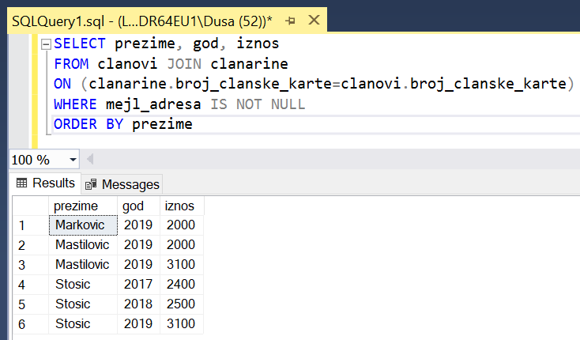

Упит SELECT - спајање табела
============================

.. infonote::

 Подаци који се иначе виде заједно на једном месту, у бази података се чувају у различитим
 табелама. Већ смо анализирали, на пример, корице једног примерка књиге. На тим корицама је
 назив књиге, као и основни подаци о ауторима и издавачу. Сви ови подаци се у бази података,
 што смо већ научили, чувају у четири табеле: *knjige*, *autori*, *izdavaci* и *primerci*. Ово је
 веома важно и максимално спречава непотребно понављање података и смањује могућност за
 настајање разних грешака. 

 Међутим, када претражујемо базу, нама су за исти извештај најчешће потребни подаци из
 различитих табела. Да бисмо то постигли, треба да правилно спојимо табеле. Не би било добро
 ако бисмо, на пример, повезали име аутора са књигом коју није написао, или књигу са
 издавачем који је није објавио. Важно је да се добро савлада правилно упаривање података
 из различитих табела које су повезане системом страних и одговарајућих примарних кључева. 

Увек прво треба проверити да ли се сви подаци који су нам неопходни да изградимо упит налазе
у једној табели. Ако је то случај, спајање табела нам није потребно. Међутим, најчешће за
исти упит тражимо податке који се налазе у различитим табелама, тако да је спајање табела
изузетно важно. 

Упознаћемо могућности упита SELECT који узима податке из више табела кроз пример базе података
библиотеке. Следи списак свих табела са колонама. Примарни кључеви су истакнути болдом, а страни
италиком.

.. image:: ../../_images/slika_401.png
   :width: 780
   :align: center

.. image:: ../../_images/slika_401a.png
   :width: 780
   :align: center

Упити се пишу и покрећу када се кликне *New Query* након што се покрене систем *SQL Server*
и кликне на креирану базу *Biblioteka* у прозору *Object Explorer*. Фајл са упитима
*SQLQuery1.sql* може, али и не мора да се сачува.

Након што се унесе једна команда, кликне се на дугме *Execute*. Уколико се у простору за
писање команди налази више њих, потребно је обележити ону коју желимо да покренемо. Ако
има више база података, обавезно проверити да ли је поред овог дугмета назив базе у којој
желите да вршите упите. 

.. image:: ../../_images/slika_401b.png
   :width: 390
   :align: center

.. questionnote::

 1. Написати упит којим се, уз презиме члана, приказују износ и година плаћене чланарине. 

Ова два података се налазе у различитим табелама које су повезане. Потребно је спојити те
табеле и то тако што се упореде по једнакости вредности страног кључа и одговарајућег
примарног кључа. У овом случају стани кључ је колона *broj_clanske_karte*, која се налази у
табели *clanarine*, а примарни кључ је колона која се зове исто *broj_clanske_karte* и налази
се у табели *clanovi*. Након кључне речи FROM наводимо називе табела које спајамо и између
кључну реч JOIN, после чега следе кључна реч ON и услов спајања. Како у ове две табеле
постоје колоне које се зову исто, када пишемо услов спајања, потребно је да испред назива
колоне додамо и назив табеле да би се знало на коју колону се мисли.

::

 SELECT prezime, god, iznos 
 FROM clanovi JOIN clanarine 
 ON (clanarine.broj_clanske_karte=clanovi.broj_clanske_karte)

.. image:: ../../_images/slika_411b.png
   :width: 390
   :align: center

Потпуно је свеједно редослед којим напишемо табеле, па и следећи упит има исти резултат.

::

 SELECT prezime, god, iznos 
 FROM clanarine JOIN clanovi
 ON (clanarine.broj_clanske_karte=clanovi.broj_clanske_karte)

Имајте на уму да је у делу упита где наводимо услов спајања након кључне речи ON прво
наведена колона која је страни кључ *clanarine.broj_clanske_karte*, а затим колона која
је одговарајући примарни кључ. Неће бити никакве разлике и ако променимо редослед, па
и следећи упит има исти резултат.

::

 SELECT prezime, god, iznos 
 FROM clanarine JOIN clanovi
 ON (clanovi.broj_clanske_karte=clanarine.broj_clanske_karte)

.. questionnote::

 2. Написати упит којим се, уз презиме и имејл адресу члана, приказују износ и година плаћене
 чланарине, али само за чланове који имају имејл адресу. Податке приказати уређене абецедно
 по презимену.

Овај упит је проширење претходног и садржи селекцију којом бирамо само неке редове, као и
сортирање резултата.

::

 SELECT prezime, god, iznos 
 FROM clanovi JOIN clanarine 
 ON (clanarine.broj_clanske_karte=clanovi.broj_clanske_karte)
 WHERE mejl_adresa IS NOT NULL
 ORDER BY prezime

.. questionnote::

 3. Написати упит којим се приказују назив књиге и назив њеног издавача.

Ова два података се налазе у различитим табелама које су повезане. Потребно је спојити те табеле.

.. image:: ../../_images/slika_411d.png
   :width: 780
   :align: center

::

 SELECT knjige.naziv "Knjiga", izdavaci.naziv "Izdavac"
 FROM knjige JOIN izdavaci ON (knjige.id_izdavaca=izdavaci.id)

.. image:: ../../_images/slika_411e.png
   :width: 620
   :align: center

Како се у ове две табеле налазе две колоне *naziv* (једна се односи на назив књиге, а друга
на назив издавача), обавезно испред имена колоне мора да се наведе име табеле. Како, међутим,
у обе табеле постоји само једна колона *id_izdavaca* и само једна колона *id*, можемо да
изоставимо називе табела испред назива колона, па упит може да се напише и на следећи начин.

::

 SELECT knjige.naziv "Knjiga", izdavaci.naziv "Izdavac"
 FROM knjige JOIN izdavaci ON (id_izdavaca=id)

Можемо, ради краћег записа, табелама да доделимо нове кратке називе који се користе само у
упиту. У наредном упиту ћемо табелу *knjige* назвати привремено *k*, а табелу *izdavaci* ћемо
назвати *i*. У том случају свуда у упиту користимо кратке називе.

::

 SELECT k.naziv "Knjiga", i.naziv "Izdavac"
 FROM knjige k JOIN izdavaci i ON (k.id_izdavaca=i.id)

.. questionnote::

 4. Написати упит којим се приказују презиме запосленог и презиме његовог менаџера.

Ови подаци, и презиме менаџера и презиме запосленог, налазе се у истој табели која има страни
кључ *id_manadzera* који показује на примарни кључ исте табеле *id*. 

::
 
 zaposleni(id, ime, prezime, mejl, datum_zaposlenja, plata, id_menadzera)

У овој ситуацији је обавезна употреба кратких назива табела који се користе само у упиту.
У упиту ћемо симулирати ситуацију као да имамо две табеле: једну из које читамо податке о
запосленом, и другу из које читамо податке о његовом менаџеру. 

::

 SELECT z.prezime "Zaposleni", m.prezime "Menadzer"
 FROM zaposleni z JOIN zaposleni m ON (z.id_menadzera=m.id)

.. questionnote::

 5. Написати упит којим се приказују име и презиме члана, датум позајмице, инвентарски број
 примерка и идентификациони број књиге за све позајмице током месеца маја 2019. године.

Подаци које тражимо налазе се у три повезане табеле, па је потребно да их све три повежемо,
тако што прво спојимо две, па онда урадимо и спајање са трећом.

Неки од података, и то име и презиме члана, као и датум узимања књиге, налазе се у по једној
од ове три табеле, тако да испред назива одговарајућих колона није неопходно додати назив табеле.
Пошто колона *inventarski_broj*, коју такође желимо да испишемо, постоји у две табеле, *primerci*
и *pozajmice*, потребно је додати назив табеле испред назива те колоне. Како спајамо по једнакости
овог података, потпуно је свеједно који назив табеле додамо, тј. свеједно је да ли напишемо
*primerci.inventarski_broj* или *pozajmice.inventarski_broj* у SELECT делу SELECT упита.

::

 SELECT ime, prezime, pozajmice.inventarski_broj, datum_uzimanja
 FROM primerci JOIN pozajmice 
 ON (pozajmice.inventarski_broj=primerci.inventarski_broj)
 JOIN clanovi ON (pozajmice.broj_clanske_karte=clanovi.broj_clanske_karte)
 WHERE datum_uzimanja>='2019-05-01' AND datum_uzimanja<='2019-05-31'

.. image:: ../../_images/slika_411g.png
   :width: 620
   :align: center

Табеле смо могли да спојимо и другим редоследом, на пример:

::

 FROM pozajmice JOIN primerci
 ON (pozajmice.inventarski_broj=primerci.inventarski_broj)
 JOIN clanovi ON (pozajmice.broj_clanske_karte=clanovi.broj_clanske_karte)

Или:

::

 FROM pozajmice JOIN clanovi
 ON (pozajmice.broj_clanske_karte=clanovi.broj_clanske_karte)
 JOIN primerci ON (pozajmice.inventarski_broj=primerci.inventarski_broj)

Или:

::

 FROM clanovi JOIN pozajmice
 ON (pozajmice.broj_clanske_karte=clanovi.broj_clanske_karte)
 JOIN primerci ON (pozajmice.inventarski_broj=primerci.inventarski_broj)

Свеједно је којим редом спајамо табеле док год водимо рачуна о томе да спајамо табеле које
су директно повезане. Дакле, у овом случају само нисмо могли да почнемо спајање тако што ћемо
за прве две табеле које спајамо да изаберемо табеле *clanovi* и *primerci* зато што оне нису
директно повезане системом страних и примарних кључева. 

.. questionnote::

 6. Написати упит којим се приказују подаци о тренутно издатим књигама (текуће позајмице): име
 и презиме члана, датум позајмице, инвентарски број примерка и идентификациони број књиге.

::

 SELECT ime, prezime, pozajmice.inventarski_broj, datum_uzimanja
 FROM primerci JOIN pozajmice 
 ON (pozajmice.inventarski_broj=primerci.inventarski_broj)
 JOIN clanovi ON (pozajmice.broj_clanske_karte=clanovi.broj_clanske_karte)
 WHERE datum_vracanja IS NULL

Упит је сличан претходном, потребно је спојити три табеле, само што треба да се уради селекција
оних редова код којих још нема датума враћања.

.. questionnote::

 7. Написати упит којим се приказују подаци о свим позајмицама: име и презиме члана, датум позајмице,
 инвентарски број узетог примерка и назив књиге.

Овај упит узима податке из четири повезане табеле па је потребно да спојимо две, које ћемо потом
спојити са трећом, и на крају са четвртом.

::

 SELECT ime, prezime, datum_uzimanja, pozajmice.inventarski_broj, naziv
 FROM clanovi JOIN pozajmice
 ON (pozajmice.broj_clanske_karte=clanovi.broj_clanske_karte)
 JOIN primerci ON (pozajmice.inventarski_broj=primerci.inventarski_broj)
 JOIN knjige ON (primerci.id_knjige=knjige.id_knjige)

.. questionnote:: 

 8. Написати упит којим се приказују назив књиге и име аутора. Резултат уредити по називу књиге. 

.. image:: ../../_images/slika_411i.png
   :width: 780
   :align: center

Иако су нам потребна два податка који се налазе у две различите табеле, назив књиге из табеле
*knjige* и име аутора из табеле *autori*, ове табеле нису директно повезане па, да бисмо добили
жељене податке, морамо да повежемо три табеле.

::

 SELECT naziv, ime+' '+prezime "Autor"
 FROM autori JOIN autori_knjige ON (autori_knjige.id_autora=autori.id_autora)
 JOIN knjige ON (autori_knjige.id_knjige=knjige.id_knjige)
 ORDER BY naziv

.. questionnote:: 

 9. Написати упит којим се приказују називи књигa чији је један од аутора Мијодраг Ђуришић.

::

 SELECT naziv
 FROM autori JOIN autori_knjige ON (autori_knjige.id_autora=autori.id_autora)
 JOIN knjige ON (autori_knjige.id_knjige=knjige.id_knjige)
 WHERE ime='Mijodrag' AND prezime='Djurisic'

.. questionnote:: 

 10. Написати упит којим се приказују називи књига које је из библиотеке узимао члан са бројем
 чланске карте 22, али без понављања. Дакле, уколико је члан током година колико је члан
 библиотеке узимао исту књигу неколико пута, назив те књиге треба да се прикаже само једном. 

::

 SELECT DISTINCT naziv
 FROM pozajmice JOIN primerci 
 ON (pozajmice.inventarski_broj=primerci.inventarski_broj)
 JOIN knjige ON (primerci.id_knjige=knjige.id_knjige)
 WHERE broj_clanske_karte=22

.. questionnote:: 

 11. Написати упит којим се приказују имена чланова и имена аутора чије су књиге читали, без
 понављања (исти члан је могао да чита неколико књига истог аутора). 

У овом упиту је важно обратити пажњу на то да се у две различите табеле налазе колоне са
истим називима и да је обавезно да се наведу називи табела из којих се узимају. Овај упит
захтева и велики број спајања табела. 

.. image:: ../../_images/slika_411j.png
   :width: 780
   :align: center

::

 SELECT DISTINCT clanovi.ime+'  '+clanovi.prezime "Clan", autori.ime+' '+autori.prezime "Autor"
 FROM clanovi JOIN pozajmice
 ON (pozajmice.broj_clanske_karte=clanovi.broj_clanske_karte)
 JOIN primerci ON (pozajmice.inventarski_broj=primerci.inventarski_broj)
 JOIN knjige ON (primerci.id_knjige=knjige.id_knjige)
 JOIN autori_knjige ON (autori_knjige.id_knjige=knjige.id_knjige)
 JOIN autori ON (autori_knjige.id_autora=autori.id_autora)

Овај упит, ради прегледности резултата, има смисла уредити или по имену члана, или по имену
аутора, у зависности од тога како желимо да анализирамо извештај. Уколико желимо да за сваког
члана видимо прегледно које је ауторе читао, онда ћемо уредити резултат по члану.

::

 SELECT DISTINCT clanovi.ime+'  '+clanovi.prezime "Clan", autori.ime+' '+autori.prezime "Autor"
 FROM clanovi JOIN pozajmice
 ON (pozajmice.broj_clanske_karte=clanovi.broj_clanske_karte)
 JOIN primerci ON (pozajmice.inventarski_broj=primerci.inventarski_broj)
 JOIN knjige ON (primerci.id_knjige=knjige.id_knjige)
 JOIN autori_knjige ON (autori_knjige.id_knjige=knjige.id_knjige)
 JOIN autori ON (autori_knjige.id_autora=autori.id_autora)
 ORDER BY "Clan"

Ако желимо да за сваког аутора видимо који чланови су читали његове књиге, уредићемо резултат
по аутору. 

.. questionnote:: 

 12. Написати упит којим се приказују називи издавача и називи њихових књига. Приказати и издаваче
 чијих књига нема у библиотеци. 

Подразумевано спајање је унутрашње спајање, тј. приказаће се само подаци који су повезани са
подацима у другој табели. Уколико покренемо следећи упит, приказаће се само издавачи чије књиге
имамо у библиотеци.

::

 SELECT izdavaci.naziv, knjige.naziv 
 FROM izdavaci JOIN knjige ON (izdavaci.id=knjige.id_izdavaca)

Уколико желимо да се на списку појави и издавач чије књиге немамо, онда је потребно да нагласимо
да желимо спољно спајање, **FULL OUTER JOIN**, којим се приказују и неупарени подаци. 

::

 SELECT izdavaci.naziv, knjige.naziv 
 FROM izdavaci FULL OUTER JOIN knjige ON (izdavaci.id=knjige.id_izdavaca)

Да бисмо видели резултат рада овог упита, пре него што га покренете, додајте у табелу *izdavaci*
још један ред, податке о издавачу чије књиге немамо у библиотеци.

::

 INSERT INTO izdavaci VALUES(5, 'Vulkan', null, null) 

.. questionnote:: 

 13. Написати упит којим се приказују називи издавача и називи њихових књига. Приказати и издаваче
 чијих књига нема у библиотеци. Уредити списак абецедно по називу издавача. 

::

 SELECT izdavaci.naziv, knjige.naziv 
 FROM izdavaci FULL OUTER JOIN knjige ON (izdavaci.id=knjige.id_izdavaca)
 ORDER BY izdavaci.naziv
