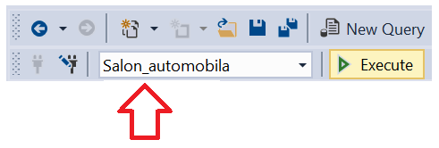

Задаци
======

Упити се пишу и покрећу када се кликне *New Query* након што се покрене систем *SQL Server* и
кликне на креирану базу *Salon_automobila* у прозору *Object Explorer*. Фајл са упитима
*SQLQuery1.sql* може, али и не мора да се сачува.

Након што се унесе једна команда, кликне се на дугме *Execute*. Уколико се у простору за писање
команди налази више њих, потребно је обележити ону коју желимо да покренемо. Ако има више база
података, обавезно проверити да ли је поред овог дугмета назив базе у којој желите да вршите упите.

Сви наредни SELECT упити обрађују податке из базе података за салон аутомобила. Следи списак свих
табела са колонама. Примарни кључеви су истакнути болдом, а страни италиком.

proizvodjaci(**pib**, maticni_broj, naziv, adresa)

kategorije(**id_kategorije**, naziv, opis)

modeli(**id_modela**, oznaka, jacina_motora, broj_vrata, tip_goriva, *pib*, *id_kategorije*)

.. questionnote::

 1. Написати упит којим се приказују ознака модела и назив произвођача возила која имају петора
 врата. Назив произвођача и ознаку модела приказати спојено са цртицом између у једној колони.
 Уредити резултат по називу произвођача, а уколико два модела имају истог произвођача, по
 називу модела. 

.. reveal:: 4141
   :showtitle: Прикажи решење   
   :hidetitle: Сакриј
   
   ::
   
    SELECT naziv+' - '+oznaka "Model"  
    FROM modeli JOIN proizvodjaci ON (modeli.pib=proizvodjaci.pib) 
    WHERE broj_vrata=5
    ORDER BY naziv, oznaka

 .. image:: ../../_images/slika_414b.png
   :width: 480
   :align: center

.. questionnote::

 2. Написати упит којим се приказују ознака модела, назив произвођача, назив и опис категорије за
 све моделе. Уредити приказ резултата по називу категорије. 

.. reveal:: 4142
   :showtitle: Прикажи решење 
   :hidetitle: Сакриј

 ::

    SELECT oznaka, proizvodjaci.naziv "proizvodjac", kategorije.naziv "kategorija", opis
    FROM modeli JOIN proizvodjaci ON (modeli.pib=proizvodjaci.pib) 
    JOIN kategorije ON (modeli.id_kategorije=kategorije.id_kategorije)
    ORDER BY kategorije.naziv

 .. image:: ../../_images/slika_414c.png
   :width: 480
   :align: center

.. questionnote::

 3. Написати упит којим се приказује ознака модела за све лимузине произвођача Mercedes-Benz.

.. reveal:: 4143
   :showtitle: Прикажи решење 
   :hidetitle: Сакриј

 ::

    SELECT oznaka
    FROM modeli JOIN proizvodjaci ON (modeli.pib=proizvodjaci.pib) 
    JOIN kategorije ON (modeli.id_kategorije=kategorije.id_kategorije)
    WHERE proizvodjaci.naziv='Mercedes-Benz' AND kategorije.naziv='limuzina'

 .. image:: ../../_images/slika_414d.png
   :width: 480
   :align: center

.. questionnote::

 4. Написати упит којим се абецедно уређено приказују произвођачи модела који користе дизел.
 Обратити пажњу да, ако један произвођач производи више модела који користе дизел, назив
 тог произвођача треба приказати само једном. 

.. reveal:: 4144
   :showtitle: Прикажи решење 
   :hidetitle: Сакриј

 ::

    SELECT DISTINCT proizvodjaci.naziv
    FROM modeli JOIN proizvodjaci ON (modeli.pib=proizvodjaci.pib) 
    WHERE tip_goriva='dizel'
    ORDER BY proizvodjaci.naziv

.. questionnote::

 5. Написати упит којим се абецедно уређено приказују произвођачи џипова.

.. reveal:: 4145
   :showtitle: Прикажи решење 
   :hidetitle: Сакриј

 ::

    SELECT DISTINCT proizvodjaci.naziv
    FROM modeli JOIN proizvodjaci ON (modeli.pib=proizvodjaci.pib) 
    JOIN kategorije ON (modeli.id_kategorije=kategorije.id_kategorije)
    WHERE kategorije.naziv='dzip'
    ORDER BY proizvodjaci.naziv
