Упит SELECT - употреба функција
===============================

.. infonote::

 Шта ћемо да урадимо ако треба да заокружимо број, пребројимо неке податке или нађемо максимум
 или минимум? Постоји велики број функција које можемо да употребимо да би нам помогле да дођемо
 до жељеног резултата. 

 У овој лекцији ће бити приказане неке од њих и биће објашњено како извршавају свој задатак.
 Списак свих функција које имамо на располагању је веома велики и по потреби нека функција коју
 нисмо споменули, а потребна нам је, може да се нађе претрагом на интернету или у званичној
 онлајн документацији система за управљање базама података који користимо.

У упитима можемо да користимо разне функције. Постоје две врсте функција. Једноставне функције
се извршавају тако што се примењују на сваком реду резултата појединачно. Групне функције враћају
један резултат за више редова. Употребу функција ћемо приказати кроз примере. 

За све примере ћемо користити базу података библиотеке. Следи списак свих табела са колонама.
Примарни кључеви су истакнути болдом, а страни италиком. 

.. image:: ../../_images/slika_401.png
   :width: 780
   :align: center

Упити се пишу и покрећу када се кликне *New Query* након што се покрене систем *SQL Server* и
кликне на креирану базу *Biblioteka* у прозору *Object Explorer*. Фајл са упитима *SQLQuery1.sql*
може, али и не мора да се сачува.

Када се унесе једна команда, кликне се на дугме *Execute*. Уколико се у простору за писање команди
налази више њих, потребно је обележити ону коју желимо да покренемо. Ако је ту више база података,
обавезно проверити да ли је поред овог дугмета назив базе у којој желите да вршите упите. 

.. image:: ../../_images/slika_401b.png
   :width: 390
   :align: center

.. questionnote::

 1. Написати упит којим се приказујe извештај о запосленима у једној колони са новим заглављем
 „Izvestaj“ у виду реченице која садржи, име, презиме и плату, као у примеру који следи:

 ``Ana Milosavljevic ima platu 60.000 RSD``

Да би се формирао текстуални податак, потребно је извршити конверзију броја у текст.
**Функција CONVERT** узима најмање два параметра, тип у који се врши конверзија и податак који
треба да се конвертује. Могуће је употребити и додатне параметре за форматирање.

::

 SELECT ime+' '+prezime+' ima platu '+CONVERT(varchar,plata)+ ' RSD' "Izvestaj"
 FROM zaposleni

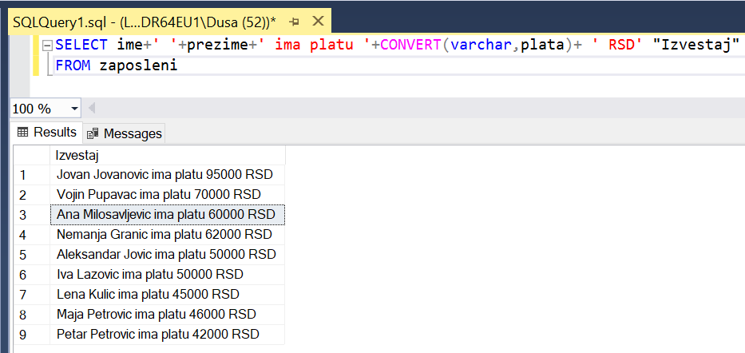

.. questionnote::

 2. Библиотека је одлучила да свим члановима додели посебне имејл адресе, које се формирају
 од првог слова имена, целог презимена и наставка @clanovi.rs. Написати упит којим се
 приказује имејл адреса члана који се презива „Зорановић“.

**Функције могу да се користе у SELECT делу и у WHERE делу упита.**

Функција UPPER је употребљена у WHERE делу упита како би се обезбедило да претрага не буде
осетљива на мала и велика слова.

::

 SELECT CONCAT(LOWER(SUBSTRING(ime,1,1)+prezime),'@clanovi.rs') "Mejl adresa"
 FROM clanovi
 WHERE UPPER(prezime)='ZORANOVIC'

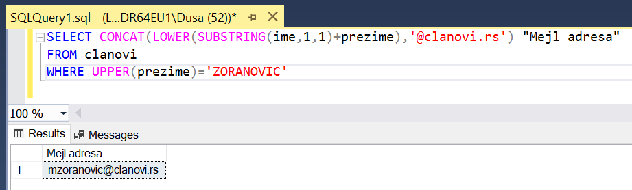

Следи кратак опис употребљених функција за рад са текстуалним подацима:

- функција LOWER – пребацује све у мала слова;
- функција UPPER – пребацује све у велика слова;
- функција SUBSTRING – издваја део текста, као параметри се наводе позиција од које се креће,
  а затим број знакова (SUBSTRING(ime,1,1) узима од прве позиције један знак, SUBSTRING(ime,1,4)
  узима од прве позиције четири знака, а SUBSTRING(ime,3,2) узима од треће позиције два знака).

.. questionnote::

 3. Написати упит којим се приказују називи књига који у себи садрже реч „programiranje“.

Овај упит смо већ раније решавали и добили смо следеће решење у којем се водило рачуна о томе
да реч „programiranje“ може да буде на почетку, у средини или на крају, и може да буде написана
великим словима, малим словима или да је прво слово велико а остала мала уколико је реч на
почетку назива књиге.

::

 SELECT naziv FROM knjige 
 WHERE naziv LIKE '%Programiranje%' OR naziv LIKE '%programiranje%'
 OR naziv LIKE '%PROGRAMIRANJE%'

Употребом функције UPPER можемо да поједноставимо ово решење.

::

 SELECT naziv FROM knjige 
 WHERE UPPER(naziv) LIKE '%PROGRAMIRANJE%'

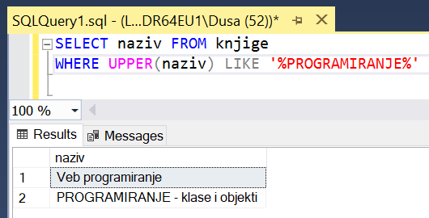

.. questionnote::

 4. Написати упит којим се приказују подаци о плаћеним чланаринама. Ако постоји опис, нека се
 прикаже опис, или порука „Nema popusta“ уколико опис не постоји.  

::

 SELECT broj_clanske_karte, god, iznos, ISNULL(opis, 'Nema popusta')
 FROM clanarine

**Функција ISNULL** анализира први параметар. Ако је вредност различита од null, приказаће
вредност, а у супротном ће приказати други параметар.

На следећој слици може да се упоредни како изгледа резултат упита без и са позивом
функције ISNULL.

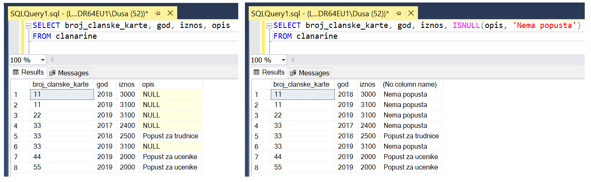

.. questionnote::

 5. Написати упит којим се приказују износи свих чланарина када би били умањени за 3,3%.
 Заокружити резултат на цео број. 

**Функција ROUND** служи да се заокружи број и има најмање два параметра. Први параметар
је број који треба да се заокружи, а други је број децимала. Уколико пише нула на месту
другог параметра, заокружује се на цео број.

::

 SELECT ROUND(0.967*iznos,0) FROM clanarine

.. questionnote::

 6. Написати упит којим се приказују најмања, највећа и просечна плата свих запослених.

::

 SELECT MIN(plata) "Najmanja plata", MAX(plata) "Najveca plata", AVG(plata) "Prosecna plata"
 FROM zaposleni

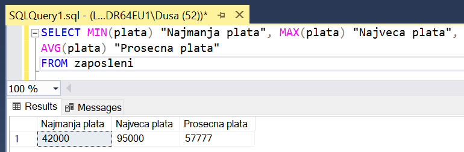

**Функције MIN, MAX и AVG су групне, односно агрегатне функције**. Групне функције враћају
један резултат за више редова. Функција AVG ради само са бројевима. Функције MIN и MAX раде
са свим типовима података чије вредности могу да се упоређују.

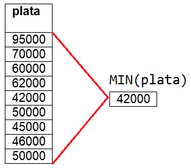

.. questionnote::

 7. Написати упит којим се приказује број позајмица члана са бројем чланске карте 22.

**Функција COUNT** je још једна групнa функциjа која, уколико се стави звездица (*), врши
пребројавање по колони која је примарни кључ табеле, тј. враћа број редова. 

Можемо да покренемо следећи упит да бисмо видели колико има позајмица члан са бројем
чланске карте 22.

.. image:: ../../_images/slika_421g.png
   :width: 480
   :align: center

Видимо да члан са бројем чланске карте 22 има укупно седам позајмица. Да бисмо добили тај
број, потребно је да употребимо функцију COUNT. Видећемо да следећи упит пребројава позајмице
и враћа њихов број. 

::

 SELECT COUNT(*) "Ukupan broj pozajmica clana 22" FROM pozajmice 
 WHERE broj_clanske_karte = 22

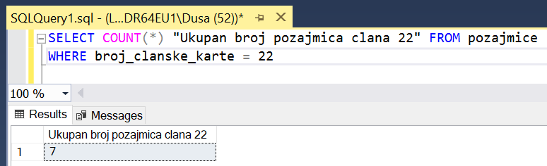

.. questionnote::

 8. Написати упит којим се приказује датум када се прва особа запослила у библиотеци. 

Функције MIN и MAX раде са свим типовима података чије вредности могу да се упоређују.
Најранији датум је најстарији датум, а најкаснији датум је најновији.

::

 SELECT MIN(datum_zaposlenja)
 FROM zaposleni

.. questionnote::

 9. Написати упит којим се приказује просечна плата оних запослених који зарађују бар 50.000 динара. 

::

 SELECT AVG(plata)
 FROM zaposleni
 WHERE plata >= 50000

У овом упиту је извршена селекција одређених редова пре позива групне функције.

.. questionnote::

 10. Написати упит којим се за сваког менаџера приказује просечна плата његових запослених. 

У овом упиту је потребно да групишемо редове према вредности идентификационог броја менаџера,
а да се затим за сваку групу редова израчуна просечна вредност плата. Упит мора да има GROUP
BY део за груписање.

::

 SELECT id_menadzera, AVG(plata) "Prosecna plata tima"
 FROM zaposleni
 GROUP BY id_menadzera

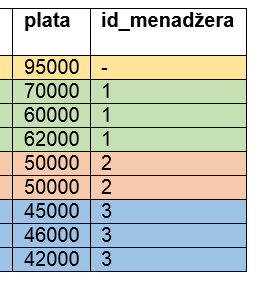

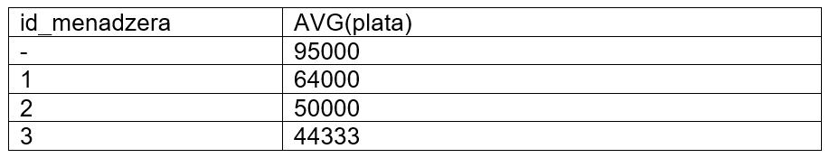

.. questionnote::

 11. Написати упит којим се за сваког менаџера приказује просечна плата његових запослених.
 Издвојити само менаџере чији запослени имају просек плата већи од 50.000 динара. 

У овом упиту прво треба да израчунамо просек плата запослених сваког менаџера, а затим да
извршимо селекцију резултата. Потребно је да упиту додамо HAVING део. 

::

 SELECT id_menadzera, AVG(plata) "Prosecna plata tima"
 FROM zaposleni
 GROUP BY id_menadzera
 HAVING AVG(plata) > 50000

На следећој слици може да се види како је додавањем HAVING дела извршена селекција редова
резултата који је добијен након позива групне функције за рачунање просечне плате. 

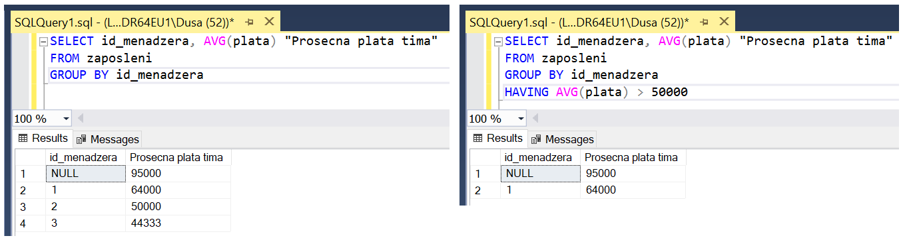

**Групне функције могу да се користе у SELECT делу и у HAVING делу упита, а не могу да се
користе у WHERE делу упита.**

.. questionnote::

 12. Написати упит којим се за сваког менаџера приказује просечна плата његових запослених.
 Издвојити само менаџере који имају више од два запослена. 

У HAVING делу упита можемо да употребимо и неку другу функцију, а не само ону чији
резултат приказујемо. 

::

 SELECT id_menadzera, AVG(plata)
 FROM zaposleni
 GROUP BY id_menadzera
 HAVING COUNT(*) > 2

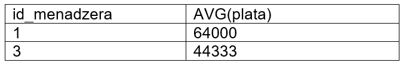

Менаџери са идентификационим бројевима 1 и 3 имају по три запослена.

.. questionnote::

 13. Написати упит којим се за сваког издавача приказује број његових књига у библиотеци. 

::

 SELECT id_izdavaca, COUNT(id_knjige) "Broj knjiga"
 FROM knjige
 GROUP BY id_izdavaca

Уколико желимо да прикажемо и назив издавача, морамо да спојимо табеле. У GROUP BY делу
упита морамо да набројимо све податке који су набројани у SELECT делу упита ван позива групне
функције.

::

 SELECT id_izdavaca, izdavaci.naziv, COUNT(id_knjige) "Broj knjiga"
 FROM knjige JOIN izdavaci ON (izdavaci.id=knjige.id_izdavaca)
 GROUP BY id_izdavaca, izdavaci.naziv

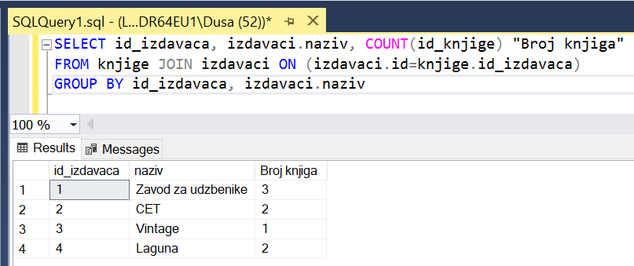

.. questionnote::

 14. Написати упит којим се приказује укупан број плаћених чланарина.

::

 SELECT COUNT(*)
 FROM clanarine

Групне функције игноришу NULL. Обратити пажњу да следећи упит неће вратити тачан резултат и
да зато у колони *opis* постоји више редова у којима није унета вредност описа.

::

 SELECT COUNT(opis)
 FROM clanarine
 
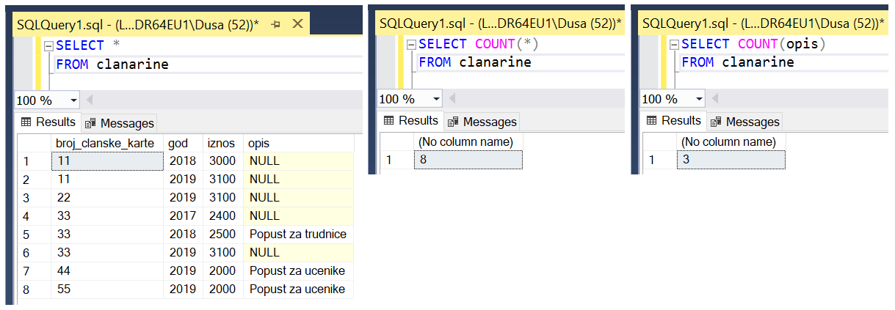

.. questionnote::

 15. Написати упит којим се приказује укупан износ плаћених чланарина за сваку годину.
 
**Функција SUM** je једна групнa функциja која сабира вредности.

::
 
 SELECT god, SUM(iznos) "Ukupan iznos uplacenih clanarina"
 FROM clanarine
 GROUP BY god
 
Можемо на следећој слици да видимо како изгледају сви подаци о уплаћеним чланаринама по годинама, и како изгледа 
резултат функције SUM која за сваку годину сабере све износе. 

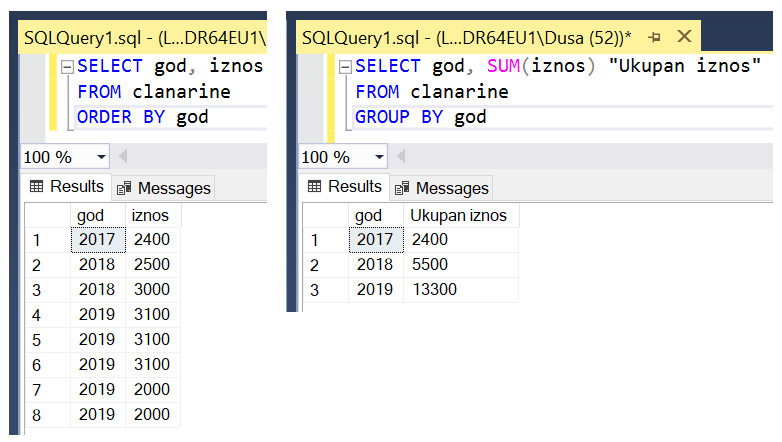
   
.. questionnote::

 16. Написати упит којим се приказује за сваког аутора број издавача за које је радио.

Можемо да видимо за које је издаваче аутор радио тако што повежемо ауторе са књигама које су написали, а онда књиге 
повежемо са издавачима. На следећој слици се види једна од честих ситуација, да је исти аутор писао и неколико књига 
за истог издавача.  

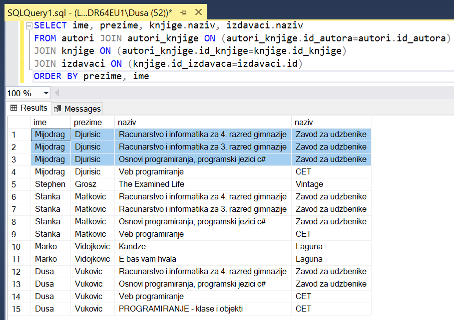
   
Из наведених разлога је важно да пребројимо само различите издаваче, тако да додајемо реч DISTINCT. 

::

 SELECT ime, prezime, COUNT(DISTINCT izdavaci.naziv)
 FROM autori JOIN autori_knjige ON (autori_knjige.id_autora=autori.id_autora)
 JOIN knjige ON (autori_knjige.id_knjige=knjige.id_knjige)
 JOIN izdavaci ON (knjige.id_izdavaca=izdavaci.id)
 GROUP BY prezime, ime

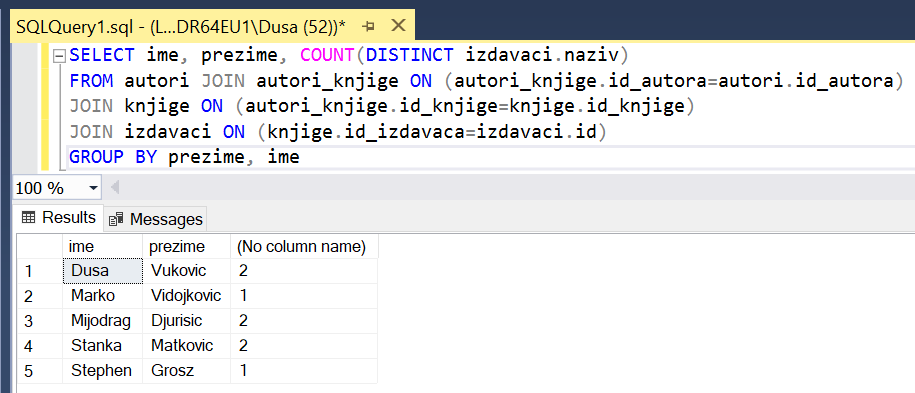