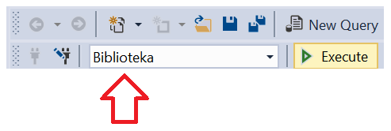

Упит SELECT - подупити
======================

.. infonote::

 Уколико желимо да пронађемо запослене који зарађују 50.000 динара, можемо да напишемо и
 покренемо следећи упит:
 
 ::

    SELECT prezime FROM zaposleni
    WHERE plata = 50000

 У овом примеру смо тачно знали који износ тражимо. Постоје, међутим, ситуације у којима нам
 није позната тачна вредност већ ту вредност морамо прво да сазнамо из података сачуваних у
 бази. На пример, како ћемо да решимо задатак да нам се прикажу сви запослени који имају исту
 висину плате као запослена која се презива Лазовић? У случајевима попут овог користимо подупите.

Начин писања подупита и њихову употребу ћемо приказати кроз примере. 

За све наредне примере користићемо базу података библиотеке. Следи списак свих табела са колонама.
Примарни кључеви су истакнути болдом, а страни италиком.

.. image:: ../../_images/slika_401.png
   :width: 780
   :align: center

Упити се пишу и покрећу када се кликне *New Query* након што се покрене систем *SQL Server* и
кликне на креирану базу *Biblioteka* у прозору *Object Explorer*. Фајл са упитима *SQLQuery1.sql*
може, али и не мора да се сачува.

Након што се унесе једна команда, кликне се на дугме *Execute*. Уколико се у простору за писање
команди налази више њих, потребно је обележити ону коју желимо да покренемо. Ако је ту више база
података, обавезно проверити да ли је поред овог дугмета назив базе у којој желите да вршите упите.

.. questionnote::

 1. Написати упит којим се приказују запослени који зарађују исто као запослена са презименом
 „Лазовић“.

::

 SELECT prezime, plata
 FROM zaposleni
 WHERE plata = (SELECT plata FROM zaposleni WHERE prezime='Lazovic')

Подупит се први изврши и врати главном упиту податак о томе који је износ плате запослене са
презименом „Лазовић“. Како у бази података постоји само једна запослена особа која се презива
„Лазовић“, подупит враћа једну вредности и цео упит ће радити. 

Упит можемо да поправимо тако да не приказује запослену са презименом „Лазовић“. 

::

 SELECT prezime, plata
 FROM zaposleni
 WHERE plata = (SELECT plata FROM zaposleni WHERE prezime='Lazovic')
 AND prezime <> 'Lazovic'

.. questionnote::

 2. Написати упит којим се приказују сви чланови који током 2019. године плаћају исти износ
 чланарине као члан са бројем чланске карте 33.

::

 SELECT prezime 
 FROM clanarine JOIN clanovi 
 ON (clanarine.broj_clanske_karte=clanovi.broj_clanske_karte)
 WHERE iznos = (SELECT iznos FROM clanarine WHERE broj_clanske_karte=33 AND god=2019)
 AND clanovi.broj_clanske_karte <> 33

.. questionnote::

 3. Написати упит којим се приказују сви чланови који су у неком тренутку плаћали исти износ
 чланарине као члан са бројем чланске карте 33. 

Прва идеја је да се напише следећи упит, али он неће радити:

::

 SELECT prezime
 FROM clanarine JOIN clanovi 
 ON (clanarine.broj_clanske_karte=clanovi.broj_clanske_karte)
 WHERE iznos= (SELECT iznos FROM clanarine WHERE broj_clanske_karte=33)
 AND clanovi.broj_clanske_karte <> 33

Подупит у наведеном упиту враћа више од једне вредности зато што је овај члан библиотеке
био члан неколико година и у свакој години је имао неки износ чланарине који је плаћао.
Када подупит враћа више од једне вредности, морају да се користе другачији оператори. 

Први начин је да се уз оператор поређења = дода реч ANY :

::

 SELECT prezime
 FROM clanarine JOIN clanovi 
 ON (clanarine.broj_clanske_karte=clanovi.broj_clanske_karte)
 WHERE iznos = ANY(SELECT iznos FROM clanarine WHERE broj_clanske_karte=33)
 AND clanovi.broj_clanske_karte <> 33

Други начин је да се употреби оператор који проверава да ли је нека вредност у скупу:

::

 FROM clanarine JOIN clanovi 
 ON (clanarine.broj_clanske_karte=clanovi.broj_clanske_karte)
 WHERE iznos IN (SELECT iznos FROM clanarine WHERE broj_clanske_karte=33)
 AND clanovi.broj_clanske_karte <> 33

.. questionnote::

 4. Написати упит којим се приказују све књиге које је објавио исти издавач који је објавио
 књигу са називом „ПРОГРАМИРАЊЕ – класе и објекти“. 

::

 SELECT knjige.naziv
 FROM knjige JOIN izdavaci ON (knjige.id_izdavaca = izdavaci.id)
 WHERE izdavaci.naziv = (SELECT izdavaci.naziv 
                         FROM knjige JOIN izdavaci 
                         ON (knjige.id_izdavaca = izdavaci.id)
                         WHERE knjige.naziv = 'PROGRAMIRANJE - klase i objekti')
 AND NOT(knjige.naziv = 'PROGRAMIRANJE - klase i objekti')

.. questionnote::

 5. Написати упит којим се приказују подаци о запосленом који најмање зарађује.

::

 SELECT * FROM zaposleni 
 WHERE plata = (SELECT MIN(plata) FROM zaposleni)

.. questionnote::

 6. Написати упит којим се приказују подаци о запосленима који зарађују више од просека.

::

 SELECT *
 FROM zaposleni 
 WHERE plata > (SELECT AVG(plata) FROM zaposleni)

.. questionnote::

 7. Написати упит којим се приказује назив књиге која је издата током најстарије позајмице.

::

 SELECT naziv
 FROM knjige JOIN primerci ON (primerci.id_knjige=knjige.id_knjige)
 JOIN pozajmice ON (pozajmice.inventarski_broj=primerci.inventarski_broj)
 WHERE datum_uzimanja = (SELECT MIN(datum_uzimanja) FROM pozajmice)

.. questionnote::

 8. Написати упит којим се приказују чланови библиотеке који су позајмили бар једну књигу
 исту као члан са бројем чланске карте 33. 

::

 SELECT DISTINCT clanovi.broj_clanske_karte, prezime
 FROM clanovi JOIN pozajmice ON (pozajmice.broj_clanske_karte=clanovi.broj_clanske_karte)
 JOIN primerci ON (pozajmice.inventarski_broj=primerci.inventarski_broj)
 WHERE id_knjige = ANY(SELECT id_knjige 
                       FROM pozajmice JOIN primerci 
                       ON (pozajmice.inventarski_broj=primerci.inventarski_broj)
                       WHERE broj_clanske_karte = 33)
 AND clanovi.broj_clanske_karte <> 33
