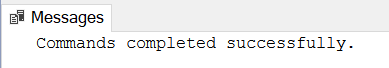

База података за продају дигиталних композиција
===============================================

.. infonote::

 Све до сада објашњено и научено провежбаћемо на још једном добром примеру базе података. То је база података фиктивне 
 компаније за продају музичких композиција (углавном песама). Модел за ову базу већ имамо припремљен. База је доброг 
 обима, имаће 11 повезаних табела. Креираћемо базу и попунићемо је подацима, а затим ћемо претраживати податке 
 користећи многобројне могућности упита SELECT са којима смо се упознали. 
 

На следећој слици је приказан модел на основу којег ћемо креирати релациону базу података библиотеке. На моделу су 
коришћена наша латинична слова, али ћемо се приликом креирања базе података, креирања табела и уноса података у базу 
држати правила да користимо слова енглеске абецеде, или како се неформално каже, користићемо „шишану латиницу“. У овом 
примеру базе података ће називи табела које креирамо бити у једнини. 

Базу података за продају дигиталних композиција ћемо креирати употребом алата *SQL Server Management Studio*. 

Кликнути десни тастер миша над *Databases* у прозору *Object Explorer* и изабрати *New Database*...

   
Унети назив нове базе података и кликнути дугме OK. 

Нова база података се појавила на списку у прозору *Object Explorer*. Требало би да се поред ње ту већ налазе још две 
базе података, једна за библиотеку, а друга за салон аутомобила. 

Кликнути дугме *New Query* испод главног падајућег менија. Обавезно проверити да се исправан назив базе налази у пољу 
лево од дугмета *Execute*, у овом случају назив нове базе података *Pesme*. 

   
Прво извршити све **CREATE TABLE** команде, једну по једну.

**Напомена: Редослед је важан!** Пре креирања табеле која има страни кључ, неопходно је креирати табелу на коју она 
показује. 

Све команде могу да се прекопирају истовремено, али се свака појединачно прво означи мишем и за сваку означену команду 
се кликне *Execute*, као што је приказано на следећој слици. 

Након сваке успешно извршене команде, појави се одговарајућа порука.

   
Након што се свака команда изврши, све табеле ће остати сачуване у бази података за даљу употребу. Фајл *SQLQuery1.sql* 
може, али и не мора да се сачува.

Следе све CREATE TABLE команде. 

::

 CREATE TABLE format 
 ( id_format INT PRIMARY KEY, 
 naziv VARCHAR(120) );

 CREATE TABLE zanr 
 ( id_zanr INT PRIMARY KEY, 
 naziv VARCHAR(120) );

 CREATE TABLE plejlista 
 ( id_plejlista INT PRIMARY KEY, 
 naziv VARCHAR(120) );

 CREATE TABLE izvodjac 
 ( id_izvodjac INT PRIMARY KEY, 
 naziv VARCHAR(120) );

 CREATE TABLE album 
 ( id_album INT PRIMARY KEY, 
 naziv VARCHAR(160) NOT NULL, 
 id_izvodjac INT NOT NULL, 
 FOREIGN KEY (id_izvodjac) REFERENCES izvodjac(id_izvodjac)
 ON DELETE NO ACTION ON UPDATE NO ACTION );
 
 CREATE TABLE kompozicija 
 ( id_kompozicija INT PRIMARY KEY, 
 naziv VARCHAR(200) NOT NULL, 
 id_album INT, 
 id_format INT NOT NULL, 
 id_zanr INT, 
 trajanje INT NOT NULL, 
 velicina INT, 
 cena NUMERIC(10, 2) NOT NULL, 
 FOREIGN KEY (id_album) REFERENCES album(id_album) 
 ON DELETE NO ACTION ON UPDATE NO ACTION, 
 FOREIGN KEY (id_zanr) REFERENCES zanr(id_zanr) 
 ON DELETE NO ACTION ON UPDATE NO ACTION, 
 FOREIGN KEY (id_format) REFERENCES format(id_format) 
 ON DELETE NO ACTION ON UPDATE NO ACTION );
 
 CREATE TABLE plejlista_kompozicija 
 ( id_plejlista INT NOT NULL, 
 id_kompozicija INT NOT NULL, 
 PRIMARY KEY (id_plejlista, id_kompozicija), 
 FOREIGN KEY (id_plejlista) REFERENCES plejlista (id_plejlista) 
 ON DELETE NO ACTION ON UPDATE NO ACTION, 
 FOREIGN KEY (id_kompozicija) REFERENCES kompozicija 
 ON DELETE NO ACTION ON UPDATE NO ACTION);
 
 CREATE TABLE zaposleni 
 ( id_zaposleni INT PRIMARY KEY, 
 prezime VARCHAR(20) NOT NULL, 
 ime VARCHAR(20) NOT NULL, 
 pozicija VARCHAR(30), 
 id_nadredjeni INT, 
 datum_rodjenja DATETIME, 
 datum_zaposlenja DATETIME, 
 adresa VARCHAR(70), 
 grad VARCHAR(40), 
 drzava VARCHAR(40), 
 mejl VARCHAR(60), 
 FOREIGN KEY (id_nadredjeni) REFERENCES zaposleni(id_zaposleni) 
 ON DELETE NO ACTION ON UPDATE NO ACTION );
 
 CREATE TABLE kupac 
 ( id_kupac INT PRIMARY KEY, 
 ime VARCHAR(40) NOT NULL, 
 prezime VARCHAR(20) NOT NULL, 
 kompanija VARCHAR(80), 
 adresa VARCHAR(70), 
 grad VARCHAR(40), 
 drzava VARCHAR(40), 
 mejl VARCHAR(60) NOT NULL, 
 id_zaposleni INT, 
 FOREIGN KEY (id_zaposleni) REFERENCES zaposleni (id_zaposleni) 
 ON DELETE NO ACTION ON UPDATE NO ACTION );
 
 CREATE TABLE narudzbenica 
 ( id_narudzbenica INT PRIMARY KEY, 
 id_kupac INT NOT NULL, 
 datum DATETIME NOT NULL, 
 ukupan_iznos NUMERIC(10, 2) NOT NULL, 
 FOREIGN KEY (id_kupac) REFERENCES kupac(id_kupac) 
 ON DELETE NO ACTION ON UPDATE NO ACTION );
 
 CREATE TABLE stavka_narudzbenice 
 ( id_stavka INT PRIMARY KEY, 
 id_narudzbenica INT NOT NULL, 
 id_kompozicija INT NOT NULL, 
 cena NUMERIC(10, 2) NOT NULL, 
 kolicina INT NOT NULL, 
 FOREIGN KEY (id_narudzbenica) REFERENCES narudzbenica 
 ON DELETE NO ACTION ON UPDATE NO ACTION, 
 FOREIGN KEY (id_kompozicija) 
 REFERENCES kompozicija 
 ON DELETE NO ACTION ON UPDATE NO ACTION );

 

 

