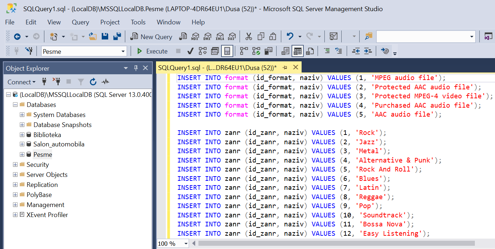
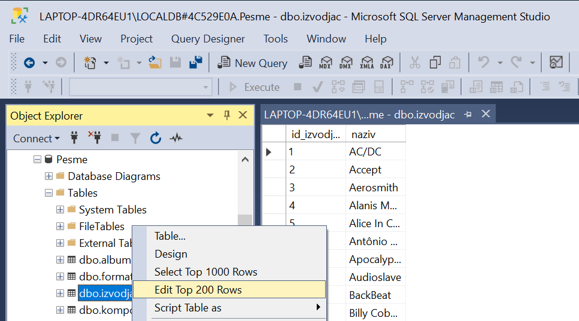

База података за продају дигиталних композиција
===============================================

Уколико је прозор за писање команди угашен, кликнути поново дугме *New Query* испод главног падајућег менија. 
Пребацити комплетан садржај фајла `pesme_insert_into.sql <https://petljamediastorage.blob.core.windows.net/root/Media/Default/Kursevi/baze_IV/pesme_insert_into.sql>`_ и кликнути *Execute*. 

Након што се све команде изврше, сви подаци ће остати сачувани у бази података за даљу употребу. Фајл *SQLQuery1.sql* 
може, али и не мора да се сачува.

   
Може да се провери да ли су подаци унети у табеле тако што се изабере *Edit Top 200 Rows* са менија који се добије када 
се кликне десни тастер миша над називом неке од табела. 

