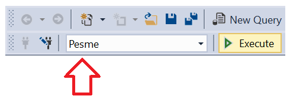
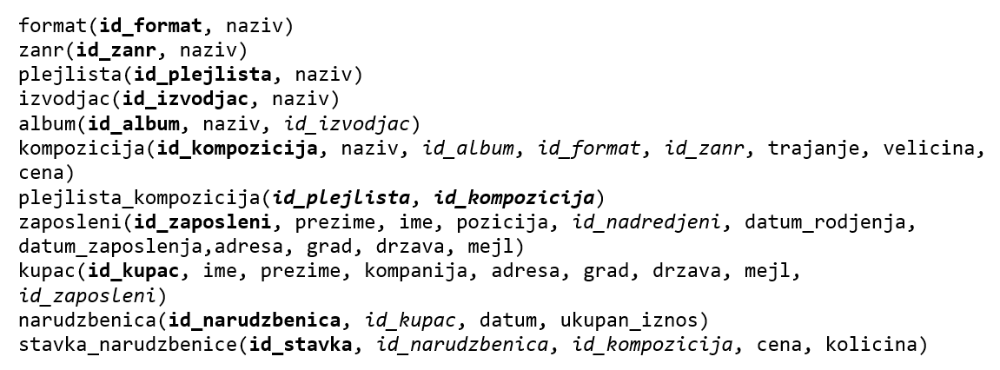

Задаци - спајање табела
=======================

Сви задаци који следе могу да се провежбају и у систему *SQL Server Management Studio*.

Упити се пишу и покрећу када се кликне *New Query* након што се покрене систем *SQL Server* и кликне на креирану 
базу *Pesme* у прозору *Object Explorer*. Фајл са упитима *SQLQuery1.sql* може, али и не мора да се сачува.

Након што се унесе једна команда, кликне се на дугме *Execute*. Уколико се у простору за писање команди налази више 
њих, потребно је обележити ону коју желимо да покренемо. Ако има више база података, обавезно проверити да ли је поред 
овог дугмета назив базе у којој желите да вршите упите. 

Сви наредни SELECT упити обрађују податке из базе података фиктивне компаније за продају музичких композиција 
(углавном песама). Следи списак свих табела са колонама. Примарни кључеви су истакнути болдом, а страни италиком. 
   

.. questionnote::

 1. Прикажи називе свих песама и њихове жанрове.
 
.. reveal:: db_4341
	:showtitle: Прикажи решење
	:hidetitle: Сакриј
	
	.. code-block:: sql
		
		SELECT kompozicija.naziv AS kompozicija, zanr.naziv AS zanr
		FROM kompozicija JOIN
		zanr ON kompozicija.id_zanr = zanr.id_zanr
	
	.. image:: ../../_images/slika_434p1.png
		:width: 450
		:align: center
	
.. questionnote::

 2. Прикажи називе свих џез композиција (жанр је Jazz).
 
.. reveal:: db_4342
	:showtitle: Прикажи решење
	:hidetitle: Сакриј

	.. code-block:: sql		
	
		SELECT kompozicija.naziv
		FROM kompozicija JOIN
			zanr ON kompozicija.id_zanr = zanr.id_zanr
		WHERE zanr.naziv = 'Jazz'
	
	.. image:: ../../_images/slika_434p2.png
		:width: 450
		:align: center
	
.. questionnote::

 3. Прикажи називе свих поп композиција (жанр је Pop) које су снимљене у формату AAC.
 
.. reveal:: db_4343
	:showtitle: Прикажи решење
	:hidetitle: Сакриј

	.. code-block:: sql		
	
		SELECT kompozicija.naziv
		FROM kompozicija JOIN
			zanr ON kompozicija.id_zanr = zanr.id_zanr JOIN
			format ON kompozicija.id_format = format.id_format
		WHERE zanr.naziv = 'Pop' AND format.naziv LIKE '%AAC%'
	
	.. image:: ../../_images/slika_434p3.png
		:width: 450
		:align: center
		
.. questionnote::

 4. Прикажи називе свих песама групе *Queen*.
 
.. reveal:: db_4344
	:showtitle: Прикажи решење
	:hidetitle: Сакриј

	.. code-block:: sql		
	
		SELECT kompozicija.naziv
		FROM kompozicija JOIN
			zanr ON kompozicija.id_zanr = zanr.id_zanr JOIN
			format ON kompozicija.id_format = format.id_format
		WHERE zanr.naziv = 'Pop' AND format.naziv LIKE '%AAC%'
	
	.. image:: ../../_images/slika_434p4.png
		:width: 450
		:align: center
		
.. questionnote::

 5. Приказати називе свих различитих жанрова композиција групе *Iron Maiden*.
 
.. reveal:: db_4345
	:showtitle: Прикажи решење
	:hidetitle: Сакриј

	.. code-block:: sql		
	
		SELECT DISTINCT zanr.naziv
		FROM kompozicija JOIN
			album ON kompozicija.id_album = album.id_album JOIN
			izvodjac ON izvodjac.id_izvodjac = album.id_izvodjac JOIN
			zanr ON zanr.id_zanr = kompozicija.id_zanr
		WHERE izvodjac.naziv = 'Iron Maiden'
	
	.. image:: ../../_images/slika_434p5.png
		:width: 450
		:align: center
	
.. questionnote::

 6. Приказати списак композиција који садржи назив извођача и назив композиције.
 	
.. dbpetlja:: 4346
   :dbfile: music.sql
   :showresult:         
   :solutionquery: SELECT izvodjac.naziv AS izvodjac, kompozicija.naziv AS kompozicija
                   FROM kompozicija JOIN
                        album ON kompozicija.id_album = album.id_album JOIN
                        izvodjac ON izvodjac.id_izvodjac = album.id_izvodjac																	

.. questionnote::

 7. Приказати податке о томе који запослени подноси извештај ком
 запосленом у читљивом формату (у свакој врсти приказати
 идентификатор, име и презиме шефа, а затим идентификатор, име и
 презиме оног коме је та особа шеф).

.. dbpetlja:: 4347
   :dbfile: music.sql
   :showresult:         
   :solutionquery: SELECT z1.id_zaposleni, z1.ime, z1.prezime,
                          z2.id_zaposleni, z2.ime, z2.prezime
                   FROM zaposleni z1 JOIN
                        zaposleni z2 ON z1.id_zaposleni = z2.id_nadredjeni
                     
.. questionnote::

 8. Приказати имена купаца уз имена запослених који су задужени за
 њихову техничку подршку (сортирати списак по именима запослених, а
 за сваког запосленог по именима купаца).

.. dbpetlja:: 4348
   :dbfile: music.sql
   :showresult:         
   :solutionquery: SELECT k.ime, k.prezime, z.ime, z.prezime
                   FROM kupac k JOIN
                        zaposleni z ON k.id_zaposleni = z.id_zaposleni
                        ORDER BY z.prezime, z.ime, k.prezime, k.ime
   
                        