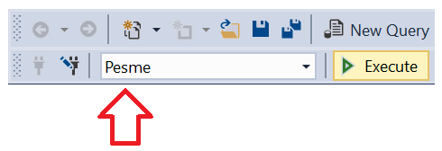
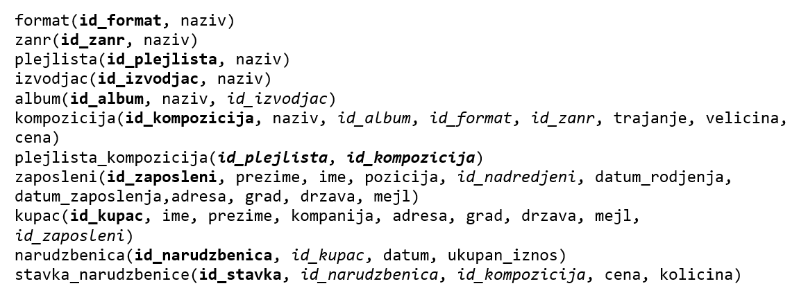

Задаци - групне функције и једна табела
=======================================

Сви задаци који следе могу да се провежбају и у систему *SQL Server Management Studio*.

Упити се пишу и покрећу када се кликне *New Query* након што се покрене систем *SQL Server* и кликне на креирану 
базу *Pesme* у прозору *Object Explorer*. Фајл са упитима *SQLQuery1.sql* може, али и не мора да се сачува.

Након што се унесе једна команда, кликне се на дугме *Execute*. Уколико се у простору за писање команди налази више 
њих, потребно је обележити ону коју желимо да покренемо. Ако има више база података, обавезно проверити да ли је поред 
овог дугмета назив базе у којој желите да вршите упите. 

Сви наредни SELECT упити обрађују податке из базе података фиктивне компаније за продају музичких композиција 
(углавном песама). Следи списак свих табела са колонама. Примарни кључеви су истакнути болдом, а страни италиком. 
   

.. questionnote::

 1. Израчунати колико укупно гигабајта заузимају све композиције.
 
.. reveal:: db_4351
	:showtitle: Прикажи решење
	:hidetitle: Сакриј
	
	.. code-block:: sql
		
		SELECT SUM(velicina) / (1024.0 * 1024.0 * 1024.0) AS GB
		FROM kompozicija;
	
	.. image:: ../../_images/slika_435p1.png
		:width: 450
		:align: center
	
.. questionnote::

 2. Одредити колико милисекунди траје најкраћа, а колико најдужа композиција.
 
.. reveal:: db_4352
	:showtitle: Прикажи решење
	:hidetitle: Сакриј
	
	.. code-block:: sql
	
		SELECT Min(trajanje) AS najkraca, Max(trajanje) AS najduza
		FROM kompozicija;
	
	.. image:: ../../_images/slika_435p2.png
		:width: 450
		:align: center
	
.. questionnote::

 3. Одредити укупан број жанрова.
 
.. reveal:: db_4353
	:showtitle: Прикажи решење
	:hidetitle: Сакриј
	
	.. code-block:: sql
	
		SELECT COUNT(*)
		FROM zanr

	.. image:: ../../_images/slika_435p3.png
		:width: 450
		:align: center
		
.. questionnote::

 4. Одредити број различитих албума који садрже песме.
 
.. reveal:: db_4354
	:showtitle: Прикажи решење
	:hidetitle: Сакриј
	
	.. code-block:: sql
	
		SELECT COUNT(*)
		FROM zanr
	
	.. image:: ../../_images/slika_435p4.png
		:width: 450
		:align: center
		
.. questionnote::

 5. Одредити број албума у табели албума.
 
.. reveal:: db_4355
	:showtitle: Прикажи решење
	:hidetitle: Сакриј
	
	.. code-block:: sql
	
		SELECT COUNT(*)
		FROM album
	
	.. image:: ../../_images/slika_435p5.png
		:width: 450
		:align: center
		
.. questionnote::

 6. Одредити број композиција сваког жанра.
 
.. reveal:: db_4356
	:showtitle: Прикажи решење
	:hidetitle: Сакриј
	
	.. code-block:: sql
	
		SELECT id_zanr, COUNT(*)
		FROM kompozicija
		GROUP BY id_zanr
	
	.. image:: ../../_images/slika_435p6.png
		:width: 450
		:align: center
		
.. questionnote::

 7. Одредити укупну дужину свих песама на сваком албуму. Списак уредити по укупној дужини, од најкраћих до најдужих албума.
 
.. reveal:: db_4357
	:showtitle: Прикажи решење
	:hidetitle: Сакриј
	
	.. code-block:: sql
	
		SELECT id_album, SUM(trajanje) AS trajanje_albuma
		FROM kompozicija
		GROUP BY id_album
		ORDER BY trajanje_albuma
	
	.. image:: ../../_images/slika_435p7.png
		:width: 450
		:align: center
		
.. questionnote::

 8. Одредити највећи број песама на некој листи.
 
.. reveal:: db_4358
	:showtitle: Прикажи решење
	:hidetitle: Сакриј
	
	.. code-block:: sql
	
		SELECT COUNT(*) AS broj
		FROM plejlista_kompozicija
		GROUP BY id_plejlista
		ORDER BY broj DESC
		LIMIT 1
	
	.. image:: ../../_images/slika_435p8.png
		:width: 450
		:align: center
		
.. questionnote::

 9. На основу свих наруџбеница одредити укупан промет компаније.
 
.. dbpetlja:: db_4359
   :dbfile: music.sql
   :showresult:
   :solutionquery: SELECT SUM(ukupan_iznos)
                   FROM narudzbenica
				   
.. questionnote::

 10. Одредити просечни износ наруџбенице током 2010. године.
 
.. dbpetlja:: db_43510
   :dbfile: music.sql
   :showresult:
   :solutionquery: SELECT AVG(ukupan_iznos)
                   FROM narudzbenica
                   WHERE datum LIKE '2010-%'
				   
.. questionnote::

 11. За сваког купца који је извршио неку наруџбину током 2011. године приказати укупан износ наруџбина које је 
 извршио током те године. Резултате приказати заокружене на најближи цео број у нерастућем редоследу укупног износа 
 наруџбина.

.. dbpetlja:: db_43511
   :dbfile: music.sql
   :showresult:
   :solutionquery: SELECT id_kupac, ROUND(SUM(ukupan_iznos)) AS ukupno
                   FROM narudzbenica
                   WHERE datum>='2011-01-01' AND datum<='2011-12-31'
                   GROUP BY id_kupac ORDER BY ukupno DESC
				   
.. questionnote::

 12. За сваку годину приказати укупан број наруџбина. Резултат сортирати на основу године.
 
.. dbpetlja:: db_43512
   :dbfile: music.sql
   :showresult:
   :solutionquery: SELECT strftime('%Y', datum) AS godina, COUNT(*) AS ukupno
                   FROM narudzbenica
                   GROUP BY godina
                   ORDER BY godina
				   
.. questionnote::
	
 13. На табеле ставки наруџбина *stavka_narudzbenice* приказати укупан износ наруџбина на свакој наруџбеници 
 (износ сваке ставке се добија множењем количине *kolicina* и јединичне цене *cena*, а укупан износ наруџбине се 
 добија сабирањем свих овако израчунатих износа ставки са те наруџбине). Сваки износ заокружити на две децимале.
 
.. dbpetlja:: db_43513
   :dbfile: music.sql
   :showresult:
   :solutionquery: SELECT id_narudzbenica, ROUND(SUM(kolicina * cena), 2) AS Ukupno
                   FROM stavka_narudzbenice
                   GROUP BY id_narudzbenica
				   
.. questionnote::

 14. За сваку државу из које постоји неки купац приказати укупан број купаца.

.. dbpetlja:: db_43514
   :dbfile: music.sql
   :showresult:
   :solutionquery: SELECT drzava, COUNT(*) AS broj_kupaca
                   FROM kupac
                   GROUP BY drzava

                   
.. questionnote::

   15. За сваку земљу из које постоји бар 5 купаца приказати укупан број
   купаца (резултат сортирати по броју купаца, нерастући).

.. dbpetlja:: db_43515
   :dbfile: music.sql
   :showresult:
   :solutionquery: SELECT drzava, COUNT(*) AS broj_kupaca
                   FROM kupac
                   GROUP BY drzava
                   HAVING broj_kupaca >= 5
                   ORDER BY broj_kupaca DESC
                   
.. questionnote::

   16. Приказати идентификаторе жанрова за које је у понуди више од 10
   сати музике.

.. dbpetlja:: 43516
   :dbfile: music.sql
   :showresult:
   :solutionquery: SELECT id_zanr
                   FROM kompozicija
                   GROUP BY id_zanr
                   HAVING SUM(trajanje) >= 10 * 60 * 60 * 1000

.. questionnote::

   17. За сваки жанр приказати број различитих типова медија на којима су
   снимане песме тог жанра (приказати идентификатор жанра и број
   типова медија).

.. dbpetlja:: db_43517
   :dbfile: music.sql
   :showresult:
   :solutionquery: SELECT id_zanr, COUNT (DISTINCT id_format)
                   FROM kompozicija
                   GROUP BY id_zanr
