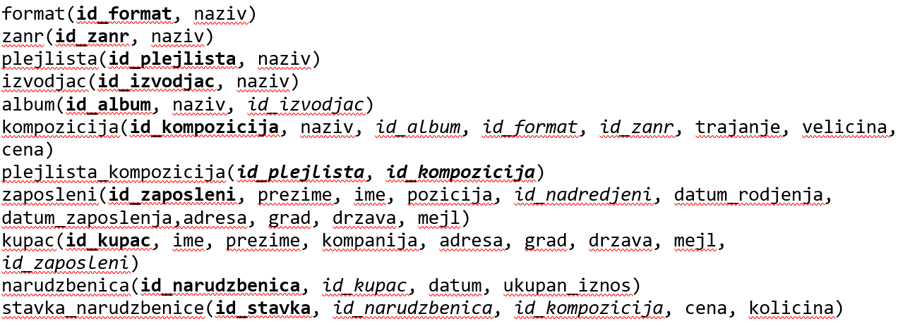

Задаци - групне функције и спајање табела
=========================================

Сви задаци који следе могу да се провежбају и у систему *SQL Server Management Studio*.

Упити се пишу и покрећу када се кликне *New Query* након што се покрене систем *SQL Server* и кликне на креирану 
базу *Pesme* у прозору *Object Explorer*. Фајл са упитима *SQLQuery1.sql* може, али и не мора да се сачува.

Након што се унесе једна команда, кликне се на дугме *Execute*. Уколико се у простору за писање команди налази више 
њих, потребно је обележити ону коју желимо да покренемо. Ако има више база података, обавезно проверити да ли је поред 
овог дугмета назив базе у којој желите да вршите упите. 

.. image:: ../../_images/slika_433a.png
   :width: 400
   :align: center

Сви наредни SELECT упити обрађују податке из базе података фиктивне компаније за продају музичких композиција 
(углавном песама). Следи списак свих табела са колонама. Примарни кључеви су истакнути болдом, а страни италиком. 
   

.. questionnote::

 1. За сваког извођача приказати укупан број снимљених минута, заокружен на две децимале.
 
.. reveal:: db_4361
	:showtitle: Прикажи решење
	:hidetitle: Сакриј
	
	.. code-block:: sql
	
		SELECT izvodjac.naziv, round(SUM(kompozicija.trajanje) / (1000.0 * 60.0), 2) AS minuti
		FROM kompozicija JOIN
			album ON kompozicija.id_album = album.id_album 
		JOIN izvodjac ON izvodjac.id_izvodjac = album.id_izvodjac
		GROUP BY izvodjac.id_izvodjac
		
	.. image:: ../../_images/slika_436p1.png
		:width: 450
		:align: center
	
.. questionnote::

 2. За сваког извођача приказати број композиција снимљених у MPEG формату. Занемарити оне извођаче који имају мање 
 од пет таквих композиција.
 
.. reveal:: db_4362
	:showtitle: Прикажи решење
	:hidetitle: Сакриј
	
	.. code-block:: sql
	
		SELECT izvodjac.naziv, round(SUM(kompozicija.trajanje) / (1000.0 * 60.0), 2) AS minuti
		FROM kompozicija JOIN
			album ON kompozicija.id_album = album.id_album JOIN
			izvodjac ON izvodjac.id_izvodjac = album.id_izvodjac
		GROUP BY izvodjac.id_izvodjac
		
	.. image:: ../../_images/slika_436p2.png
		:width: 450
		:align: center

.. questionnote::
		
 3. За сваки жанр приказати назив жанра и просечно трајање композиције у секундама (уредити их опадајуће, по трајању).
 
.. reveal:: db_4363
	:showtitle: Прикажи решење
	:hidetitle: Сакриј
	
	.. code-block:: sql
	
		SELECT izvodjac.naziv, round(SUM(kompozicija.trajanje) / (1000.0 * 60.0), 2) AS minuti
		FROM kompozicija JOIN
			album ON kompozicija.id_album = album.id_album JOIN
			izvodjac ON izvodjac.id_izvodjac = album.id_izvodjac
		GROUP BY izvodjac.id_izvodjac
		
	.. image:: ../../_images/slika_436p3.png
		:width: 450
		:align: center 
		
.. questionnote::
		
 4. Приказати укупну дужину свих композиција групе *Metallica*.
 
.. reveal:: db_4364
	:showtitle: Прикажи решење
	:hidetitle: Сакриј
	
	.. code-block:: sql
	
		SELECT SUM(trajanje) AS ukupno_trajanje
		FROM kompozicija JOIN
			album ON kompozicija.id_album = album.id_album JOIN
			izvodjac ON izvodjac.id_izvodjac = album.id_izvodjac
		WHERE izvodjac.naziv = 'Metallica'
		
	.. image:: ../../_images/slika_436p4.png
		:width: 450
		:align: center 

.. questionnote::
		
 5. Приказати извођаче којима је просечна дужина трајања композиције између три и четири минута.
 
.. reveal:: db_4365
	:showtitle: Прикажи решење
	:hidetitle: Сакриј
	
	.. code-block:: sql
	
		SELECT izvodjac.naziv, round(AVG(trajanje / (1000.0 * 60.0)), 2) AS prosecno_minuta
		FROM kompozicija JOIN
			album ON kompozicija.id_album = album.id_album JOIN
			izvodjac ON izvodjac.id_izvodjac = album.id_izvodjac
		GROUP BY izvodjac.id_izvodjac
		HAVING prosecno_minuta BETWEEN 3.0 AND 4.0
		
	.. image:: ../../_images/slika_436p5.png
		:width: 450
		:align: center 
		
.. questionnote::

 6. За сваког уметника/групу који има пет или више албума приказати број албума (резултат приказати сортирано по броју албума, опадајуће)
 
.. reveal:: db_4366
	:showtitle: Прикажи решење
	:hidetitle: Сакриј
	
	.. code-block:: sql
	
		SELECT izvodjac.naziv, COUNT(*) AS broj_albuma
		FROM izvodjac JOIN
			album ON izvodjac.id_izvodjac = album.id_izvodjac
		GROUP BY izvodjac.id_izvodjac
		HAVING broj_albuma >= 5
		ORDER BY broj_albuma DESC
		
	.. image:: ../../_images/slika_436p6.png
		:width: 450
		:align: center  
		
.. questionnote::

 7. За сваког уметника/групу који има пет или више албума приказати број албума (резултат приказати сортирано по броју 
 албума, опадајуће)
 
.. reveal:: db_4367
	:showtitle: Прикажи решење
	:hidetitle: Сакриј
	
	.. code-block:: sql
	
		SELECT izvodjac.naziv, count(DISTINCT kompozicija.id_zanr) AS broj_zanrova
		FROM kompozicija JOIN
			album ON kompozicija.id_album = album.id_album JOIN
			izvodjac ON izvodjac.id_izvodjac = album.id_izvodjac
		GROUP BY izvodjac.id_izvodjac
		HAVING broj_zanrova > 1
		ORDER BY broj_zanrova DESC
		
	.. image:: ../../_images/slika_436p7.png
		:width: 450
		:align: center  

.. questionnote::
 		
 8. За сваког извођача приказати идентификатор, име и укупан број рок композиција које је снимио 
 (ако није снимио ниједну, приказати нулу).
 
.. reveal:: db_4368
	:showtitle: Прикажи решење
	:hidetitle: Сакриј
	
	Пошто се тражи приказ броја композиција за све извођаче, а многи извођачи нису снимили 
	ниједну рок композицију, потребно је да употребимо лево спајање.
	
	.. code-block:: sql
	
		SELECT i.naziv, COUNT(k.naziv) AS broj_rok_kompozicija
		FROM (izvodjac i JOIN
			album a ON a.id_izvodjac = i.id_izvodjac)
		LEFT JOIN
			(kompozicija k JOIN
			zanr z ON k.id_zanr = z.id_zanr AND z.naziv = 'Rock') ON a.id_album = k.id_album
		GROUP BY i.id_izvodjac
		ORDER BY broj_rok_kompozicija DESC
		
	.. image:: ../../_images/slika_436p8.png
		:width: 450
		:align: center  

.. questionnote::

 9. За сваки жанр приказати дужину најкраће и најдуже композиције.
   
.. dbpetlja:: 4369
   :dbfile: music.sql
   :showresult:         
   :solutionquery: SELECT z.naziv, Min(trajanje), Max(trajanje)
                   FROM zanr z JOIN 
                        kompozicija k ON z.id_zanr = k.id_zanr
                   GROUP BY z.id_zanr
    
.. questionnote::

 10. Приказати број ставки на свакој наруџбеници испорученој у Бразил (приказати идентификатор наруџбенице, име и 
 презиме купца и број ставки). Резултате сортирати неопадајуће по броју ставки.

.. dbpetlja:: 43610
   :dbfile: music.sql
   :showresult:         
   :solutionquery: SELECT n.id_narudzbenica, k.ime, k.prezime, COUNT(*) AS broj_stavki
                   FROM narudzbenica n JOIN
                        stavka_narudzbenice s ON n.id_narudzbenica = s.id_narudzbenica JOIN
                        kupac k ON n.id_kupac = k.id_kupac
                   WHERE drzava_dostave = 'Brazil'
                   GROUP BY n.id_narudzbenica
                   ORDER BY broj_stavki
                 
.. questionnote::

 11. Приказати имена, презимена и укупне износе наруџбина (заокружене на 2 децимале) сваког купца за 3 купаца 
 који су направили највеће износе наруџбина. Резултат приказати опадајуће по укупном износу.
   
.. dbpetlja:: 43611
   :dbfile: music.sql
   :showresult:         
   :solutionquery: SELECT k.ime, k.prezime, ROUND(SUM(n.ukupan_iznos), 2) AS ukupan_iznos
                   FROM narudzbenica n JOIN
                        kupac k ON k.id_kupac = n.id_kupac
                   GROUP BY k.id_kupac
                   ORDER BY ukupan_iznos DESC
                   LIMIT 3

.. questionnote::

 12. За сваког запосленог прикази идентификатор, име, презиме, број запослених којима је он надређени службеник. 
 Приказати и оне запослене којима је тај број једнак нули.

   
.. dbpetlja:: 43612
   :dbfile: music.sql
   :showresult:         
   :solutionquery: SELECT z1.id_zaposleni, z1.ime, z1.prezime,
                          COUNT(z2.id_zaposleni) AS broj_podredjenih
                   FROM zaposleni z1 LEFT JOIN
                        zaposleni z2 ON z1.id_zaposleni = z2.id_nadredjeni
                   GROUP BY z1.id_zaposleni
 