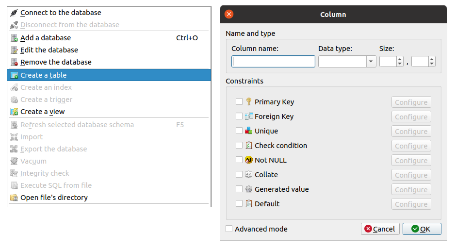
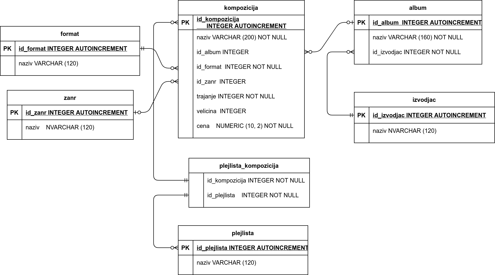
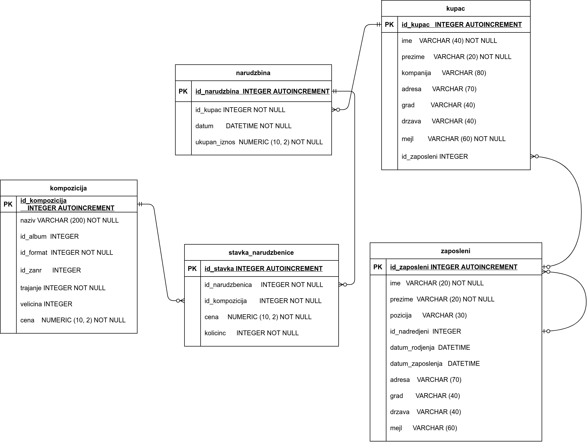
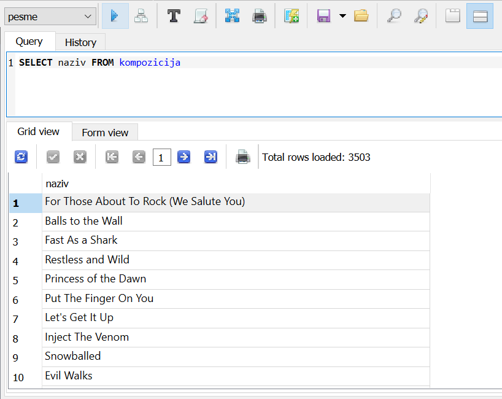

База података библиотеке – ORACLE
=================================

Систем *SQLite Studio*, који пружа графички кориснички интерфејс за администрирање *SQL* база података, може се бесплатно 
преузети са интернета и инсталирати на разним оперативним системима. *SQLite Studio* у себи садржи уграђен СУБП за *SQLite*, 
тако да не треба ништа додатно инсталирати да бисте могли да креирате нову или приступите постојећој *SQLite* бази 
података.

Адреса за преузимање је:

https://sqlitestudio.pl/

База података може да се креира из програма *SQLite Studio* командом менија *Database / Add a database*. 
Приликом креирања базе потребно је одабрати датотеку у којој ће се та база чувати (ове датотеке обично имају 
екстензију .db) и назив под којим ће се база приказивати у корисничком интерфејсу. 

Свака табела се појединачно креира након избора *Create a table* додавањем свих потребних колона. 

  
Након креирања табеле помоћу графичког корисничког интерфејса, на картици *DDL* можемо да видимо како би се табела 
могла креирати и помоћу упита у језику *SQL*.

Следи приказ базе података за продају дигиталних композиција. Приказани су модел и команде за креирање табела. 

|

::

 CREATE TABLE zanr 
 ( id_zanr INTEGER PRIMARY KEY AUTOINCREMENT NOT NULL,
 naziv VARCHAR(120) );
 
 CREATE TABLE format 
 ( id_format INTEGER PRIMARY KEY AUTOINCREMENT NOT NULL,
 naziv VARCHAR (120) );
 
 CREATE TABLE izvodjac 
 ( id_izvodjac INTEGER PRIMARY KEY AUTOINCREMENT NOT NULL,
 naziv VARCHAR(120) );
 
 CREATE TABLE album 
 ( id_album INTEGER PRIMARY KEY AUTOINCREMENT NOT NULL,
 naziv VARCHAR(160) NOT NULL,
 id_izvodjac INTEGER NOT NULL,
 FOREIGN KEY id_izvodjac REFERENCES izvodjac (id_izvodjac) 
 ON DELETE RESTRICT ON UPDATE RESTRICT ); 
 
 CREATE TABLE kompozicija (
 id_kompozicija INTEGER PRIMARY KEY AUTOINCREMENT NOT NULL,
 naziv VARCHAR(200) NOT NULL,
 id_album INTEGER,
 id_format INTEGER NOT NULL,
 id_zanr INTEGER,
 trajanje INTEGER NOT NULL,
 velicina INTEGER,
 cena NUMERIC(10, 2) NOT NULL,
 FOREIGN KEY id_album
 REFERENCES album id_album 
 ON DELETE RESTRICT ON UPDATE RESTRICT,
 FOREIGN KEY id_zanr REFERENCES zanr id_zanr 
 ON DELETE RESTRICT ON UPDATE RESTRICT,
 FOREIGN KEY id_format REFERENCES format id_format 
 ON DELETE RESTRICT ON UPDATE RESTRICT );
 
 CREATE TABLE plejlista 
 ( id_plejlista INTEGER PRIMARY KEY AUTOINCREMENT NOT NULL,
 naziv VARCHAR(120) );
 
 CREATE TABLE plejlista_kompozicija 
 ( id_plejlista    INTEGER NOT NULL,
 id_kompozicija  INTEGER NOT NULL,
 CONSTRAINT PRIMARY KEY (id_plejlista, id_kompozicija),
 FOREIGN KEY id_plejlista REFERENCES plejlista (id_plejlista) 
 ON DELETE RESTRICT ON UPDATE RESTRICT,
 FOREIGN KEY id_kompozicija REFERENCES kompozicija (id_kompozicija) 
 ON DELETE RESTRICT ON UPDATE RESTRICT ); 
 
 CREATE TABLE id_zaposleni 
 ( id_zaposleni INTEGER PRIMARY KEY AUTOINCREMENT NOT NULL,
 prezime VARCHAR(20) NOT NULL,
 ime VARCHAR(20) NOT NULL,
 naziv VARCHAR(30),
 id_nadredjeni INTEGER,
 datum_rodjenja DATETIME,
 datum_zaposlenja DATETIME,
 adresa VARCHAR(70),
 grad VARCHAR(40),
 drzava VARCHAR(40),
 mejl VARCHAR(60),
 FOREIGN KEY (id_nadredjeni) REFERENCES zaposleni (id_zaposleni) 
 ON DELETE RESTRICT ON UPDATE RESTRICT );
 
 CREATE TABLE kupac 
 ( id_kupac INTEGER PRIMARY KEY AUTOINCREMENT NOT NULL,
 ime VARCHAR(40) NOT NULL,
 prezime VARCHAR(20) NOT NULL,
 kompanija VARCHAR(80),
 adresa VARCHAR(70),
 grad VARCHAR(40),
 drzava VARCHAR(40),
 mejl VARCHAR(60) NOT NULL,
 id_zaposleni INTEGER, 
 FOREIGN KEY (id_zaposleni) REFERENCES zaposleni (id_zaposleni) 
 ON DELETE RESTRICT ON UPDATE RESTRICT );
 
 CREATE TABLE narudzbenica 
 ( id_narudzbenica INTEGER PRIMARY KEY AUTOINCREMENT NOT NULL,
 id_kupac INTEGER NOT NULL,
 datum DATETIME NOT NULL,
 ukupan_iznos NUMERIC (10, 2) NOT NULL,
 FOREIGN KEY (id_kupac) REFERENCES kupac 
 ON DELETE RESTRICT ON UPDATE RESTRICT );
 
 CREATE TABLE stavka_narudzbenice 
 (id_stavka INTEGER PRIMARY KEY AUTOINCREMENT NOT NULL,
 id_narudzbenica INTEGER NOT NULL,
 id_kompozicija INTEGER NOT NULL,
 cena NUMERIC(10, 2) NOT NULL,
 kolicina INTEGER NOT NULL,
 FOREIGN KEY (id_narudzbenica) REFERENCES narudzbenica 
 ON DELETE NO ACTION UPDATE NO ACTION,
 FOREIGN KEY (id_kompozicija) REFERENCES kompozicija 
 ON DELETE NO ACTION ON UPDATE NO ACTION );

База која садржи описане табеле, попуњене подацима, може се преузети као фајл `music.db <https://petljamediastorage.blob.core.windows.net/root/Media/Default/Kursevi/baze_IV/chinook.db>`_ 
и 
отворити у програму *SQLite Studio*.

Да би се отворила готоба база података, потребно је изабрати са менија *Database/Add a database* и затим изабрати 
фајл који садржи базу. 

Упити се пишу када се изабере са менија *Tools/Open SQL editor*. 

